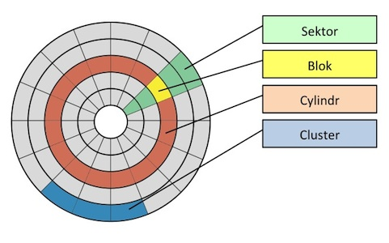
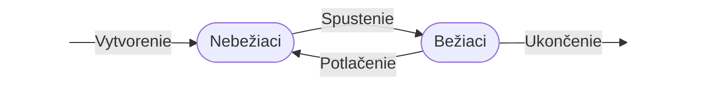
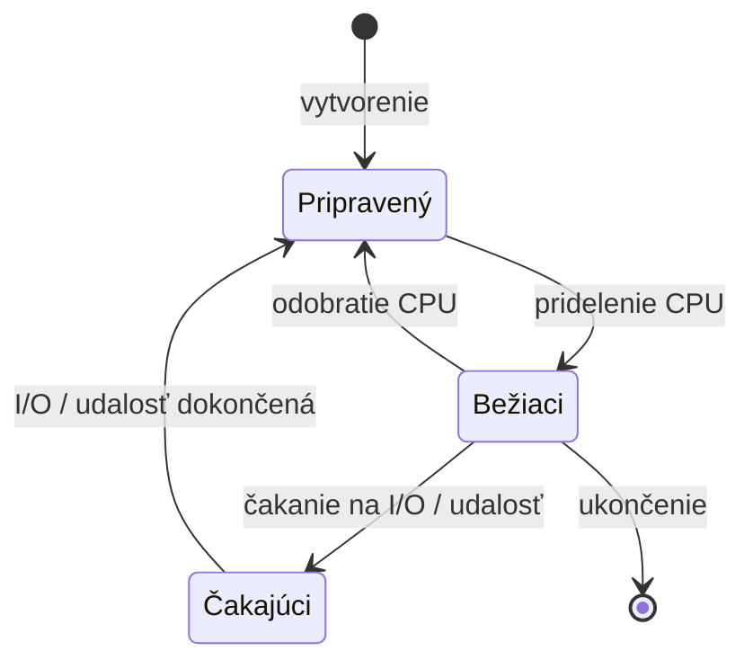
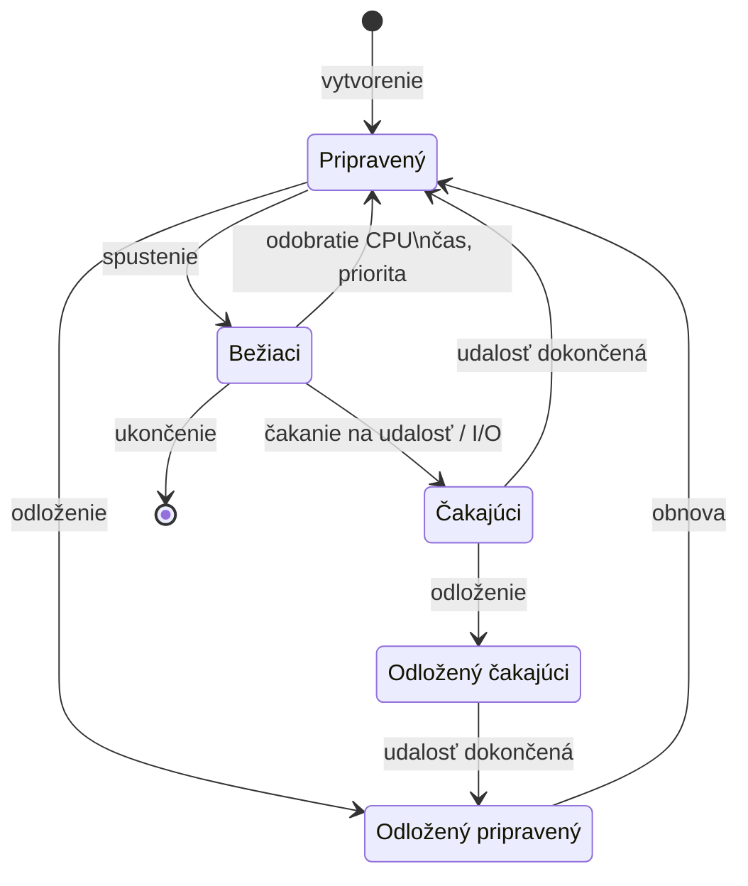

## Operačné systémy

### 1. Charakteristika pojmu a klasifikácia operačných systémov (podľa funkcií, počtu používateľov, počtu vykonávaných úloh a počtu vlákien). Štruktúra číslicového počítača - pamäťový podsystém, operačný podsystém, riadiaci podsystém, vstupno-výstupný podsystém. Rozdiely medzi operačnými systémami - MS Windows, Linux, MacOS. Charakteristika vybraných typov OS monolitický systém, hierarchická štruktúra, virtuálny počítač a model klient-server.

#### Charakteristika

**Operačný systém** je základná softvérová vrstva medzi hardvérom a aplikáciami alebo používateľom. Poskytuje jednotné rozhranie na prácu s hardvérom, takže programy nemusia poznať detaily konkrétneho zariadenia. Zároveň spravuje a prideľuje hlavné zdroje počítača, najmä procesor, pamäť, disk a vstupno-výstupné zariadenia.

Typické úlohy OS:

- **Správa procesov a vlákien** – vytváranie, plánovanie, synchronizácia.
- **Správa pamäte** – prideľovanie RAM, virtuálna pamäť, stránkovanie.
- **Správa súborov** – súborový systém, prístupové práva.
- **Správa I/O** – komunikácia so zariadeniami cez ovládače, prerušenia a vstupno-výstupné operácie.
- **Bezpečnosť a autentifikácia** – používateľské účty, prístupové práva.
- **Sieťová komunikácia** – rozhranie na komunikáciu cez sieť.
- **Používateľské rozhranie** – shell (CLI) alebo grafické prostredie (GUI).

#### Klasifikácia operačných systémov

##### Podľa funkcií (podľa Tanenbauma)

- **OS ako rozšírený stroj** – OS zakrýva nepríjemné detaily hardvéru a programom poskytuje jednoduchšie, jednotné rozhranie. Programy nepracujú priamo so sektorom disku, radičom zariadenia alebo konkrétnou I/O operáciou, ale používajú abstrakcie ako súbory, procesy, pamäť a systémové volania.

> „One of the major tasks of the operating system is to hide the hardware and present programs (and their programmers) with nice, clean, elegant, consistent, abstractions to work with instead. Operating systems turn the ugly into the beautiful, as shown in Fig. 1-2.“
>
> — Tanenbaum, *Modern Operating Systems*

- **OS ako správca zdrojov** – prideľuje a kontroluje procesor, pamäť, disk a vstupno-výstupné zariadenia medzi procesmi a používateľmi. Rieši zdieľanie, ochranu, konflikty a férové prideľovanie zdrojov.

##### Podľa počtu používateľov

- **Jednopoužívateľský** – nepodporuje viacerých používateľov (napr. **MS-DOS**).
- **Viacpoužívateľský** – podporuje viacerých používateľov = oddelené účty a práva.

##### Podľa počtu vykonávaných úloh (procesov)

- **Jednoúlohový** – v danej chvíli beží len jeden proces (napr. **MS-DOS**).
- **Viacúlohový** – umožňuje súbežný beh viacerých procesov. V praxi sa pri multitaskingu rozlišuje **preemptívny** prístup, kde OS môže procesu odobrať CPU, a **kooperatívny** prístup, kde sa proces musí CPU vzdať sám.
  - **Typický príklad:** **Windows, macOS, Linux**.

##### Podľa počtu vlákien

- **Bez podpory vlákien** – jednotkou je proces (historické Unixy).
- **S podporou vlákien (multi-threaded)** – jeden proces môže mať viac vlákien, ktoré zdieľajú pamäť procesu, ale vykonávajú sa samostatne.

#### Štruktúra číslicového počítača

Číslicový počítač sa skladá z viacerých podsystémov, ktoré spolupracujú pri vykonávaní programu. Základ tvoria **procesor**, **pamäť**, **vstupno-výstupné zariadenia** a ich prepojenie cez **zbernice**.

Pri **Von Neumannovej architektúre** sú **program aj dáta uložené v spoločnej pamäti**. **Harvardská architektúra** ich oddeľuje – má samostatnú pamäť pre program a samostatnú pamäť pre dáta.

#### Pamäťový podsystém

**Pamäťový podsystém** slúži na uchovávanie **programov a dát**, s ktorými počítač pracuje. Pri behu programu musí byť v operačnej pamäti uložený vykonávaný kód aj potrebné dáta.

Základom pamäte je **pamäťová bunka**, ktorá má svoju **adresu**. Z pamäťovej bunky sa dá čítať bez zmeny obsahu a dá sa do nej zapísať nová hodnota.

#### Operačný podsystém

**Operačný podsystém** vykonáva operácie nad **dátami**. Jeho jadrom je **aritmeticko-logická jednotka (ALU)**.

**ALU** realizuje **aritmetické a logické operácie**, napríklad sčítanie, odčítanie, porovnávanie, bitové operácie alebo posuny. Pri práci využíva **registre** a výsledky operácií sa ukladajú späť do registrov alebo pamäte.

#### Riadiaci podsystém

**Riadiaci podsystém** riadi postup vykonávania **inštrukcií**. Zabezpečuje základný cyklus: **načítanie inštrukcie z pamäte**, jej **dekódovanie**, **spustenie príslušnej operácie** a posun na ďalšiu inštrukciu alebo skok na inú adresu.

Koordinuje činnosť **registrov**, **ALU**, **pamäte** a **vstupno-výstupných zariadení** tak, aby sa inštrukcie vykonali v správnom poradí.

#### Vstupno-výstupný podsystém

Vstupno-výstupný podsystém **zabezpečuje komunikáciu počítača s okolím**, napríklad s klávesnicou, monitorom alebo tlačiarňou.

Prenos dát medzi **procesorom**, **pamäťou** a zariadeniami sprostredkúvajú **radiče** a **ovládače zariadení**.

Komunikácia môže byť riadená **programovo**, pomocou **prerušení** alebo cez **DMA** (priamy prístup do pamäte), aby procesor nemusel pri každom prenose robiť všetku prácu sám.

#### Rozdiely medzi MS Windows, Linux a macOS

| Vlastnosť       | Windows                        | Linux                                | macOS                                  |
| --------------- | ------------------------------ | ------------------------------------ | -------------------------------------- |
| Výrobca         | Microsoft                      | komunita + distribúcie               | Apple                                  |
| Licencia        | proprietárna, platená          | open source (GPL)                    | proprietárna, viazaná na HW            |
| Jadro           | Windows NT – hybridné          | Linux kernel – monolitické, modulárne | XNU – hybridné                          |
| Filesystem      | NTFS                           | ext4                                 | APFS                                   |
| Shell           | PowerShell, cmd                | bash, zsh                            | zsh (predtým bash)                     |
| Hardvér         | ľubovoľný x86/ARM              | ľubovoľný HW                         | iba Apple (Mac)                        |
| Hlavné použitie | desktop, podnikové prostredie, gaming | servery, cloud, embedded, vývoj      | desktop, kreatívna práca, vývoj        |

#### Charakteristika vybraných typov OS

Pri vnútornom usporiadaní OS sa porovnáva hlavne to, **kde bežia systémové služby**, **ako spolu komunikujú** a aká je miera oddelenia medzi **jadrom**, službami a používateľskými programami.

Rozlišujú sa štyri klasické modely:

#### Monolitický systém

**Monolitický systém** má **jadro OS** a väčšinu systémových služieb v jednom spoločnom priestore v **režime jadra**. Systémové volania sa obsluhujú priamo v jadre a jeho časti môžu volať jedna druhú bez zložitého sprostredkovania.

**Výhodou** je vysoký výkon a jednoduchšie priame volanie služieb. **Nevýhodou** je horšia modularita: veľké jadro sa ťažšie ladí a chyba v jednej časti môže ovplyvniť celý systém.

**Príklad:** **tradičný UNIX**.

#### Hierarchická štruktúra

**Hierarchická štruktúra** delí OS na viac **vrstiev**. Nižšie vrstvy sú bližšie k **hardvéru**, vyššie vrstvy poskytujú abstraktnejšie služby, napríklad pre **procesy**, **súbory** alebo používateľské rozhranie.

**Výhodou** je prehľadnejší návrh a jasnejšie oddelenie zodpovedností. **Nevýhodou** je, že volanie služby môže prechádzať viacerými vrstvami, čo zvyšuje réžiu a môže znížiť výkon.

**Príklad:** **THE system (Dijkstra)**.

#### Virtuálny počítač

**Virtuálny počítač** je model, v ktorom **hypervízor** alebo virtualizačná vrstva vytvára nad fyzickým hardvérom samostatné **virtuálne stroje**. Každý z nich sa správa, akoby mal vlastný procesor, pamäť, disk a vstupno-výstupné zariadenia, takže v ňom môže bežať samostatný OS.

**Výhodou** je možnosť prevádzkovať viac OS na jednom fyzickom stroji a dobre ich izolovať. **Nevýhodou** je réžia virtualizácie, takže výkon môže byť nižší než pri priamom behu na hardvéri.

**Príklad:** VirtualBox, VMware, Hyper-V.

#### Model klient-server

**Model klient-server** stavia OS na malom **mikrojadre**, ktoré rieši len základné veci, napríklad plánovanie, komunikáciu medzi procesmi a základnú správu pamäte. Ostatné služby, napríklad súborový systém, ovládače alebo sieťové služby, bežia ako samostatné používateľské procesy – servery.

**Výhodou** je dobrá štruktúra, oddelené adresové priestory služieb a vyššia odolnosť voči chybám. **Nevýhodou** je réžia komunikácie medzi procesmi, takže systém môže byť pomalší než monolitický model.

**Príklad:** **Minix**.

### 2. Správa pamäte. Charakteristika, rozdiel a činnosť primárnej a sekundárnej pamäte. Princíp činnosti SSD a HDD rozdiely medzi nimi. Charakteristika pojmov cluster, sektor, blok, cylinder, fragmentácia (externá a interná), swapping. virtuálna pamäť. Stratégie primárnej pamäte a rozdiely medzi nimi: spojité a nespojité. Charakteristika segmentácie, stránkovania, segmentácie a stránkovanie na žiadosť a pod.

#### Správa pamäte

**Správa pamäte** je časť operačného systému, ktorá rozhoduje, ako sa **operačná pamäť** efektívne prideľuje **procesom** a ako sa chráni pred neoprávneným prístupom. Proces môže bežať len vtedy, keď má jeho **program** a potrebné **dáta** dostupné v pamäti, preto OS rieši **prideľovanie**, **uvoľňovanie**, **relokáciu**, **ochranu** a prípadné **zdieľanie pamäťových oblastí**.

Cieľom správy pamäte je, aby každý proces dostal vlastný použiteľný adresný priestor a zároveň nemohol zasahovať do pamäte iných procesov ani do pamäte jadra operačného systému. Preto správa pamäte úzko súvisí s **ochranou pamäte** a s prekladom adries, s ktorými pracuje program, na reálne miesta vo fyzickej pamäti.

#### Charakteristika, rozdiel a činnosť primárnej a sekundárnej pamäte

**Primárna pamäť (RAM)** je **priamo adresovateľná procesorom**. Pri vykonávaní programu v nej musia byť uložené práve vykonávané **inštrukcie** aj **dáta**, s ktorými program pracuje. Je **rýchla**, ale **volatilná**, takže po vypnutí sa jej obsah stratí. Medzi procesorom a primárnou pamäťou je ešte **cache pamäť (L1/L2/L3)**, ktorá zrýchľuje prístup k často používaným údajom.

**Sekundárna pamäť** nie je **priamo adresovateľná procesorom**; pristupuje sa k nej cez **vstupno-výstupný podsystém** a ovládače zariadení. Je to **perzistentná** pamäť, teda slúži na **dlhodobé uloženie** programov, súborov a dát. Ide napríklad o **HDD** alebo **SSD**. Dáta sa z nej musia pred spracovaním načítať do **RAM**.

| Vlastnosť       | Primárna (RAM)                 | Sekundárna (HDD/SSD)                      |
| --------------- | ------------------------------ | ----------------------------------------- |
| Prístup CPU     | priamy (adresovateľná)         | cez ovládač a I/O                         |
| Volatilita      | volatilná (obsah mizne)        | perzistentná (prežije vypnutie)           |
| Rýchlosť        | veľmi rýchla (ns)              | pomalšia (µs – ms)                        |
| Kapacita        | GB                             | TB                                        |
| Cena            | vyššia                         | nižšia                                    |
| Účel            | beh programov a ich dát        | dlhodobé uloženie                         |

#### Princíp činnosti SSD a HDD, rozdiely medzi nimi

**HDD** je **mechanické magnetické úložisko**:

- dáta sú uložené na otočných **platniach** v **stopách** a **sektoroch**; stopy s rovnakým polomerom cez viaceré platne tvoria **cylinder**,
- pri čítaní alebo zápise sa hlava musí presunúť na správnu stopu a počkať, kým sa pod ňu otočí požadovaný sektor,
- preto je HDD pomalší hlavne pri **náhodnom prístupe**, kde sa stále mení poloha hlavy,
- výhodou HDD je najmä priaznivá cena pri veľkých kapacitách.

**SSD (Solid-State Drive)** je **elektronické úložisko bez pohyblivých častí**, založené na **flash NAND pamäti**:

- dáta sa čítajú a zapisujú elektricky, takže SSD má výrazne **nižšiu latenciu** a lepší **náhodný prístup** než HDD,
- pri zápise pracuje so **stránkami** a **blokmi** a pamäťové bunky majú obmedzený počet zápisov,
- preto používa mechanizmy ako **wear leveling**, **garbage collection** a **TRIM**, ktoré pomáhajú rovnomerne rozkladať zápisy a udržiavať výkon.

#### Charakteristika pojmov cluster, sektor, blok, cylinder

**Cluster**

**Cluster** je skupina viacerých susedných **sektorov**, s ktorou súborový systém pracuje ako s jednou alokačnou jednotkou. Aj malý súbor zaberie aspoň jeden celý cluster, takže nevyužitý zvyšok clusteru spôsobuje **internú fragmentáciu**.

**Sektor**

**Sektor** je výsek **stopy** na magnetickej platni HDD a patrí medzi základné adresovateľné časti disku. Tradične mal veľkosť **512 bajtov**, moderné disky môžu používať aj **4-kilobajtové sektory**.

**Blok**

**Blok** je časť magnetickej platne určená prienikom **stopy** a **sektora**. Prakticky ide o malú oblasť, do ktorej sa ukladajú dáta.

**Cylinder**

**Cylinder** tvorí množina **stôp s rovnakým polomerom** na viacerých platniach HDD. Je to pojem z fyzickej geometrie pevných diskov; pri SSD takáto mechanická geometria neexistuje.

#### Fragmentácia (externá a interná)

**Fragmentácia** je jav, pri ktorom je pamäťový alebo úložný priestor rozdrobený na menšie časti, takže vzniká nevyužité alebo horšie využiteľné miesto.

**Interná fragmentácia**

**Interná fragmentácia** vzniká vtedy, keď je pridelený blok väčší, než proces alebo súbor reálne potrebuje. Nevyužitý zvyšok bloku zostane prázdny, ale už je pridelený. Typický príklad je **súbor menší než cluster** alebo **posledná stránka procesu pri stránkovaní**.

**Externá fragmentácia**

**Externá fragmentácia** vzniká vtedy, keď je voľné miesto rozdelené na veľa menších častí. V pamäti môže byť súčet voľných dier dostatočný, ale žiadna súvislá oblasť nie je dosť veľká. Na disku sa tým často myslí, že jeden súbor je rozmiestnený na viacerých **nesúvislých miestach**, čo spomaľuje čítanie a zápis.

**Riešením** je v **RAM** napríklad **kompaktovanie** alebo použitie techník ako **stránkovanie**, zatiaľ čo pri disku sa používa **defragmentácia**.

#### Swapping

**Swapping** je dočasné odkladanie pamäťového priestoru procesu z **operačnej pamäte** na **disk** a jeho neskoršie načítanie späť. Keď OS potrebuje uvoľniť RAM, môže časť procesu alebo celý proces odložiť na disk (*swap out*). Keď má proces znovu pokračovať, potrebné dáta sa načítajú späť do RAM (*swap in*).

**Výhodou** je, že OS môže udržať viac pripravených procesov, než by sa naraz zmestilo do fyzickej RAM.

**Nevýhodou** je, že swapping je pomalý, pretože prístup na disk je výrazne pomalší než prístup do RAM; pri SSD navyše častý swapping znamená viac zápisov, a teda aj väčšie opotrebovanie úložiska.

#### Virtuálna pamäť

**Virtuálna pamäť** je stratégia správy pamäte, ktorá oddeľuje **logický adresný priestor procesu** od **fyzickej pamäte**. Proces pracuje s **logickými adresami pamäte**, teda s vlastným zdanlivo súvislým adresným priestorom. OS a hardvér potom tieto adresy mapujú na **fyzické adresy pamäte**, teda na reálne miesta v **RAM** alebo podľa potreby na priestor na **disku**.

Vo fyzickej pamäti nemusia byť naraz všetky časti programu a dát, ale iba tie, ktoré sú práve potrebné. Preto môže byť **logický adresný priestor väčší než dostupná RAM**. Virtuálna pamäť zároveň pomáha **izolovať procesy**, lebo každý proces pracuje vo vlastnom adresnom priestore.

**Typickou implementáciou** je **stránkovanie na žiadosť** (*demand paging*), pri ktorom sa stránka načíta do RAM až vtedy, keď ju proces skutočne potrebuje. Ak proces pristúpi k stránke, ktorá v RAM ešte nie je, vznikne **page fault** a OS potrebnú stránku načíta z disku.

#### Stratégie primárnej pamäte a rozdiely medzi nimi: spojité a nespojité

**Spojité prideľovanie** znamená, že proces dostane jednu **súvislú oblasť fyzickej pamäte**.

- **Prideľovanie celej voľnej pamäte** – jednoduchý historický model, kde je pamäť prakticky vyhradená jednému procesu alebo jednému programu.
- **Prideľovanie pevných blokov pamäte** – **RAM** je rozdelená na pevné bloky a proces dostane jeden z nich. Je to jednoduché, ale môže vznikať **interná fragmentácia** a proces sa nespustí, ak je väčší než najväčší blok.
- **Prideľovanie blokov premenlivej veľkosti** – blok sa vytvorí podľa veľkosti procesu. Lepšie využíva pamäť, ale vzniká **externá fragmentácia**. Pri výbere voľného miesta sa používajú stratégie ako **first fit**, **best fit** alebo **worst fit**.

**Nespojité prideľovanie** znamená, že proces nemusí byť uložený v jednej súvislej oblasti pamäte. Jeho časti môžu byť rozložené na viacerých miestach **fyzickej pamäte** a OS zabezpečuje **preklad logických adries na fyzické**.

Patrí sem **segmentácia**, **stránkovanie**, **stránkovanie na žiadosť** a **segmentácia so stránkovaním na žiadosť**. **Výhodou** je lepšie využitie pamäte a menší problém so súvislým voľným miestom, **nevýhodou** je zložitejší preklad adries a väčšia réžia.

#### Segmentácia

**Segmentácia** delí proces na logické časti, teda **segmenty**. Segment môže predstavovať napríklad **kód programu**, procedúry, funkcie, konštanty, globálne premenné, **zásobník** alebo **haldu**. Je to prirodzené z pohľadu programátora, lebo segmenty zodpovedajú významovým častiam programu.

Pri segmentácii sa logická adresa skladá z **čísla segmentu** a **offsetu**. Číslo segmentu vyberie záznam v **tabuľke segmentov** a **offset** určuje pozíciu vo vnútri segmentu. Záznam obsahuje najmä **base**, teda počiatočnú fyzickú adresu segmentu, a **limit**, teda jeho dĺžku. Pri preklade sa kontroluje, či offset neprekračuje limit.

**Výhodou** je, že segmenty umožňujú nastavovať práva, chrániť pamäť, zdieľať napríklad kód programu medzi procesmi a detegovať prístup mimo segmentu.

**Nevýhodou** je, že segmenty majú rôznu veľkosť, preto vzniká **externá fragmentácia** a OS musí riešiť, kam ich vo fyzickej pamäti umiestniť.

#### Stránkovanie

**Stránkovanie** delí **logický adresný priestor procesu** aj **fyzickú pamäť** na rovnako veľké bloky. V logickom priestore sa nazývajú **stránky (pages)** a vo fyzickej pamäti **rámce (frames)**. Proces teda nemusí byť uložený v jednej súvislej oblasti RAM, jeho stránky môžu byť rozložené v rôznych rámcoch.

Pri stránkovaní sa logická adresa skladá z **čísla stránky** a **offsetu**. Číslo stránky sa pomocou **tabuľky stránok** preloží na **číslo rámca** a **offset** určuje konkrétne miesto v rámci.

**Výhodou** je, že stránkovanie odstraňuje **externú fragmentáciu** a nie je nutné presúvať veľké súvislé bloky pamäte.

**Nevýhodou** je, že posledná stránka procesu nemusí byť úplne využitá, takže vzniká **interná fragmentácia**. Stránkovanie tiež potrebuje **hardvérovú podporu** a **tabuľky stránok**, čo pridáva réžiu.

Preklad adries môže zrýchľovať **TLB**, teda malá cache pre nedávno použité **preklady stránok**.

#### Segmentácia a stránkovanie na žiadosť

**Stránkovanie na žiadosť (demand paging)**

Pri **stránkovaní na žiadosť** sa stránka nenačíta do **RAM** hneď pri spustení programu, ale až vtedy, keď ju proces skutočne potrebuje. Ak proces pristúpi k stránke, ktorá nie je vo fyzickej pamäti, vznikne **page fault**. OS stránku nájde na disku, načíta ju do voľného **rámca** a upraví **tabuľku stránok**. Ak voľný rámec nie je, musí vybrať inú stránku na odloženie.

**Výhodou** je, že do RAM sa načítavajú len potrebné časti programu a dát, takže súčet pamäťových nárokov procesov môže prekročiť veľkosť fyzickej pamäte.

**Nevýhodou** je, že pri častých výpadkoch stránok systém trávi veľa času presúvaním dát medzi diskom a RAM. Potrebná je aj **hardvérová podpora**.

**Segmentácia so stránkovaním na žiadosť**

Proces sa najprv rozdelí na **logické segmenty** a segmenty sa ďalej spravujú pomocou **stránok**. Tým sa kombinuje logický pohľad segmentácie s výhodou stránkovania, že **fyzická pamäť nemusí obsahovať veľké súvislé bloky**.

### 3. Charakteristika a klasifikácia súborových systémov, atribúty súboru, adresáre so stromovou štruktúrou a acyklickými adresármi, ochrana prístupu k súborom, journaling. Charakteristika a komparácia FAT 32, exFAT, NTFS, ext2, ext3 a ext4.

#### Charakteristika a klasifikácia súborových systémov

**Súborový systém** poskytuje nad surovými sektormi disku abstrakciu **súborov** a **adresárov**. Určuje, ako sa súbory ukladajú, vyhľadávajú, pomenúvajú a chránia. Zároveň eviduje ich **metadáta**, mapuje ich obsah na konkrétne **bloky** alebo **clustre** na úložisku a stará sa o **konzistenciu dát**, napríklad pri páde systému počas zápisu.

##### Klasifikácia súborových systémov

- **Diskové súborové systémy** – používajú sa na lokálnych diskoch, napríklad **FAT32**, **exFAT**, **NTFS**, **ext2**, **ext3**, **ext4**, **HFS+** alebo **APFS**.
- **Sieťové súborové systémy** – umožňujú prístup k súborom cez sieť, napríklad **SMB/CIFS** vo Windows alebo **NFS** v UNIX/Linux prostredí.
- **Súborové systémy pre špeciálne účely** – neslúžia primárne na bežné ukladanie súborov na disk, ale poskytujú špeciálny pohľad na dáta alebo systém, napríklad **procfs** alebo **tmpfs**.

#### Atribúty súboru

Každý súbor má **metadáta** uložené vo **FS**, ktoré popisujú jeho vlastnosti:

- **Meno** – identifikátor v rámci **adresára**.
- **Typ súboru** – informácia, ako má OS alebo aplikácia s obsahom pracovať, napríklad textový, spustiteľný alebo binárny súbor.
- **Veľkosť** – v **bajtoch**.
- **Umiestnenie (alokácia)** – informácie o tom, v ktorých **blokoch** alebo **clusteroch** je obsah súboru uložený.
- **Prístupové práva** – určujú, kto môže **čítať**, **zapisovať** alebo **spúšťať** súbor.
- **Vlastník a skupina** – identifikácia subjektov, ktorým súbor patrí.
- **Časové značky (timestamps)** – prístup (**atime**), zmena obsahu (**mtime**), zmena metadát (**ctime**).
- **Príznaky (flags)** – napr. **read-only**, skrytý, systémový, archív.

V **UNIX/Linux** sú metadáta uložené v **inode** – dátovej štruktúre oddelenej od názvu súboru. Názov žije v **adresári** a odkazuje na **číslo inode**.

#### Adresáre so stromovou štruktúrou

Adresáre so **stromovou štruktúrou** organizujú súbory hierarchicky od **koreňa** smerom nadol. Každý súbor alebo adresár má práve jedného **rodiča**, takže vzniká **strom bez cyklov**.

Vlastnosti stromových adresárov:

- **Efektívnejšie hľadanie** – súbor sa nehľadá v jednom veľkom zozname, ale podľa **cesty** v konkrétnej vetve stromu.
- **Nezávislé pomenovanie** – rovnaký názov môže existovať vo viacerých adresároch, pretože jednoznačná je až **celá cesta**.
- **Jednoduchá organizácia** – súbory sa dajú zoskupovať podľa logickej príbuznosti, napríklad podľa projektov, používateľov alebo typu dát.
- **Správa podľa práv** – používateľ môže vytvárať a rušiť súbory alebo adresáre tam, kde na to má oprávnenie.

Stromová štruktúra sama osebe neumožňuje prirodzené **zdieľanie toho istého objektu** vo viacerých vetvách. Na to sú potrebné **odkazy** alebo všeobecnejšia **acyklická štruktúra**.

So stromovou štruktúrou súvisí aj **prístupová cesta** a **pracovný adresár**:

- **Pracovný adresár** – dynamicky určený východiskový bod procesu, vzhľadom na ktorý sa vyhodnocujú **relatívne cesty**.
- **Absolútna cesta** – začína v **koreňovom adresári**.
- **Relatívna cesta** – je určená vzhľadom na **pracovný adresár**.
- **Oddeľovač úsekov cesty** – v **POSIX** systémoch `/`, vo Windows tradične `\\`.

#### Acyklické adresáre

**Acyklické adresáre** umožňujú **zdieľať súbory aj adresáre**. Jeden objekt tak môže mať **dve alebo viac rôznych mien**, čomu sa hovorí **aliasing**. Štruktúra už nie je čistý strom, ale stále nesmie obsahovať **cykly**.

**Výhodou** je, že ten istý objekt možno sprístupniť z viacerých miest bez jeho kopírovania. Problém nastáva vtedy, keď sa zruší pôvodný objekt alebo jedna vetva adresárovej štruktúry. V inej časti potom môže zostať **neplatný alebo nezmyselný odkaz**.

V praxi sa to realizuje pomocou odkazov:

- **Hard link** – druhé meno pre ten istý **inode**.
- **Symbolický odkaz (soft link)** – samostatný súbor obsahujúci **cestu** na iný objekt. Po zmazaní cieľa môže zostať **neplatný**.

#### Ochrana prístupu k súborom

**Ochrana prístupu k súborom** je dôležitá hlavne vo **viacpoužívateľských systémoch**, kde treba určiť, **kto** môže so súborom pracovať a **akým spôsobom**.

Základné modely riadenia prístupu:

- **Voliteľné riadenie prístupu (DAC, Discretionary Access Control)** – o prístupe rozhoduje **vlastník súboru**. Ten môže určiť, kto a s akými právami môže so súborom pracovať.
- **Povinné riadenie prístupu (MAC, Mandatory Access Control)** – pravidlá určuje **systémová bezpečnostná politika**. Bežný používateľ ich nemôže meniť. Meniť ich môže len **správca systému** alebo samotný bezpečnostný mechanizmus OS.

Typické práva prístupu k súboru sú:

- **read (`r`)** – čítanie,
- **write (`w`)** – zápis,
- **execute (`x`)** – spustenie.

V širšom modeli sa môžu rozlišovať aj operácie ako **append** alebo **delete**.

V systémoch typu **POSIX** sa práva prideľujú pre tri triedy:

- **user** – vlastník,
- **group** – skupina,
- **other** – ostatní.

Príklad: **`rwxr-xr-x`** alebo oktálovo **`755`**.

#### Journaling

**Journaling** je mechanizmus na udržiavanie **konzistencie súborového systému** pri páde systému alebo výpadku napájania. Pred samotnou zmenou na disku sa najprv do **žurnálu** zapíše požiadavka na operáciu a jej opis, teda **transakcia**. Až potom sa operácia vykoná nad súborovým systémom.

Ak operácia prebehne úspešne, **transakcia sa potvrdí** a záznam v žurnále už nie je potrebný. Ak nastane chyba, systém pri štarte skontroluje žurnál a podľa neho vie zistiť, čo sa malo **dokončiť** alebo **vrátiť späť**.

**Výhodou** je, že po páde systému netreba kontrolovať celý disk ako pri filesystemoch bez žurnálu. Obnova konzistencie je výrazne rýchlejšia.

Typicky journaling používajú **NTFS**, **ext3** a **ext4**. Pri ext3 sa spomínajú režimy **journal**, **writeback** a **ordered**, ktoré sa líšia tým, čo presne sa žurnáluje a aký je kompromis medzi **výkonom** a **spoľahlivosťou**.

#### Charakteristika a komparácia FAT 32, exFAT, NTFS, ext2, ext3 a ext4

| FS       | Max súbor  | Journal | Práva       | Typické použitie                    |
| -------- | ---------- | ------- | ----------- | ----------------------------------- |
| FAT32    | 4 GiB      | nie ❌   | žiadne      | USB kľúče, staré systémy, BIOS boot |
| exFAT    | 16 EiB     | nie ❌   | minimálne   | SD karty, externé disky, cross-OS   |
| NTFS     | 16 EiB     | áno ✅   | ACL         | Windows, interné disky              |
| ext2     | 2 TiB      | nie ❌   | POSIX       | historické Linuxy, flash bez journ. |
| ext3     | 2 TiB      | áno ✅   | POSIX       | staršie Linux systémy               |
| ext4     | 16 TiB     | áno ✅   | POSIX + ACL | moderný Linux default               |

Kľúčovo sa tieto súborové systémy líšia hlavne **kompatibilitou**, podporou **journalingu**, **prístupovými právami** a **typickým použitím**.

**FAT32** je najjednoduchší a veľmi kompatibilný súborový systém, ale má zásadný limit **4 GiB na súbor** a nepodporuje **journaling**. **exFAT** je jeho modernejší nástupca pre **flash médiá** a **externé disky**, ktorý tento limit odstraňuje, ale stále nemá journaling.

**NTFS** je hlavný súborový systém **Windows**. Oproti FAT/exFAT je robustnejší, podporuje **journaling**, **prístupové práva**, **kompresiu**, **kvóty**, **šifrovanie** a metadáta uložené v **MFT (Master File Table)**, teda hlavnej tabuľke záznamov o súboroch a adresároch.

V **Linuxe** je historicky základom **ext2**, ktorý nemá journaling. **ext3** pridáva journaling a zachováva kompatibilitu s ext2. **ext4** je moderný nástupca ext3 s **vyššími limitmi**, **lepším výkonom** a journalingom.

### 4. Procesy a vlákna. Životný cyklus procesov 2stavový model, 3stavový model a 5stavový model. Plánovacie algoritmy – FCFS, SPN(SJN), SRT... Deadlock – vznik uviaznutia a riešenia predchádzaniu vzniku deadlocku. Vlákna – definícia, rozdiel medzi procesom a vláknom, User Level Threads, Kernel Level Threads – charakteristika, rozdiely, výhody a nevýhody.

#### Procesy

[[verified: **Program** je zápis algoritmu v programovacom jazyku. **Proces** (*process, task*) je bežiaci program – je tvorený nemenným kódom programu.]]

Proces teda nie je iba súbor s programom na disku, ale jeho **konkrétne vykonávanie v operačnom systéme**. Aby mohol proces bežať, musí mať svoj **kód** a potrebné **dáta** zavedené v **operačnej pamäti**.

Proces je definovaný:

- [[verified: **textovým a dátovým regionom** (segmentom),]]
- [[verified: **zásobníkom**,]]
- [[verified: **dátovými štruktúrami** spojenými s procesom (registry, systémové tabuľky a záznamy v nich).]]

Tieto časti dohromady tvoria [[verified: **kontext procesu**]], teda informácie potrebné na to, aby OS vedel proces **prerušiť**, neskôr **obnoviť** a pokračovať v jeho vykonávaní.

Zdroje systému potrebné pre beh procesu:

- [[verified: procesor,]]
- [[verified: vnútorná pamäť,]]
- [[verified: ďalšie prostriedky (I/O zariadenie, súbory apod.).]]

OS udržiava o každom procese záznam – **Process Control Block (PCB)**. **PCB** slúži na **identifikáciu procesu**, uchovanie jeho **aktuálneho stavu** a na **plánovanie jeho behu**.

PCB obsahuje napríklad:

- [[verified: stav procesu (bežiaci, pripravený...),]]
- [[verified: čítač inštrukcií,]]
- [[verified: registry procesora,]]
- [[verified: informácie potrebné pre správu pamäti,]]
- [[verified: informácie potrebné pre správu I/O,]]
- [[verified: účtovacie informácie.]]

#### Životný cyklus procesov

[[verified: **Proces** je dynamická entita – môže sa nachádzať v rôznych **stavoch** a počas svojej existencie prechádza z jedného stavu do druhého.]]

Prechody medzi stavmi spôsobujú **udalosti**, napríklad vytvorenie procesu, pridelenie **CPU**, čakanie na **I/O**, dokončenie udalosti, **preempcia** alebo ukončenie. [[verified: Prechod je riadený jednotlivými časťami operačného systému.]]

Jednotlivé **stavové modely** sa líšia tým, koľko stavov rozlišujú a ako podrobne opisujú život procesu.

#### 2-stavový model

**2-stavový model** rozlišuje iba dva stavy procesu: **bežiaci** a **nebežiaci**.

- **[[verified: Nebežiaci]]** (*Not Running*) – proces existuje, ale práve nie je na CPU.
- **[[verified: Bežiaci]]** (*Running*) – proces sa aktívne vykonáva na CPU.

Po **vytvorení** sa proces zaradí medzi nebežiace procesy. Keď mu OS pridelí **procesor**, prejde do stavu **bežiaci**. Ak mu je procesor odobraný, napríklad pri **preempcii**, vráti sa späť medzi **nebežiace** procesy. Z bežiaceho stavu môže byť proces **ukončený** normálne, používateľom, operačným systémom alebo chybou.

**Výhodou** modelu je jednoduchosť. **Nevýhodou** je, že stav **nebežiaci** nerozlišuje, či je proces pripravený na CPU, alebo čaká na I/O či inú udalosť. Preto sa používa presnejší **3-stavový model**.

#### 3-stavový model

**3-stavový model** rozlišuje proces, ktorý je **pripravený na CPU**, proces, ktorý práve **beží**, a proces, ktorý **čaká na udalosť**.

- **[[verified: Pripravený]]** (*Ready*) – proces je v pamäti a čaká na pridelenie CPU.
- **[[verified: Bežiaci]]** (*Running*) – proces sa vykonáva na CPU.
- **[[verified: Čakajúci]]** (*Waiting / Blocked*) – proces čaká na dokončenie I/O alebo inej udalosti.

Po **vytvorení** sa proces zaradí medzi **pripravené** procesy. Keď mu **plánovač** pridelí procesor, prejde do stavu **bežiaci**. Ak proces požiada o službu, na ktorej dokončenie musí čakať, napríklad **I/O operáciu**, prejde do stavu **čakajúci**. Po vzniku udalosti, na ktorú čakal, sa vracia späť medzi **pripravené** procesy.

Ak je procesu odobratý procesor, ale proces je ďalej schopný behu, ide o **preempciu** a proces sa vracia do stavu **pripravený**. Z bežiaceho stavu môže proces skončiť normálne alebo násilne.

Oproti **2-stavovému modelu** je tento model presnejší, pretože odlišuje proces **pripravený na CPU** od procesu, ktorý je **blokovaný čakaním**.

#### 5-stavový model

**5-stavový model** vychádza z **3-stavového modelu**, ale pridáva rozlíšenie procesov, ktoré sú dočasne **odsunuté z operačnej pamäte**. [[verified: Každý proces, aby bol procesom, sa raz musí dostať do operačnej pamäte.]]

- **[[verified: Pripravený]]** – proces je v pamäti a čaká na pridelenie CPU.
- **[[verified: Bežiaci]]** – proces sa vykonáva na CPU.
- **[[verified: Čakajúci]]** – proces je v pamäti, ale čaká na I/O alebo inú udalosť.
- **[[verified: Odložený pripravený]]** – proces je pripravený na beh, ale momentálne je odsunutý z operačnej pamäte.
- **[[verified: Odložený čakajúci]]** – proces čaká na udalosť a zároveň je odsunutý z operačnej pamäte.

**Plánovač** môže presunúť proces zo stavu **pripravený** do **bežiaci**, ak mu pridelí **CPU**. Ak proces čaká na službu alebo **I/O**, prejde zo stavu **bežiaci** do **čakajúci**. Ak mu je CPU odobraté, napríklad pre čas alebo prioritu, vracia sa späť do stavu **pripravený**. Po vzniku udalosti, na ktorú proces čakal, sa čakajúci proces vracia medzi pripravené procesy.

**Odložené stavy** súvisia so **správou pamäte**. Ak OS potrebuje uvoľniť **RAM**, môže pripravený alebo čakajúci proces dočasne odsunúť z operačnej pamäte. Po obnove sa **odložený pripravený** proces vracia medzi pripravené procesy. Ak udalosť nastane ešte počas odloženého čakania, proces prejde zo stavu **odložený čakajúci** do **odložený pripravený**.

#### Plánovacie algoritmy

**Plánovač** rozhoduje, **ktorý pripravený proces dostane CPU**. Plánovanie procesora sa používa hlavne vo **viacúlohových systémoch**, kde sa o CPU delí viac procesov.

K plánovaciemu rozhodnutiu dochádza napríklad vtedy, keď proces **skončí**, prejde zo stavu **bežiaci** do **čakajúci**, je **preemptovaný** späť do stavu **pripravený**, alebo keď sa čakajúci proces po udalosti vráti medzi pripravené procesy.

**[[verified: Nepreemptívne plánovanie]]**

[[verified: Proces sa musí procesora sám vzdať]], napríklad keď skončí alebo sa zablokuje na **I/O**. OS mu ho násilne neodoberá. **Výhodou** je, že proces nemôže byť nechtiac prerušený. **Nevýhodou** je, že zle sa správajúci proces môže CPU blokovať na dlhý čas. Príklad: **FCFS, SPN**.

**[[verified: Preemptívne plánovanie]]**

[[verified: Operačný systém môže procesu odobrať procesor]], typicky na základe prerušenia od **časovača**. Príklad: **SRT**.

#### FCFS

**First Come First Served (FCFS)** znamená, že procesy dostávajú **CPU** v poradí, v akom prišli. Ide o **[[verified: najjednoduchšie nepreemptívne plánovanie]]**.

[[verified: Nový proces sa zaradí na koniec fronty.]] Keď sa dostane na rad, beží dovtedy, kým neskončí alebo sa sám nezablokuje.

**Výhodou** FCFS je jednoduchosť. **Nevýhodou** je, že **priemerná doba čakania silne závisí od poradia procesov**. Ak krátke procesy čakajú za dlhým procesom, vzniká **[[verified: konvojový efekt]]**.

Pri **krátkodobom plánovaní** sa FCFS samostatne veľmi nepoužíva, skôr ako súčasť zložitejších plánovacích postupov.

<table class="schedule-grid">
  <thead>
    <tr><th></th><th scope="col">0</th><th scope="col">1</th><th scope="col">2</th><th scope="col">3</th><th scope="col">4</th><th scope="col">5</th><th scope="col">6</th><th scope="col">7</th><th scope="col">8</th><th scope="col">9</th><th scope="col">10</th><th scope="col">11</th><th scope="col">12</th><th scope="col">13</th><th scope="col">14</th><th scope="col">15</th><th scope="col">16</th><th scope="col">17</th><th scope="col">18</th><th scope="col">19</th></tr>
  </thead>
  <tbody>
    <tr><th scope="row">A</th><td class="run proc-a" style="background:#88a8c7"></td><td class="run proc-a" style="background:#88a8c7"></td><td class="run proc-a" style="background:#88a8c7"></td><td class="idle"></td><td class="idle"></td><td class="idle"></td><td class="idle"></td><td class="idle"></td><td class="idle"></td><td class="idle"></td><td class="idle"></td><td class="idle"></td><td class="idle"></td><td class="idle"></td><td class="idle"></td><td class="idle"></td><td class="idle"></td><td class="idle"></td><td class="idle"></td><td class="idle"></td></tr>
    <tr><th scope="row">B</th><td class="idle"></td><td class="idle"></td><td class="idle"></td><td class="run proc-b" style="background:#d787a2"></td><td class="run proc-b" style="background:#d787a2"></td><td class="run proc-b" style="background:#d787a2"></td><td class="run proc-b" style="background:#d787a2"></td><td class="run proc-b" style="background:#d787a2"></td><td class="run proc-b" style="background:#d787a2"></td><td class="idle"></td><td class="idle"></td><td class="idle"></td><td class="idle"></td><td class="idle"></td><td class="idle"></td><td class="idle"></td><td class="idle"></td><td class="idle"></td><td class="idle"></td><td class="idle"></td></tr>
    <tr><th scope="row">C</th><td class="idle"></td><td class="idle"></td><td class="idle"></td><td class="idle"></td><td class="idle"></td><td class="idle"></td><td class="idle"></td><td class="idle"></td><td class="idle"></td><td class="run proc-c" style="background:#b2b5ba"></td><td class="run proc-c" style="background:#b2b5ba"></td><td class="run proc-c" style="background:#b2b5ba"></td><td class="run proc-c" style="background:#b2b5ba"></td><td class="idle"></td><td class="idle"></td><td class="idle"></td><td class="idle"></td><td class="idle"></td><td class="idle"></td><td class="idle"></td></tr>
    <tr><th scope="row">D</th><td class="idle"></td><td class="idle"></td><td class="idle"></td><td class="idle"></td><td class="idle"></td><td class="idle"></td><td class="idle"></td><td class="idle"></td><td class="idle"></td><td class="idle"></td><td class="idle"></td><td class="idle"></td><td class="idle"></td><td class="run proc-d" style="background:#93b8a0"></td><td class="run proc-d" style="background:#93b8a0"></td><td class="run proc-d" style="background:#93b8a0"></td><td class="run proc-d" style="background:#93b8a0"></td><td class="run proc-d" style="background:#93b8a0"></td><td class="idle"></td><td class="idle"></td></tr>
    <tr><th scope="row">E</th><td class="idle"></td><td class="idle"></td><td class="idle"></td><td class="idle"></td><td class="idle"></td><td class="idle"></td><td class="idle"></td><td class="idle"></td><td class="idle"></td><td class="idle"></td><td class="idle"></td><td class="idle"></td><td class="idle"></td><td class="idle"></td><td class="idle"></td><td class="idle"></td><td class="idle"></td><td class="idle"></td><td class="run proc-e" style="background:#d6c67b"></td><td class="run proc-e" style="background:#d6c67b"></td></tr>
  </tbody>
</table>

#### SPN (SJN)

**Shortest Process Next (SPN)**, často nazývané aj **Shortest Job Next (SJN)**, vyberá z pripravených procesov ten, ktorý má najkratšiu predpokladanú **dávku CPU**. Ide o **[[verified: nepreemptívne plánovanie]]**.

Keď proces dostane **CPU**, beží dovtedy, kým neskončí alebo sa nezablokuje. **Krátke procesy** sa tak dostanú na rad skôr ako dlhé procesy.

**Výhodou** SPN je veľmi dobrá **priemerná doba čakania**. Ak by OS presne poznal dĺžky CPU dávok, **SJF** je z tohto pohľadu optimálny algoritmus.

**Nevýhodou** je, že dĺžku CPU dávky treba odhadovať. **Dlhé procesy** môžu byť stále predbiehané kratšími procesmi, takže im hrozí **starvation**, teda starnutie.

<table class="schedule-grid">
  <thead>
    <tr><th></th><th scope="col">0</th><th scope="col">1</th><th scope="col">2</th><th scope="col">3</th><th scope="col">4</th><th scope="col">5</th><th scope="col">6</th><th scope="col">7</th><th scope="col">8</th><th scope="col">9</th><th scope="col">10</th><th scope="col">11</th><th scope="col">12</th><th scope="col">13</th><th scope="col">14</th><th scope="col">15</th><th scope="col">16</th><th scope="col">17</th><th scope="col">18</th><th scope="col">19</th></tr>
  </thead>
  <tbody>
    <tr><th scope="row">A</th><td class="run proc-a" style="background:#88a8c7"></td><td class="run proc-a" style="background:#88a8c7"></td><td class="run proc-a" style="background:#88a8c7"></td><td class="idle"></td><td class="idle"></td><td class="idle"></td><td class="idle"></td><td class="idle"></td><td class="idle"></td><td class="idle"></td><td class="idle"></td><td class="idle"></td><td class="idle"></td><td class="idle"></td><td class="idle"></td><td class="idle"></td><td class="idle"></td><td class="idle"></td><td class="idle"></td><td class="idle"></td></tr>
    <tr><th scope="row">B</th><td class="idle"></td><td class="idle"></td><td class="idle"></td><td class="run proc-b" style="background:#d787a2"></td><td class="run proc-b" style="background:#d787a2"></td><td class="run proc-b" style="background:#d787a2"></td><td class="run proc-b" style="background:#d787a2"></td><td class="run proc-b" style="background:#d787a2"></td><td class="run proc-b" style="background:#d787a2"></td><td class="idle"></td><td class="idle"></td><td class="idle"></td><td class="idle"></td><td class="idle"></td><td class="idle"></td><td class="idle"></td><td class="idle"></td><td class="idle"></td><td class="idle"></td><td class="idle"></td></tr>
    <tr><th scope="row">C</th><td class="idle"></td><td class="idle"></td><td class="idle"></td><td class="idle"></td><td class="idle"></td><td class="idle"></td><td class="idle"></td><td class="idle"></td><td class="idle"></td><td class="idle"></td><td class="idle"></td><td class="run proc-c" style="background:#b2b5ba"></td><td class="run proc-c" style="background:#b2b5ba"></td><td class="run proc-c" style="background:#b2b5ba"></td><td class="run proc-c" style="background:#b2b5ba"></td><td class="idle"></td><td class="idle"></td><td class="idle"></td><td class="idle"></td><td class="idle"></td></tr>
    <tr><th scope="row">D</th><td class="idle"></td><td class="idle"></td><td class="idle"></td><td class="idle"></td><td class="idle"></td><td class="idle"></td><td class="idle"></td><td class="idle"></td><td class="idle"></td><td class="idle"></td><td class="idle"></td><td class="idle"></td><td class="idle"></td><td class="idle"></td><td class="idle"></td><td class="run proc-d" style="background:#93b8a0"></td><td class="run proc-d" style="background:#93b8a0"></td><td class="run proc-d" style="background:#93b8a0"></td><td class="run proc-d" style="background:#93b8a0"></td><td class="run proc-d" style="background:#93b8a0"></td></tr>
    <tr><th scope="row">E</th><td class="idle"></td><td class="idle"></td><td class="idle"></td><td class="idle"></td><td class="idle"></td><td class="idle"></td><td class="idle"></td><td class="idle"></td><td class="idle"></td><td class="run proc-e" style="background:#d6c67b"></td><td class="run proc-e" style="background:#d6c67b"></td><td class="idle"></td><td class="idle"></td><td class="idle"></td><td class="idle"></td><td class="idle"></td><td class="idle"></td><td class="idle"></td><td class="idle"></td><td class="idle"></td></tr>
  </tbody>
</table>

#### SRT

**Shortest Remaining Time (SRT)** je **[[verified: preemptívna verzia SPN]]**. **CPU** dostane proces, ktorý má najkratší **zostávajúci čas do ukončenia**.

Ak počas behu príde nový proces s kratším zostávajúcim časom, než má aktuálne bežiaci proces, **plánovač** aktuálnemu procesu odoberie CPU a pridelí ho novému procesu. Tým sa SRT líši od **SPN**, ktoré už raz spustený proces nepreemptuje.

**Výhodou** SRT je dobrý **priemerný čas čakania** a dobrý **čas odozvy** pre krátke procesy.

**Nevýhodou** je vyššia réžia kvôli častejšiemu **prepínaniu kontextu**. **Dlhé procesy** môžu byť opakovane predbiehané kratšími procesmi, takže im hrozí **starvation**, teda starnutie.

<table class="schedule-grid">
  <thead>
    <tr><th></th><th scope="col">0</th><th scope="col">1</th><th scope="col">2</th><th scope="col">3</th><th scope="col">4</th><th scope="col">5</th><th scope="col">6</th><th scope="col">7</th><th scope="col">8</th><th scope="col">9</th><th scope="col">10</th><th scope="col">11</th><th scope="col">12</th><th scope="col">13</th><th scope="col">14</th><th scope="col">15</th><th scope="col">16</th><th scope="col">17</th><th scope="col">18</th><th scope="col">19</th></tr>
  </thead>
  <tbody>
    <tr><th scope="row">A</th><td class="run proc-a" style="background:#88a8c7"></td><td class="run proc-a" style="background:#88a8c7"></td><td class="run proc-a" style="background:#88a8c7"></td><td class="idle"></td><td class="idle"></td><td class="idle"></td><td class="idle"></td><td class="idle"></td><td class="idle"></td><td class="idle"></td><td class="idle"></td><td class="idle"></td><td class="idle"></td><td class="idle"></td><td class="idle"></td><td class="idle"></td><td class="idle"></td><td class="idle"></td><td class="idle"></td><td class="idle"></td></tr>
    <tr><th scope="row">B</th><td class="idle"></td><td class="idle"></td><td class="idle"></td><td class="run proc-b" style="background:#d787a2"></td><td class="idle"></td><td class="idle"></td><td class="idle"></td><td class="idle"></td><td class="idle"></td><td class="idle"></td><td class="run proc-b" style="background:#d787a2"></td><td class="run proc-b" style="background:#d787a2"></td><td class="run proc-b" style="background:#d787a2"></td><td class="run proc-b" style="background:#d787a2"></td><td class="run proc-b" style="background:#d787a2"></td><td class="idle"></td><td class="idle"></td><td class="idle"></td><td class="idle"></td><td class="idle"></td></tr>
    <tr><th scope="row">C</th><td class="idle"></td><td class="idle"></td><td class="idle"></td><td class="idle"></td><td class="run proc-c" style="background:#b2b5ba"></td><td class="run proc-c" style="background:#b2b5ba"></td><td class="run proc-c" style="background:#b2b5ba"></td><td class="run proc-c" style="background:#b2b5ba"></td><td class="idle"></td><td class="idle"></td><td class="idle"></td><td class="idle"></td><td class="idle"></td><td class="idle"></td><td class="idle"></td><td class="idle"></td><td class="idle"></td><td class="idle"></td><td class="idle"></td><td class="idle"></td></tr>
    <tr><th scope="row">D</th><td class="idle"></td><td class="idle"></td><td class="idle"></td><td class="idle"></td><td class="idle"></td><td class="idle"></td><td class="idle"></td><td class="idle"></td><td class="idle"></td><td class="idle"></td><td class="idle"></td><td class="idle"></td><td class="idle"></td><td class="idle"></td><td class="idle"></td><td class="run proc-d" style="background:#93b8a0"></td><td class="run proc-d" style="background:#93b8a0"></td><td class="run proc-d" style="background:#93b8a0"></td><td class="run proc-d" style="background:#93b8a0"></td><td class="run proc-d" style="background:#93b8a0"></td></tr>
    <tr><th scope="row">E</th><td class="idle"></td><td class="idle"></td><td class="idle"></td><td class="idle"></td><td class="idle"></td><td class="idle"></td><td class="idle"></td><td class="idle"></td><td class="run proc-e" style="background:#d6c67b"></td><td class="run proc-e" style="background:#d6c67b"></td><td class="idle"></td><td class="idle"></td><td class="idle"></td><td class="idle"></td><td class="idle"></td><td class="idle"></td><td class="idle"></td><td class="idle"></td><td class="idle"></td><td class="idle"></td></tr>
  </tbody>
</table>

#### Deadlock

**Deadlock**, slovensky **uviaznutie**, je stav, keď sa **dva alebo viac procesov navzájom blokujú**, pretože každý drží určitý prostriedok a zároveň čaká na ďalší, ktorý vlastní niekto iný. Kým sa situácia nerozviaže, žiadny z nich nevie pokračovať.

Deadlock sa dá riešiť napríklad **odobratím prostriedku** niektorému procesu, **ukončením procesu** alebo **obnovou systému** do predchádzajúceho stavu. Takéto riešenie však môže byť drahé a pri nespravodlivom rozhodovaní môže viesť k **starnutiu (starvation)**.

**Vznik uviaznutia**

Deadlock môže vzniknúť iba vtedy, ak súčasne platia všetky štyri podmienky (**Coffmanove podmienky**):

1. **[[verified: Výlučný prístup]]** – ide o **nezdieľateľné prostriedky**, ktoré v danom okamihu používa len jeden proces.
2. **[[verified: Postupné prideľovanie prostriedkov]]** – proces drží pridelený prostriedok a žiada ďalší. Ak požadovaný prostriedok nie je voľný, proces musí čakať.
3. **[[verified: Prideľovanie prostriedkov bez preempcie]]** – pridelený prostriedok sa procesu násilne neodoberie. Proces ho musí uvoľniť sám.
4. **[[verified: Cyklické čakanie]]** – existuje kruh procesov, kde každý čaká na prostriedok držaný ďalším procesom v cykle.

**Riešenia a predchádzanie vzniku deadlocku**

- **[[verified: Ignorovať hrozbu deadlocku]]** – tzv. **[[verified: pštrosí algoritmus]]**. Systém predpokladá, že deadlock bude zriedkavý. Tento prístup používa veľa bežných OS.
- **[[verified: Predchádzať deadlocku]]** – zaviesť pravidlá tak, aby sa narušila aspoň jedna zo štyroch podmienok vzniku uviaznutia.
- **[[verified: Vyhýbať sa deadlocku]]** – prostriedok sa nepridelí, ak by pridelenie mohlo viesť do nebezpečného stavu. Nevýhodou môže byť **starnutie**.
- **[[verified: Detekovať uviaznutie a zotaviť sa z neho]]** – deadlock sa pripustí, systém ho **deteguje** a vykoná obnovu stavu pred uviaznutím, prípadne odoberie prostriedok alebo ukončí vybraný proces.

Pri predchádzaní deadlocku sa cielene ruší niektorá z podmienok jeho vzniku:

- **[[verified: Výlučný prístup]]** – pomáha **virtualizácia prostriedkov**. Typický príklad je **spooler tlačiarne**, kde procesy nepracujú priamo s jedinou tlačiarňou, ale s frontou úloh.
- **[[verified: Postupné prideľovanie prostriedkov]]** – riešením je **jednorazové pridelenie všetkých potrebných prostriedkov** na začiatku behu procesu. Ďalšie sa mu už neskôr neprideľujú.
- **[[verified: Prideľovanie prostriedkov bez preempcie]]** – systém umožní procesu prostriedok **odoberať** a neskôr ho znovu prideliť.
- **[[verified: Cyklické čakanie]]** – každému typu prostriedku sa pridelí číslo a proces ich môže žiadať len v **rastúcom poradí**. Prostriedky s rovnakým číslom sa musia žiadať naraz.

#### Vlákna

**Vlákno (thread)** označuje samostatné vlákno výpočtu v rámci **procesu**. Jeden proces môže byť rozdelený na viac vlákien, ktoré sa vykonávajú samostatne, ale patria do toho istého procesu.

[[verified: Všetky vlákna v procese majú rovnakú pamäť, deskriptory a ostatné systémové zdroje.]] Samotné vlákno si drží vlastný **zásobník**, **čítač inštrukcií**, **registre procesora** a **TCB (Thread Control Block)**.

Vlákna umožňujú rozdeliť prácu procesu na viac častí. Môžu bežať **asynchrónne** a v moderných systémoch aj **paralelne** na viacerých procesoroch/jadrách. Výhodou oproti procesom je najmä **nižšia réžia** pri vytváraní a prepínaní. Používajú sa napríklad v aplikáciách, ktoré potrebujú oddeliť výpočet od reakcie používateľského rozhrania.

[[verified: Stavy vlákna sú bežiaci, pripravený a čakajúci.]]

**Rozdiel medzi procesom a vláknom**

| Vlastnosť      | Proces                         | Vlákno                                  |
| -------------- | ------------------------------ | --------------------------------------- |
| Pamäť a zdroje | má vlastný adresný priestor    | zdieľa pamäť a zdroje procesu           |
| Vykonávanie    | samostatná bežiaca inštancia   | samostatná vykonávacia jednotka procesu |
| Réžia vzniku   | vyššia                         | nižšia                                  |
| Prepínanie     | drahšie                        | lacnejšie                               |
| Komunikácia    | cez mechanizmy medzi procesmi  | cez zdieľanú pamäť procesu              |
| Izolácia       | silnejšia                      | slabšia, chyba môže ovplyvniť proces    |

#### User vs. Kernel Level Threads – charakteristika, rozdiely, výhody a nevýhody

Najväčší rozdiel je v tom, či vlákna spravuje iba **používateľská knižnica**, alebo ich priamo pozná a plánuje **jadro operačného systému**.

**User Level Threads**

[[verified: User Level Threads sa prevádzajú prostredníctvom **vláknovej knižnice**.]] Knižnica zabezpečuje vytváranie a rušenie vlákien, plánovanie ich behu a uchovávanie a obnovu ich kontextu. Jadro OS plánuje **proces ako celok**, nie jednotlivé používateľské vlákna.

**Výhodou** je **rýchle prepínanie**, pretože prepnutie medzi vláknami nevyžaduje zásah jadra ani prepnutie režimu procesora. Aplikácia si môže zvoliť vlastný plánovací algoritmus.

**Nevýhodou** je, že **blokujúce systémové volanie** môže zablokovať celý proces. Keďže jadro neplánuje používateľské vlákna samostatne, čisté ULT **nevedia naplno využiť viac procesorov/jadier**.

**Kernel Level Threads**

[[verified: Kernel Level Threads podporuje **jadro operačného systému**.]] Vytvára, plánuje a ruší ich jadro, zvyčajne cez systémové API. [[verified: Používa sa **model 1:1**]], kde používateľské vlákno zodpovedá jednému vláknu jadra.

**Výhodou** je, že jadro môže **plánovať viac vlákien rovnakého procesu súčasne** na viacerých procesoroch/jadrách. Ak sa jedno vlákno zablokuje na systémovom volaní, **nemusí tým zablokovať celý proces**.

**Nevýhodou** je **vyššia réžia**. Prepínanie medzi vláknami sprostredkúva jadro, preto je pomalšie než pri čistých používateľských vláknach a môže vyžadovať prepnutie režimu procesora.

---
