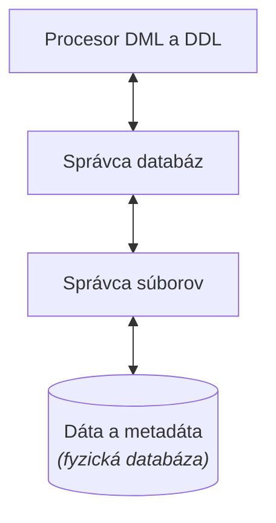
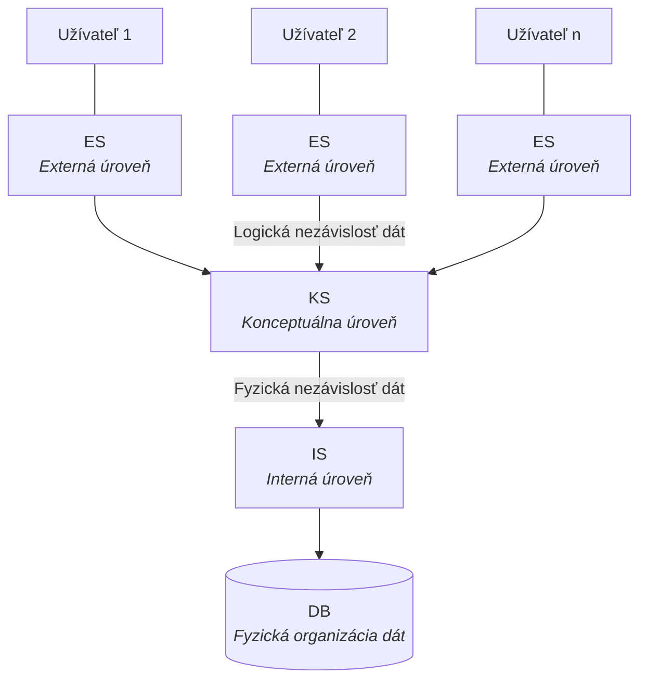
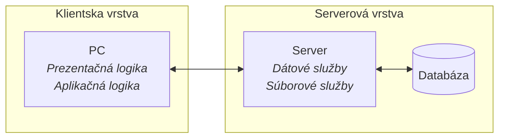
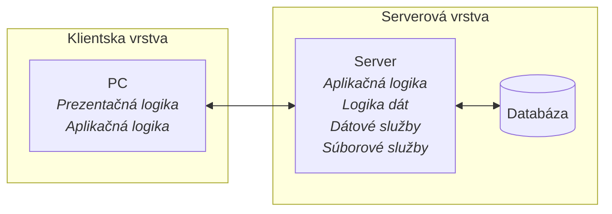
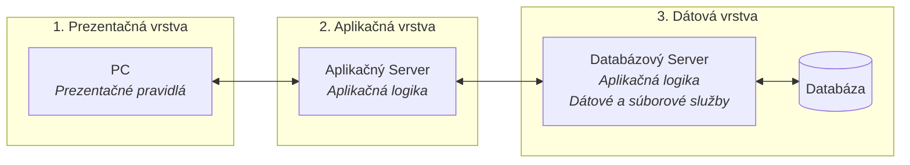

## Databázové systémy

### 9. Princípy databázových systémov. Základné pojmy – databáza, databázový systém, informačný systém, systém riadenia bázy dát, kritéria DBS, modelovanie reality, architektúra ANSI/SPARC, dátové modelovanie.

#### Základné pojmy

**Dáta** sú [[verified: údaje, ktoré je možné spracovať pomocou technických prostriedkov.]]

Predstavujú najnižšiu úroveň informácie a sú odrazom reálneho sveta.

Príklad: meno študenta, jeho známka alebo dátum zápisu v AiS2.

#### Databáza

[[verified: Akékoľvek uložené dáta v elektronickej podobe.]]

[[verified: Množina logicky pospájaných perzistentných dát, ktoré sú organizované podľa určitých pravidiel a popisujú aktuálny stav nejakej predmetnej oblasti pre informačné potreby používateľov.]]

Príklad: v AiS2 sú to samotné údaje o študentoch, predmetoch, zápisoch a známkach.

#### Databázový systém

[[verified: Množina navzájom súvisiacich dát spoločne s programovým vybavením, ktoré umožňuje prístup k dátam.]]

[[verified: DBS = SRBD + DB]]

[[verified: Databázový systém je jadrom informačných systémov.]]

Príklad: databázová vrstva AiS2, ktorá zabezpečuje prácu s akademickými údajmi.

#### Informačný systém

[[verified: Systém pre zber, uchovávanie, spracovanie a vyhľadávanie informácií.]]

[[verified: Zabezpečuje poskytovanie konkrétnej informácie pre konkrétne osoby – naplnenie špecifických informačných potrieb v rámci určitej oblasti.]]

[[verified: Výsledkom informačného systému sú dokumenty, informačné polia, databázy a informačné služby.]]

Príklad: AiS2 ako celý systém pre študentov, učiteľov a študijné oddelenie.

#### Systém riadenia bázy dát

[[verified: Programové vybavenie, ktoré umožní zabezpečiť všetky požadované vlastnosti databázového systému a manipulovať s dátami.]]

Prakticky to znamená, že spravuje prístup, konzistenciu, zálohovanie, transakcie a [[verified: optimalizuje vykonanie dopytov]].



Príklad: Oracle, PostgreSQL, MySQL / MariaDB, MS SQL Server, MongoDB.

#### Kritériá databázového systému

- **[[verified: Oddelenie definície dát a príkazov na manipuláciu s nimi]]** – riešime zvlášť, ako databáza vyzerá, teda jej schému, a zvlášť prácu s obsahom, napríklad vkladanie, úpravu, mazanie alebo vyhľadávanie dát.
- **[[verified: Nezávislosť dát na programoch]]** – program má pracovať s databázou cez jej rozhranie, nie byť závislý od detailov jej uloženia. Zmeny v databáze preto nemajú automaticky znamenať prepis aplikácie.
- **[[verified: Procedurálne a neprocedurálne rozhranie]]** – pri procedurálnom prístupe určujeme **ako** sa má výsledok získať, pri neprocedurálnom určujeme iba **čo** chceme získať. Procedurálny príklad je postupné prechádzanie záznamov v cykle; neprocedurálny príklad je SQL dopyt typu `SELECT * FROM zakaznici WHERE mesto = 'Bratislava'`.
- **[[verified: Minimalizácia redundancie dát]]** – tie isté údaje sa nemajú zbytočne opakovať, aby sa šetrilo miesto a znížilo riziko nekonzistencie.
- **[[verified: Konzistentnosť dát]]** – rovnaký údaj má mať všade rovnakú hodnotu – zmeny nesmú vytvárať rozpory medzi uloženými dátami.
- **[[verified: Integritné obmedzenia]]** – explicitne zadané pravidlá určujú, ktoré hodnoty a vzťahy sú v databáze dovolené.
- **[[verified: Zdieľanie dát]]** – viac používateľov alebo aplikácií pracuje s rovnakými dátami z jedného spoločného zdroja.
- **[[verified: Bezpečný prístup k dátam]]** – databáza musí chrániť údaje pred neoprávneným čítaním, zmenou alebo zneužitím.
- **[[verified: Viacnásobná využiteľnosť]]** – tie isté dáta sa dajú použiť rôznymi spôsobmi pre rôzne pohľady, úlohy a aplikácie.

#### Modelovanie reality

Modelovanie reality predstavuje [[verified: abstraktný pohľad na dáta]]. Údajová základňa pri ňom vytvára model reálneho sveta a v procese návrhu informačného systému sa spája návrh databázy s návrhom programového vybavenia.

Hlavné úlohy modelovania reality:

- **[[verified: Určiť podstatné charakteristiky sveta]]** – teda ktoré objekty a vlastnosti sú pre systém dôležité.
- **[[verified: Určiť vzťahy medzi nimi]]** – teda ako spolu jednotlivé objekty súvisia.

Základné úrovne abstrakcie:

1. **[[verified: Fyzická úroveň]]** – spôsob fyzického uloženia a organizácie dát.
2. **[[verified: Konceptuálna úroveň]]** – všeobecný model reality nezávislý od konkrétneho používateľského pohľadu.
3. **[[verified: Úroveň pohľadov]]** – rôzne používateľské pohľady na tie isté dáta podľa potrieb konkrétnej aplikácie alebo používateľa.

Toto vrstvenie priamo súvisí s architektúrou ANSI/SPARC.

#### Architektúra ANSI/SPARC

Architektúra ANSI/SPARC je [[verified: 3-úrovňová architektúra]] databázových systémov, ktorá oddeľuje **externú**, **konceptuálnu** a **internú** úroveň databázy. Jej cieľom je **oddeliť používateľský pohľad na dáta od ich fyzického uloženia**.



**[[verified: Externá úroveň (ES)]]**

Používateľské pohľady na dáta. Každý používateľ alebo aplikácia môže mať vlastnú predstavu o tých istých dátach a vlastný spôsob prístupu k databáze.

**[[verified: Konceptuálna úroveň (KS)]]**

Logická štruktúra celej databázy z pohľadu analytikov a návrhárov. Popisuje entity, atribúty, vzťahy a obmedzenia. [[verified: KS nie je súčtom jednotlivých ES, vzniká ich integráciou.]] - konceptuálna schéma nie je len mechanicky zlepený zoznam používateľských pohľadov, ale jeden spoločný model databázy, ktorý z nich vyberá a zjednocuje podstatné dáta.

**[[verified: Interná úroveň (IS)]]**

Fyzická realizácia databázy. Obsahuje opis štruktúry dát a organizácie súborov používaných na uloženie dát. Rieši konkrétne uloženie dát: súbory, bloky, indexy a prístupové metódy.

Zmyslom rozdelenia je dátová nezávislosť:

- **[[verified: Logická nezávislosť dát]]** – zmeny v konceptuálnej schéme sa nemajú prejaviť na externých schémach používateľov.
- **[[verified: Fyzická nezávislosť dát]]** – zmeny v internej schéme sa nemajú prejaviť na konceptuálnej ani externej úrovni.

#### Dátové modelovanie

[[verified: Dátový model je reprezentácia reálnych objektov, vzťahov medzi nimi, sémantiky a integritných obmedzení pomocou konceptuálnych nástrojov.]] Dátové modelovanie je proces, ktorým sa realita postupne prevádza na schému databázy.

Pri návrhu databázy sa prechádza tromi úrovňami:

**[[verified: Konceptuálny model]]**

Opisuje informačné objekty, vzťahy a obmedzenia **bez orientácie na konkrétne SRBD**. Pracuje s entitami, reláciami a atribútmi, typickými nástrojmi sú **ER model** a **UML**. V tejto fáze sa riešia aj požiadavky na vstupné a výstupné údaje.

**[[verified: Logický model]]**

Vzniká transformáciou konceptuálneho modelu podľa formálnych pravidiel do zvoleného dátového modelu (napr. relačného), stále **bez väzby na konkrétne SRBD**. Patrí sem aj **normalizácia relačných vzťahov**.

**[[verified: Fyzický model]]**

Dopĺňa detaily pre konkrétne SRBD. Určuje konkrétnu schému databázy, dátové typy, spôsob ukladania dát, metódy prístupu k dátam a indexy.

Základné kroky konceptuálneho návrhu:

1. **[[verified: Identifikácia entít]]**
2. **[[verified: Identifikácia relácií]]**
3. **[[verified: Identifikácia atribútov a ich priradenie entitám]]**
4. **[[verified: Identifikácia primárnych a alternatívnych kľúčov]]**
5. **[[verified: Kontrola redundancie]]**
6. **[[verified: Validácia]]**

Na zapamätanie podľa úrovní modelovania:

- **[[verified: Názvy entít, relácie a atribúty]]** riešime už na konceptuálnej a logickej úrovni.
- **[[verified: Primárne kľúče]]** sa objavujú v logickom modeli a prenášajú sa do fyzického modelu.
- **[[verified: Cudzie kľúče, mená tabuliek, názvy stĺpcov a dátové typy]]** patria do fyzického modelu.

### 10. Dátové modely a návrh relačných databáz. Rozdelenie dátových modelov, relačný dátový model, relačná algebra, entitno-relačný diagram, entita, relácia, atribút, kľúče, kardinalita, parcialita, transformácia ERD do relačnej schémy, normalizácia a normálové formy.

#### Rozdelenie dátových modelov

[[verified: Cieľom dátových modelov je zobraziť údaje takým spôsobom, aby bolo možné tento model použiť pri projektovaní databázy.]]

Dátové modely sa delia na:

**[[verified: Logické modely založené na objektoch]]**

- [[verified: Patria na logickú úroveň a úroveň pohľadov.]]
- [[verified: Zameriavajú sa na to, čo je zastúpené v databáze, nie ako je to zastúpené.]]
- [[verified: Patria sem entitno-relačné modely, objektovo-orientované modely a funkcionálne modely.]]

Typy:

- **[[verified: entitno-relačné modely]]**
- **[[verified: objektovo-orientované modely]]**
- **[[verified: funkcionálne modely]]**

**[[verified: Logické modely založené na záznamoch]]**

- [[verified: Patria na logickú úroveň a úroveň pohľadov.]]
- [[verified: Zameriavajú sa na realizáciu štruktúry dát.]]

[[verified: Najvýznamnejšie modely sú:]]

- **[[verified: Sieťový model]]**
- **[[verified: Hierarchický model]]**
- **[[verified: Relačný model]]**

**[[verified: Fyzické modely]]**

- [[verified: Používajú sa na internej úrovni.]]
- Riešia konkrétnu realizáciu uloženia dát.

##### [[verified: Hierarchický model]]

- **[[verified: Zobrazuje dáta pomocou stromovej štruktúry – základné prvky sú uzly, vetvy a listy.]]**
- **[[verified: Každý uzol na nižšej úrovni je spojený iba s jedným uzlom na vyššej úrovni – ide o vzťah rodič-dieťa typu 1:N – jednosmerný.]]**
- **[[verified: Hierarchický strom má len jeden koreňový uzol]]** – počet stromov v databáze zodpovedá počtu koreňových uzlov.
- Výhoda modelu je jednoduchosť pre prirodzene stromové dáta.
- Nevýhody: pevná štruktúra, ťažká zmena rodičovských vzťahov, zložitá realizácia **N:M** a pomalší prístup k údajom na nižších úrovniach.

##### [[verified: Sieťový dátový model]]

- **[[verified: Je podobný hierarchickému modelu, ale jeden člen môže mať viac vlastníkov]]** – tým prirodzene podporuje aj vzťahy **N:M**.
- **[[verified: Je založený na ukazovateľoch.]]**
- **[[verified: Môže obsahovať aj cykly a slučky.]]**
- Výhody: rýchlosť, flexibilita a lepšia práca so zložitejšími vzťahmi než pri hierarchickom modeli.
- Nevýhody: zložitosť a pevné ukazovatele, takže nové spôsoby využitia dát často vyžadujú zásah do štruktúry databázy.

#### Relačný dátový model

[[verified: Relačný dátový model navrhol E. F. Codd v roku 1970.]] Má vyššiu úroveň abstrakcie než hierarchický a sieťový model, reprezentácia dát je nezávislá od ich fyzickej organizácie a model je založený na **teórii relácií**, **množinovom prístupe** a **relačnej algebre**. Zahŕňa aj **teóriu normalizácie**.

Jeho cieľom je:

- **[[verified: zabezpečiť vysoký stupeň dátovej nezávislosti]]**
- **[[verified: minimalizovať redundanciu dát pri zachovaní konzistencie]]**
- **[[verified: sprístupniť databázu množinovo orientovaným neprocedurálnym jazykom]]**
- **[[verified: umožniť jednoduchú reštrukturalizáciu a rast dátového modelu]]**

Štrukturálna časť relačného modelu pracuje s tabuľkami (**reláciami**), kde:

- **Riadok** = jeden záznam.
- **Stĺpec (atribút)** = vlastnosť záznamu.
- **Schéma relácie** = názov tabuľky + zoznam atribútov s doménami (typmi).

Hlavné vlastnosti:

- **[[verified: Jediná informačná štruktúra je tabuľka]]**
- **Poradie riadkov a stĺpcov nie je dôležité** (množinový prístup).
- **Každý riadok je jedinečný** – identifikuje ho primárny kľúč.
- **Každá bunka obsahuje atomickú hodnotu**.
- **Vzťahy medzi tabuľkami** sa realizujú cez **cudzie kľúče**.

#### Relačná algebra

[[verified: Riadiaca časť relačného dátového modelu definuje dva základné mechanizmy pre manipuláciu s údajmi: relačnú algebru a relačný kalkul.]]

Relačná algebra je teoretickým základom SQL: každý SQL dopyt sa dá preložiť na kombináciu relačných operácií, čo využíva **optimalizátor dopytov**.

Je to formálny jazyk operácií nad reláciami. Každá operácia berie jednu alebo viac relácií a vracia novú reláciu. Základné operátory:

- **Selekcia (σ)** – výber riadkov podľa podmienky (`σ vek > 18 (Osoba)`).
- **Projekcia (π)** – výber stĺpcov (`π meno, email (Osoba)`).
- **Kartézsky súčin (×)** – všetky dvojice riadkov z dvoch relácií.
- **Spojenie (⋈, join)** – kombinácia relácií podľa zhodných hodnôt atribútov.
- **Zjednotenie (∪), prienik (∩), rozdiel (−)** – množinové operácie nad reláciami s rovnakou schémou.
- **Premenovanie (ρ)** – zmena mena relácie alebo atribútu.
- **Delenie (÷)** – „pre každé X platí Y“ dopyty.

#### Entitno-relačný diagram (ERD)

[[verified: Nástroj pre opis schémy alebo štruktúry databázy.]]

[[verified: Informácia o entitách, atribútoch a vzťahoch má len abstraktný charakter.]]

[[verified: Obsah ER diagramu nemôže byť priamo uložený do databázy – štruktúra musí byť prevedená do fyzickej formy.]]

#### Entita

[[verified: Entita predstavuje objekt reálneho sveta, ktorý má charakteristické vlastnosti.]]

[[verified: Môže byť fyzická alebo abstraktná.]]

[[verified: Označuje sa v jednotnom čísle, pretože predstavuje typ a nie konkrétne objekty.]]

Vlastnosti entity:

- **[[verified: musí mať jedinečné meno s tou istou interpretáciou]]**
- **[[verified: musí mať jeden alebo viac atribútov]]**
- **[[verified: musí mať jeden alebo niekoľko jedinečných kľúčov]]**
- **[[verified: môže mať ľubovoľný počet vzťahov s inými entitami]]**

#### Relácia

[[verified: Vzťah definuje, v akom spojení sú dve alebo viac entít.]]

[[verified: Vzťahy sa označujú slovesom, ktoré spája dve alebo viac podstatných mien.]]

[[verified: Vzťahová množina je matematická relácia nad množinami entít.]]

[[verified: Atribút môže patriť do vzťahovej množiny.]]

#### Atribút

[[verified: Množina atribútov popisuje vlastnosti entít.]]

[[verified: Je základnou časťou informácie uloženej v databáze.]]

Atribúty môžu byť:

- **[[verified: Atomické]]** – pozostávajú z jednej zložky, ktorá sa ďalej nedelí.
- **[[verified: Kompozitné]]** – skladajú sa z viacerých položiek.
- **[[verified: Skonštruované]]** – existujú len v databáze, napríklad identifikátory.
- **[[verified: Derivované]]** – ich hodnota sa určuje z hodnôt iných atribútov.
- **[[verified: Kľúčové]]** – slúžia na jednoznačnú identifikáciu.
- **[[verified: Voliteľné]]** – určujú, či je atribút povinný alebo nepovinný.

Integritné obmedzenia atribútov:

- **[[verified: Veľkosť]]** – počet znakov, formát, doména.
- **[[verified: Množina hodnôt]]**
- **[[verified: Definovanie kľúčového atribútu]]**
- **[[verified: Povinná hodnota]]**

#### Kľúče

[[verified: Kľúč je atribút alebo množina atribútov, ktorá jednoznačne identifikuje konkrétny riadok v tabuľke.]]

**Primárny kľúč (PK)**

- [[verified: Slúži na odlíšenie entít – jednoznačne identifikuje entity.]]
- [[verified: Pre dva rôzne riadky neexistujú rovnaké hodnoty týchto atribútov.]]
- [[verified: Atribúty, ktoré sú súčasťou primárneho kľúča, sa nazývajú kľúčové; ostatné sú nekľúčové.]]
- [[verified: Každá schéma musí mať definovaný kľúčový atribút.]]
- [[verified: Primárny kľúč nemôže mať prázdnu hodnotu – NULL.]]
- [[verified: Jednoduchý kľúč obsahuje jeden atribút, kompozitný kľúč obsahuje viac ako jeden atribút.]]
- [[verified: Slabé entity nemajú dostatok atribútov na vytvorenie primárneho kľúča; silné entity ho vytvoriť vedia.]]

**Cudzí kľúč (FK)**

- [[verified: Cudzí kľúč jednoznačne identifikuje záznam v inej tabuľke na základe jej primárneho kľúča.]]
- [[verified: Foreign Key je stĺpec alebo skupina stĺpcov, pomocou ktorého je možné spojiť príslušný riadok v nadradenej tabuľke s riadkom obsahujúcim zodpovedajúcu hodnotu v podriadenej tabuľke.]]
- [[verified: Vzťah sa určuje na základe spojenia medzi primárnym a cudzím kľúčom.]]
- [[verified: Primárny kľúč entity na strane 1 sa pridáva ako cudzí kľúč do entity na strane N.]]
- [[verified: NULL znamená, že vzťah je nepovinný; NOT NULL znamená, že vzťah je povinný.]]

**Kandidátsky kľúč**

- [[verified: Atribút, ktorý by mohol spĺňať funkciu kľúčových hodnôt.]]

**Alternatívny kľúč**

- [[verified: Nie je zvolený za primárny, ale dokáže jednoznačne identifikovať entitu.]]
- [[verified: Môže plnohodnotne nahradiť primárny kľúč.]]

#### Kardinalita

[[verified: Kardinalita sa určuje pri každom vzťahu medzi entitami.]] [[verified: Vyjadruje počet entít, ktoré môžu byť viazané s inou entitou na základe relácie.]] [[verified: Je základným krokom pri návrhu E-R diagramu.]] [[verified: Nesprávne určená kardinalita vedie k duplicite údajov, nekonzistentnosti, redundancii a problémom s údržbou databázy.]]

Základné typy kardinality:

- **[[verified: 1:1]]** – každému riadku v tabuľke A môže prislúchať najviac jeden riadok z tabuľky B a naopak.
- **[[verified: 1:N]]** – [[verified: najviac používaný typ]]; každému riadku v tabuľke A môže zodpovedať viac riadkov z tabuľky B, pričom každému riadku z tabuľky B zodpovedá najviac jeden riadok z tabuľky A.
- **[[verified: M:N]]** – každému riadku z tabuľky A môže byť priradených niekoľko riadkov z tabuľky B a naopak. Vo fyzickej schéme preto vzniká tretia tabuľka, ktorá obsahuje minimálne informáciu o kľúčových atribútoch.

#### Parcialita

[[verified: Určuje existenciu vo vzťahoch medzi entitami.]]

Existencia môže byť:

- [[verified: povinná – všetky výskyty účastníka musia byť zapojené do príslušného vzťahu.]]
- [[verified: nepovinná – jednotlivé výskyty entity môžu byť zapojené do daného vzťahu.]]
- [[verified: neznáma]]

#### Transformácia ERD do relačnej schémy

Konceptuálny ERD sa prevedie na konkrétne tabuľky podľa jednoduchých pravidiel:

- **Každá entita → tabuľka**, atribúty sa stanú stĺpcami, identifikátor PK.
- **Vzťah 1:N** → do tabuľky na „N“ strane sa pridá **cudzí kľúč** odkazujúci na PK „1“ strany.
- **Vzťah M:N** → vytvorí sa **väzobná tabuľka** s dvoma cudzími kľúčmi, ktoré spolu tvoria zložený PK.
- **Vzťah 1:1** → cudzí kľúč sa umiestni do jednej z tabuliek (typicky tam, kde je voliteľná účasť).
- **Slabá entita** → tabuľka s cudzím kľúčom na silnú entitu, ktorý je súčasťou PK.
- **Viachodnotový atribút** → samostatná tabuľka s cudzím kľúčom.

#### Normalizácia a normálové formy

Normalizácia je proces rozkladu tabuliek tak, aby sa **odstránila redundancia** a **anomálie** (pri vkladaní, mazaní, aktualizácii). Hlavné normálové formy:

- **1NF** – každá bunka obsahuje **atomickú hodnotu** (žiadne zoznamy, žiadne JSON-y). Tabuľka má PK.
- **2NF** – je v 1NF a **každý neklúčový atribút závisí od celého PK** – odstraňuje **čiastočné závislosti** (relevantné len pri zloženom PK).
- **3NF** – je v 2NF a **žiadny neklúčový atribút nezávisí od iného neklúčového atribútu** – odstraňuje **tranzitívne závislosti**.
- **BCNF (Boyce-Codd)** – striktnejšia 3NF: každý **determinant** je kandidátny kľúč.
- **4NF, 5NF** – odstraňujú viacznačné a join závislosti, v praxi zriedkavé.

V praxi sa zvyčajne **cieli na 3NF alebo BCNF**. Pri analytických systémoch (data warehouse) sa zámerne robí **denormalizácia** – vedomé porušenie 3NF pre lepší výkon dopytov.

### 11. SQL a PLSQL. SQL jazyk, štandardy, optimalizácia, relačné a množinové operátory, vnútorné a vonkajšie spojenia, prostredie a štruktúra PLSQL, trigger, cykly, procedúry a funkcie.

#### SQL jazyk

SQL (Structured Query Language) je deklaratívny jazyk na prácu s relačnými databázami – povieme *čo chceme*, nie *ako to získať*. V praxi existujú rôzne implementácie SQL podľa konkrétneho databázového systému.

Podľa účelu sa SQL delí na štyri podjazyky:

- **DDL (Data Definition Language)** – definícia štruktúry: `CREATE TABLE`, `ALTER TABLE`, `DROP TABLE`, `CREATE INDEX`.
- **DML (Data Manipulation Language)** – práca s dátami: `SELECT`, `INSERT`, `UPDATE`, `DELETE`.
- **DCL (Data Control Language)** – riadenie prístupu: `GRANT`, `REVOKE`.
- **TCL (Transaction Control Language)** – riadenie transakcií: `COMMIT`, `ROLLBACK`, `SAVEPOINT`.

#### Štandardy

SQL je definovaný štandardom **ISO/IEC 9075**. Štandard určuje spoločné jadro jazyka, ale konkrétne databázové systémy používajú vlastné **dialekty SQL** s menšími rozdielmi v syntaxi, funkciách a dátových typoch.

#### Optimalizácia

Optimalizátor dopytov sa stará o to, aby sa SQL dopyt preložil na čo najefektívnejší plán vykonania.

Každý DBMS obsahuje **optimalizátor dopytov** (query optimizer), ktorý z SQL dopytu vygeneruje **plán vykonania** (execution plan) – strom fyzických operácií (index scan, table scan, hash join, merge join a iné). Cieľom je zvoliť plán s **najnižšími očakávanými nákladmi** (CPU, I/O, pamäť).

Hlavné nástroje optimalizácie:

- **Indexy** – B-tree, hash, bitmap – výrazne zrýchľujú `WHERE` a `JOIN`.
- **Štatistiky** – optimalizátor si udržuje histogramy rozloženia dát v tabuľkách.
- **Execution plán** (`EXPLAIN`, `EXPLAIN ANALYZE`) – ukáže, ako sa dopyt reálne vykoná a kde je úzke miesto.
- **Prepis dopytov** – použitie `JOIN` namiesto poddopytov, vyhýbanie sa `SELECT *`, pridávanie `LIMIT`.
- **Materializované pohľady** (*materialized views*) – predpočítané výsledky pre analytické dopyty.
- **Denormalizácia** – vedomé duplicovanie dát pri OLAP / data warehouse, aby `JOIN`-y neboli úzkym miestom.

#### Relačné a množinové operátory

**Relačné operátory** v SQL priamo vychádzajú z relačnej algebry:

- **Selekcia** → `WHERE`.
- **Projekcia** → zoznam stĺpcov v `SELECT`.
- **Spojenie** → `JOIN`.
- **Premenovanie** → `AS`.
- **Agregácia** → `GROUP BY`, `HAVING`, funkcie `SUM`, `COUNT`, `AVG`, `MAX`, `MIN`.

**Množinové operátory** spájajú výsledky dvoch dopytov s rovnakými stĺpcami:

- `UNION` – zjednotenie bez duplikátov (`UNION ALL` zachová duplikáty).
- `INTERSECT` – prienik.
- `EXCEPT` / `MINUS` – rozdiel: riadky v prvom dopyte, ktoré nie sú v druhom.

#### Vnútorné a vonkajšie spojenia

Kombinácia riadkov z dvoch alebo viacerých tabuliek podľa spoločných hodnôt:

- `INNER JOIN` – len riadky, kde existuje zhoda v oboch tabuľkách.
- `LEFT OUTER JOIN` – všetky riadky z ľavej tabuľky + zhody z pravej (ak zhoda nie je, doplní `NULL`).
- `RIGHT OUTER JOIN` – zrkadlovo: všetky riadky z pravej.
- `FULL OUTER JOIN` – všetky riadky z oboch tabuliek, chýbajúce strany doplní `NULL`.
- `CROSS JOIN` – kartézsky súčin (každý s každým) bez podmienky.
- `SELF JOIN` – tabuľka spojená sama so sebou (napr. zamestnanec a jeho nadriadený v tej istej tabuľke).

#### Prostredie a štruktúra PLSQL

**PL/SQL (Procedural Language / SQL)** je procedurálne rozšírenie SQL od Oracle, ktoré dovoľuje písať cykly, podmienky, procedúry, funkcie a triggery priamo v databáze. Analogické rozšírenia majú aj iné DBMS, napríklad **T-SQL** v MS SQL Serveri alebo **PL/pgSQL** v PostgreSQL.

Štruktúra bloku PL/SQL:

```sql
DECLARE
    -- deklarácie premenných, typov, kurzorov
BEGIN
    -- výkonná časť (SQL + riadiace konštrukcie)
EXCEPTION
    -- spracovanie výnimiek
END;
```

Hlavné prvky: premenné, typy (vrátane `%TYPE` a `%ROWTYPE`, ktoré preberú typ zo stĺpca tabuľky), kurzory na iteráciu cez výsledky dopytu, výnimky (`EXCEPTION WHEN ... THEN`), riadenie transakcií.

#### Trigger

**Trigger** je PL/SQL blok, ktorý sa **automaticky vyvolá** pri definovanej udalosti na tabuľke: `BEFORE` alebo `AFTER` operácie `INSERT`, `UPDATE` alebo `DELETE`. Má prístup k **novým a starým hodnotám** cez pseudonymy `:NEW` a `:OLD`.

Typické použitie:

- **Audit log** – pri každej zmene sa zapíše záznam do auditnej tabuľky.
- **Derivované hodnoty** – automatické dopočítanie stĺpca (napr. `total = cena × množstvo`).
- **Validácia zložitých obmedzení**, ktoré sa nedajú vyjadriť cez `CHECK`.
- **Kaskádové zmeny** – pri zmazaní zákazníka zmazať jeho objednávky.

Nevýhodou triggerov je, že časť logiky sa vykonáva automaticky na pozadí, preto môže byť ťažšie sledovať, čo presne sa pri zmene dát stalo.

#### Cykly

PL/SQL podporuje tri typy cyklov a klasické riadenie toku:

- **Základný `LOOP`** – s explicitným `EXIT WHEN podmienka` alebo `EXIT` v tele.
- **`WHILE` cyklus** – pokračuje, kým platí podmienka.
- **`FOR` cyklus** – numerický (`FOR i IN 1..10 LOOP`) alebo **kurzorový** (`FOR r IN (SELECT ...) LOOP`).

Podmienené vetvenie cez `IF ... ELSIF ... ELSE ... END IF`, alebo `CASE` výraz (podobne ako v SQL).

#### Procedúry a funkcie

**Procedúra** – pomenovaný PL/SQL blok volaný s parametrami. Nevracia hodnotu priamo (iba cez `OUT` parametre). Typicky sa používa na zapuzdrenie business logiky nad dátami.

**Funkcia** – pomenovaný blok, ktorý **vracia hodnotu** cez `RETURN`. Dá sa použiť priamo v SQL dopyte (napr. v `SELECT`-e). Typicky sa používa na výpočet odvodenej hodnoty.

```sql
CREATE PROCEDURE zvys_plat(p_id IN NUMBER, p_suma IN NUMBER) IS
BEGIN
    UPDATE zamestnanci
       SET plat = plat + p_suma
     WHERE id = p_id;
END;
```

Parametre môžu byť typu `IN` (vstup), `OUT` (výstup) alebo `IN OUT` (oboje).

### 12. Databázová architektúra. Architektúra klient/server – dvoj a trojúrovňová.

#### Databázová architektúra

Databázová architektúra opisuje, ako je databázový systém rozložený medzi používateľa, aplikáciu a databázový server. Inak povedané, určuje, kde beží používateľské rozhranie, kde sa spracúva aplikačná logika a kde sú fyzicky uložené dáta.

[[verified: Typ architektúry závisí:]]

- [[verified: Typ DB a jej spôsob využitia]]
- [[verified: Technologické a finančné možnosti]]
- [[verified: Typ spracovaných dát]]
- [[verified: Počet užívateľov]] 

[[verified: Typy architektúr:]]

- **[[verified: Jednovrstvová]]** – všetko od spracovania až po dáta beží na centrálnom počítači.
- **[[verified: Dvojvrstvová]]** – známa ako dvojúrovňový klient/server alebo file-server.
- **[[verified: Viacvrstvová]]** – typicky trojúrovňová, kde sa pridáva samostatný aplikačný server.

#### Architektúra klient/server

Model klient/server predstavuje [[verified: rozdelenie kompetencií medzi dva procesy, ktoré pracujú nezávisle na sebe]]. Tieto [[verified: dva navzájom pôsobiace samostatné procesy – klient a server]] – môžu byť na rôznych počítačoch, pričom údaje si posielajú po sieti.

**[[verified: Proces klient (front-end)]]**

- Ide o [[verified: proces, ktorý je prevádzkovaný na užívateľských staniciach]].
- Jeho [[verified: hlavná úloha je predávať užívateľské požiadavky serveru a prezentovať výsledky]].
- [[verified: Proces nemá prístup k databáze, slúži iba ako určitý sprostredkovateľ]]. Keď užívateľ zadá požiadavku, [[verified: dopyt sa pomocou jazyka SQL posúva na databázový server]].

**[[verified: Proces server (back-end)]]**

- Ide o [[verified: proces, ktorý vykonáva a obstaráva všetky databázové operácie]].
- Tento proces [[verified: zodpovedá za udržovanie konzistencie, integrity dát a autorizáciu prihlasovaných užívateľov]].
- Z hľadiska výkonu je to [[verified: najviac zaťažený prvok v systéme – musí byť na dostatočne výkonnom počítači]].
- Po spracovaní [[verified: server vracia na klienta iba tie dáta, ktoré sú bezpodmienečne nutné pre ďalšie spracovanie]].

Hlavné výhody:

- **[[verified: Spoľahlivosť]]** – databázový server upravuje dáta na základe mechanizmu transakcií, ktorý má nasledujúce vlastnosti:
  - **[[verified: Celistvosť]]** – pri akýchkoľvek okolnostiach budú operácie transakcie buď splnené alebo nebude splnená ani jedna operácia (zabezpečí sa celistvosť dát).
  - **[[verified: Nezávislosť]]** – transakcie, ktoré sú spustené rôznymi užívateľmi, sa nemiešajú navzájom.
  - **[[verified: Stabilita]]** – všetky výsledky po ukončení transakcií sa zachovávajú. Server centrálne kontroluje transakcie, čo je oveľa efektívnejšie než na osobných počítačoch.
- **[[verified: Odolnosť voči zlyhaniu]]** – zatiaľ čo [[verified: zlyhanie v systéme File server na akejkoľvek pracovnej stanici môže spôsobiť stratu údajov a ich nedostupnosť]], [[verified: zlyhanie systému Klient/Server sa prakticky nikdy neodrazí na integrite dát a ich dostupnosti pre iných klientov]].
- **[[verified: Rozšíriteľnosť]]** – [[verified: adaptácia systému pri raste množstva užívateľov a objemu spracovania dát]] (môže podporovať tisícky užívateľov a stovky GB informácií).
- **[[verified: Bezpečnosť]]** – [[verified: poskytuje výkonnú ochranu dát pred neoprávneným prístupom]]:
  - [[verified: Práva pre prístup sa dajú administrovať až na polia v tabuľke.]]
  - [[verified: Je možné úplne zakázať priamy prístup k tabuľkám.]]
  - [[verified: Interakcia medzi užívateľom a dátami je vykonaná pomocou dočasných objektov, napr. pohľadov.]]
- **[[verified: Flexibilita]]** – aplikácia, ktorá pracuje s údajmi, má tri logické úrovne:
  - **[[verified: Užívateľské rozhranie (presentation rules)]]** – zobrazovanie informácie užívateľom.
  - **[[verified: Logika aplikácie (business rules)]]** – zabezpečuje aplikačnú logiku.
  - **[[verified: Riadenie dátami (data rules)]]** – dátové služby a logika dát (manipulácia s dátami v databáze a transakčné spracovanie).

Rozdiel medzi dvojúrovňovou a trojúrovňovou architektúrou je najmä v tom, **kde je umiestnená aplikačná logika**.

#### Dvojúrovňová architektúra

V rámci dvojvrstvovej architektúry je podstatný ten evolučný skok – začínalo sa s architektúrou **File-Server**. Tam bol server len úložiskom súborov a samotný systém riadenia bázy dát (DBMS) bežal priamo na klientovi. Keď klient chcel vyfiltrovať dáta, musel si stiahnuť celý súbor cez sieť a spracovať ho u seba, čo podstatne zahlcovalo sieť. 

Revolúcia prišla až s moderným modelom **Klient/Server**, kedy sa DBMS presunul na server a klient komunikuje **priamo s databázovým serverom**. Klient len pošle SQL dopyt a po sieti sa vráti už len zopár konkrétnych vyfiltrovaných riadkov.

Pre túto architektúru je typické:

- **[[verified: Aplikácie na vytváranie užívateľského rozhrania sa realizujú na strane klienta.]]**
- **[[verified: Funkcie riadenia dát na strane servera.]]**
- **[[verified: Logiku aplikácie je možné realizovať ako na strane servera (procedúry, triggery, pohľady), tak aj na strane klienta.]]**

Vlastnosti:

- **[[verified: Najpoužívanejší model – väčšina dnešných klient/server konfigurácií je založená na tomto modeli.]]**
- **[[verified: Poskytuje najlepšiu rozšíriteľnosť]]**
- Je pomerne jednoduchá na návrh aj nasadenie.
- Hodí sa najmä pre menší alebo uzavretý okruh používateľov.
- Klient väčšinou potrebuje ovládač a priame spojenie s databázou.

V dvojúrovňovej architektúre sa rozlišujú dva typické varianty:

**[[verified: Klient Heavy]]**

[[verified: Prezentačná logika a aplikačná sa nachádza na klientskej stanici a dátová logika sa nachádza na serveri.]] [[verified: Väčšina spracovania prebieha na strane klienta.]]



**[[verified: Server Heavy]]**

[[verified: Časť aplikačnej logiky je presunutá na server a prezentačná logika ostáva na strane klienta, dátová logika sa nachádza na serveri.]] [[verified: Väčšina služieb prebieha na strane servera.]]



[[verified: Logiku aplikácie je možné realizovať ako na strane servera (procedúry, triggery, pohľady), tak aj na strane klienta.]]

#### Trojúrovňová architektúra

[[verified: Rieši niektoré nedostatky dvojúrovňovej architektúry.]] [[verified: Vzniká tretia úroveň – realizuje aplikačnú logiku.]]



Jednotlivé vrstvy:

- **Prezentačná vrstva** – klient, ktorý komunikuje s používateľom.
- **Aplikačná vrstva** – aplikačný server, ktorý vykonáva business logiku.
- **Dátová vrstva** – databázový server, ktorý manipuluje s vlastnými dátami.

Kľúčové vlastnosti viacúrovňovej architektúry:
- **[[verified: DB server manipuluje s vlastnými dátami a plní požiadavky smerované z aplikačného servera.]]**
- **[[verified: Prezentačné pravidlá, aplikačná a dátová logika komunikujú prostredníctvom štandardizovaných rozhraní.]]**
- **[[verified: Odľahčenie klientskych staníc a servera.]]**


---
