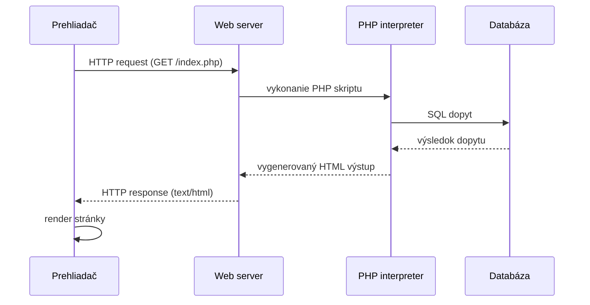

## Internetové technológie

### 13. [Jazyk HTML5](#q-13-jazyk-html5) základná štruktúra dokumentu, typ dokumentu – základné časti a príklady použitia, sémantické elementy jazyka HTML5, [syntax jazyka](#q-13-syntax-jazyka), rozdelenie html značiek, pojem atribút a hodnota, komentáre, odkazy, zoznamy, tabuľky.

#### Jazyk HTML5

HTML5 je značkovací jazyk určený na vytváranie štruktúry a významu obsahu webovej stránky. Pomocou elementov opisuje jednotlivé časti dokumentu, napríklad nadpisy, odseky, odkazy, zoznamy a tabuľky. Dôležitú úlohu majú aj sémantické elementy, ktoré vyjadrujú význam obsahu.

#### Základná štruktúra dokumentu

Základnú štruktúru HTML5 dokumentu tvorí **deklarácia** `<!DOCTYPE html>`, **koreňový element** `<html>`, hlavička `<head>` s metadátami a telo `<body>` s viditeľným obsahom. V `<head>` sa uvádzajú napríklad názov stránky, metadáta alebo odkazy na štýly, v `<body>` je samotný obsah stránky. Prehliadač si vie pri parsovaní niektoré chýbajúce časti doplniť automaticky, ale správna úplná podoba dokumentu obsahuje všetky tieto základné časti.

```html
<!DOCTYPE html>
<html>
  <head>
    <title>
      Moja stránka
    </title>
  </head>
  <body>
    Obsah stránky
  </body>
</html>
```

#### Typ dokumentu – základné časti a príklady použitia

`<!DOCTYPE html>` oznamuje prehliadaču, že dokument je v štandarde HTML5 a má sa renderovať v *standards mode*. Musí byť úplne prvým riadkom súboru. Inak sa prehliadač prepne do *quirks mode* a správa sa kompatibilne so starými, neštandardnými webmi – rozloženie potom býva nepredvídateľné.

#### Sémantické elementy jazyka HTML5

Sémantické elementy nesú **význam**, nielen vizuálne členenie dokumentu: napr. `<header>`, `<nav>`, `<main>`, `<section>`, `<article>`, `<aside>` a `<footer>`. Oproti generickému `<div>` pomáhajú **prístupnosti** (čítačky), **vyhľadávačom** (SEO) aj **čitateľnosti kódu**.

```html
<header>
  <nav>
    <a href="/">Domov</a>
    <a href="/o-nas">O nás</a>
    <a href="/kontakt">Kontakt</a>
  </nav>
</header>
```

#### Syntax jazyka

HTML dokument sa skladá zo **značiek** (tagov) zapisovaných v lomených zátvorkách. Elementy môžu byť **párové** (napr. `<p>text</p>`) alebo **nepárové** (napr. `<br>`). Do otváracej značky sa zapisujú **atribúty** a ich hodnoty.

```html
<p>Toto je prvý paragraf.</p>
<br>
<p>Toto je druhý paragraf.</p>
```

#### Rozdelenie HTML značiek

Značky možno deliť podľa spôsobu zobrazenia na **blokové** a **riadkové**. **Blokové elementy** začínajú na novom riadku a zaberajú spravidla celú dostupnú šírku, napr. `<div>`, `<p>`, nadpisy či zoznamy. **Riadkové elementy** ostávajú v rámci riadku, napr. `<span>`, `<a>`, `<strong>` alebo ``. Zároveň môžu byť **párové** alebo **nepárové**.

#### Pojem atribút a hodnota

Atribút je doplnková informácia o elemente, ktorá sa zapisuje do otváracej značky v tvare `meno="hodnota"`. Určuje vlastnosti alebo správanie elementu, napr. `href`, `src`, `alt`, `id` alebo `class`.

```html

```

#### Komentáre

Komentáre sa zapisujú medzi `<!--` a `-->` a prehliadač ich pri renderovaní ignoruje. Slúžia na poznámky v kóde alebo dočasné vypnutie časti HTML, no v zdrojovom kóde stránky zostávajú viditeľné.

```html
<!-- lorem ipsum -->
```

#### Odkazy

Element `<a href="...">text</a>` vytvára **hypertextový odkaz**. Atribút `href` určuje cieľ odkazu, ktorý môže byť **absolútny** (`https://example.sk`), **relatívny** (`podstranka.html`) alebo **kotviaci** (`#sekcia`).

```html
<a href="https://example.sk">Absolútny odkaz</a>
<a href="podstranka.html">Relatívny odkaz</a>
<a href="#sekcia">Kotva na časť stránky</a>
```

#### Zoznamy

HTML pozná tri typy: **nezoradený** `<ul>` (odrážky), **zoradený** `<ol>` (číslovaný zoznam) a **definičný** `<dl>` s dvojicami `<dt>` (termín) a `<dd>` (definícia). Položky v `<ul>` a `<ol>` sa zapisujú do `<li>`. Samotné zoznamy sa pritom môžu do seba vnárať.

```html
<ul>
  <li>Prvá položka</li>
  <li>Druhá položka</li>
</ul>
```

#### Tabuľky

Element `<table>` obsahuje **riadky** `<tr>`, v ktorých sú **dátové bunky** `<td>` alebo **hlavičkové bunky** `<th>`. Tabuľka sa môže deliť na `<thead>`, `<tbody>` a `<tfoot>`, pričom bunky možno spájať pomocou `colspan` a `rowspan`.

```html
<table>
  <tr>
    <td>Bunka 1</td>
    <td>Bunka 2</td>
  </tr>
</table>
```

### 14. Multimédia v html, obrázok, obrázok ako odkaz, povinné atribúty, favicon, obrázková mapa, audio a video prvky – vlastnosti.

#### Obrázok

Obrázok sa v HTML vkladá elementom ``. Je to **nepárový element**, čiže nemá samostatnú ukončovaciu značku. V dokumente nevytvára samotný obrázok, iba odkazuje na externý súbor, ktorý má prehliadač načítať a zobraziť.

Základ tvoria dva atribúty:

- `src` – cesta k obrázku,
- `alt` – alternatívny text, ktorý popisuje obrázok, ak sa nenačíta.
- `width` a `height` – rozmery obrázka, vďaka ktorým si prehliadač vie vyhradiť miesto ešte pred jeho načítaním.

```html

```

#### Obrázok ako odkaz

Obrázok môže slúžiť aj ako klikateľný odkaz. V takom prípade je `` obsahom odkazu a cieľ navigácie neurčuje obrázok, ale rodičovský element `<a>` cez atribút `href`.

Takýto zápis sa používa napríklad pri logu stránky, náhľade v galérii alebo reklamnom bannery. Obrázok si stále ponecháva vlastné atribúty ako `src` a `alt`, pretože z pohľadu HTML zostáva obrázkom, iba je vložený do odkazu.

```html
<a href="galeria.html">
  
</a>
```

#### Povinné atribúty

Povinné atribúty nie sú rovnaké pre všetky HTML elementy. Pri multimédiách a odkazoch ide najmä o atribúty, bez ktorých prvok buď vôbec nefunguje, alebo stráca svoj hlavný význam.

- **``** – potrebuje hlavne `src`, teda cestu k obrázku. Atribút `alt` je dôležitý, pretože poskytuje textovú náhradu, keď sa obrázok nenačíta.
- **`<a>`** – ako odkaz dáva zmysel až s atribútom `href`, ktorý určuje cieľ odkazu.
- **`<link rel="icon">`** – favicon potrebuje `rel="icon"` a `href`, teda informáciu, že ide o ikonu stránky a kde sa súbor nachádza.
- **`<map>` a `<area>`** – mapa potrebuje `name`, obrázok sa na ňu napája cez `usemap`; jednotlivé oblasti `<area>` používajú najmä `shape`, `coords` a `href`.
- **`<audio>` a `<video>`** – zdroj média sa určuje cez `src` alebo cez vnorené elementy `<source>`.

#### Favicon

Favicon je malá ikona webovej stránky. Prehliadač ju zobrazuje najmä na karte stránky, v záložkách alebo v histórii prehliadania. Slúži teda ako vizuálna identifikácia stránky.

Do HTML sa pripája v časti `<head>` pomocou elementu `<link>`. Atribút `rel="icon"` hovorí, že pripojený súbor je ikona stránky, a atribút `href` určuje cestu k súboru.

```html
<link rel="icon" href="favicon.ico">
```

#### Obrázková mapa

Obrázková mapa umožňuje rozdeliť jeden obrázok na viacero klikateľných oblastí. Každá oblasť môže viesť na iný odkaz, takže nejde o jeden spoločný link pre celý obrázok, ale o viac samostatných aktívnych častí.

Prepojenie funguje cez dva kroky:

- obrázok má atribút `usemap`, ktorým sa odkazuje na konkrétnu mapu,
- element `<map>` obsahuje jednotlivé klikateľné oblasti definované cez `<area>`.

Pri oblasti `<area>` sú dôležité najmä atribúty `shape`, `coords` a `href`. `shape` určuje tvar oblasti (`rect`, `circle`, `poly`), `coords` určujú jej súradnice v pixeloch a `href` určuje cieľ odkazu.

```html


<map name="plan">
  <area shape="rect" coords="20,30,120,90" href="miestnost-a.html">
  <area shape="circle" coords="200,80,40" href="miestnost-b.html">
</map>
```

#### Audio a video prvky – vlastnosti

Elementy `<audio>` a `<video>` umožňujú prehrávať multimediálny obsah priamo v prehliadači bez externých pluginov. Zdroj média možno uviesť priamo cez `src`, alebo cez viacero vnorených elementov `<source>`, z ktorých si prehliadač vyberie prvý podporovaný formát.

Najdôležitejšie spoločné atribúty:

- `controls` – zobrazí ovládacie prvky prehrávača,
- `autoplay` – spustí prehrávanie automaticky,
- `loop` – prehráva médium dookola,
- `muted` – spustí médium bez zvuku,
- `preload` – naznačuje, či má prehliadač médium načítať vopred.

```html
<audio controls>
  <source src="nahravka.mp3" type="audio/mpeg">
  <source src="nahravka.ogg" type="audio/ogg">
</audio>
```

Pri videu sa navyše často používajú atribúty `width`, `height` a `poster`. `poster` určuje náhľadový obrázok, ktorý sa zobrazí pred spustením videa.

```html
<video controls width="640" height="360" poster="nahlad.jpg">
  <source src="video.mp4" type="video/mp4">
  <source src="video.webm" type="video/webm">
</video>
```

### 15. [Kaskádové štýly](#q-15-kaskadove-styly) – základné použitie, výhody použitia, [syntax](#q-15-syntax), jednotky v CSS, selektory, formátovanie textu, blokový model jazyka CSS, formátovanie sémantických elementov jazyka HTML5 (rozmery elementu, okraje, celkové rozloženie elementov), pozície prvkov na stránke – obtekanie obrázka

#### Kaskádové štýly

**CSS (Cascading Style Sheets)** je jazyk, ktorým sa opisuje vzhľad webovej stránky. Kým HTML určuje štruktúru a význam obsahu, CSS určuje jeho vizuálnu podobu – napríklad farby, písma, rozmery, okraje alebo rozloženie prvkov.

Dôležitá myšlienka CSS je **oddelenie obsahu od vzhľadu**. Vďaka tomu môže byť obsah stránky zapísaný v HTML a jeho prezentácia riešená samostatne v CSS. Označenie **kaskádové** znamená, že ak sa na jeden prvok vzťahuje viac pravidiel naraz, prehliadač rozhoduje podľa pôvodu pravidla, špecifickosti selektora a poradia zápisu.

#### Základné použitie

CSS sa do HTML vkladá troma spôsobmi:

- **inline CSS** – štýl je zapísaný priamo v HTML elemente cez atribút `style`. Platí iba pre tento konkrétny prvok.

```html
<p style="color: red;">Červený odsek</p>
```

- **interné CSS** – štýly sú zapísané v tom istom HTML súbore, ale samostatne v elemente `<style>`, typicky v časti `<head>`.

```html
<style>
  p {
    color: red;
  }
</style>
```

- **externé CSS** – štýly sú uložené v samostatnom `.css` súbore a do HTML sa pripájajú cez element `<link>`.

```html
<link rel="stylesheet" href="style.css">
```

V praxi sa najčastejšie používa externé CSS, pretože je prehľadné, znovupoužiteľné a zmeny sa robia na jednom mieste.

#### Výhody použitia

Hlavná výhoda CSS je v tom, že vzhľad stránky sa dá meniť systematicky, bez prepisovania každého HTML prvku zvlášť. Prakticky to znamená:

- **jednoduchšiu údržbu** – zmena jedného pravidla sa prejaví na všetkých prvkoch, ktoré ho používajú,
- **konzistentný vzhľad** – rovnaké typy prvkov môžu mať jednotné farby, okraje, písmo a rozloženie,
- **menej duplicít** – namiesto opakovania štýlov pri každom elemente sa pravidlá definujú raz a môžu platiť globálne pre vybrané prvky,
- **responzívny dizajn** – stránka sa vie prispôsobiť rôznym veľkostiam obrazovky pomocou media queries a breakpointov, teda hraníc, pri ktorých sa mení rozloženie alebo štýl stránky.

#### Syntax

CSS pravidlo má základný tvar:

```css
selektor {
  vlastnosť: hodnota;
}
```

Skladá sa zo **selektora**, ktorý určuje, na ktoré prvky sa pravidlo aplikuje, a z **deklarácií** v zložených zátvorkách.

Každá deklarácia sa zapisuje ako dvojica `vlastnosť: hodnota` a končí bodkočiarkou. Komentáre v CSS sa zapisujú medzi `/*` a `*/`.

```css
/* Štýl pre všetky odseky */
p {
  color: red;
  font-size: 18px;
}
```

#### Jednotky v CSS

Jednotky v CSS určujú veľkosť prvkov, textu, okrajov alebo medzier. Základné delenie je na **absolútne** a **relatívne** jednotky.

**Absolútne jednotky** majú pevnú veľkosť:

- `px` – pixely, najbežnejšia pevná jednotka na obrazovke,
- `pt`, `cm`, `mm` – používajú sa skôr pri tlači než pri bežnom webe.

**Relatívne jednotky** sa počítajú podľa inej veľkosti:

- `%` – percento z veľkosti rodičovského prvku,
- `em` – násobok veľkosti písma aktuálneho alebo rodičovského prvku,
- `rem` – násobok veľkosti písma koreňového elementu,
- `vw` a `vh` – percentá zo šírky a výšky viewportu.

Pri responzívnom dizajne sa často používajú relatívne jednotky, pretože sa lepšie prispôsobujú rôznym obrazovkám.

```css
.box {
  width: 80%;
  padding: 1rem;
  font-size: 18px;
}
```

#### Selektory

Selektory určujú, na ktoré HTML prvky sa CSS pravidlo aplikuje. Vďaka nim vieme štýlovať jeden konkrétny prvok, skupinu prvkov alebo prvky v určitom vzťahu.

**Základné selektory:**

- `p`, `h1` – typový selektor podľa názvu elementu,
- `.menu` – triedny selektor podľa atribútu `class`,
- `#header` – ID selektor podľa atribútu `id`,
- `*` – univerzálny selektor pre všetky prvky.

**Vzťahové selektory:**

- `div p` – potomok, teda `p` niekde vnútri `div`,
- `div > p` – priamy potomok,
- `h1 + p` – bezprostredný súrodenec za `h1`.

**Pseudoselektory** vyberajú prvky podľa stavu alebo pozície, napríklad `:hover`, `:first-child`. Pseudoelementy ako `::before` a `::after` umožňujú štýlovať alebo vložiť virtuálnu časť prvku.

```css
.menu a:hover {
  color: blue;
}
```

Pri konflikte pravidiel rozhoduje **špecifickosť selektora** a potom poradie zápisu. Zjednodušene: ID je silnejšie než trieda a trieda je silnejšia než typový selektor.

#### Formátovanie textu

CSS umožňuje nastavovať vzhľad textu nezávisle od samotného HTML obsahu. Pri textoch sa rieši najmä typ písma, veľkosť, farba, zarovnanie a čitateľnosť.

Najčastejšie vlastnosti:

- `font-family` – typ písma; často sa uvádza viac náhradných písiem,
- `font-size` – veľkosť textu,
- `font-weight` – hrúbka písma,
- `color` – farba textu,
- `line-height` – výška riadku, dôležitá pre čitateľnosť,
- `text-align` – zarovnanie textu,
- `text-decoration` – dekorácia textu, napríklad podčiarknutie.

```css
p {
  font-family: Arial, sans-serif;
  font-size: 16px;
  line-height: 1.5;
  color: #222;
}
```

#### Blokový model jazyka CSS

V CSS sa každý element chápe ako obdĺžnikový box. Jeho výsledná veľkosť a rozostupy na stránke vznikajú z viacerých vrstiev.

Blokový model tvorí:

- **content** – samotný obsah prvku, napríklad text alebo obrázok,
- **padding** – vnútorná medzera medzi obsahom a okrajom,
- **border** – rámik okolo prvku,
- **margin** – vonkajšia medzera medzi prvkom a ostatnými prvkami.

```css
.card {
  width: 300px;
  padding: 16px;
  border: 1px solid #ccc;
  margin: 24px;
}
```

Dôležitá je vlastnosť `box-sizing`. Pri predvolenom `content-box` sa `width` vzťahuje iba na obsah, takže `padding` a `border` sa k šírke pripočítajú. Pri `border-box` sa `padding` a `border` započítajú do nastavenej šírky prvku.

#### Formátovanie sémantických elementov jazyka HTML5

Sémantické elementy HTML5, napríklad `<header>`, `<nav>`, `<main>`, `<section>`, `<article>` alebo `<footer>`, hovoria hlavne o význame časti stránky. Z pohľadu CSS sa však štýlujú rovnako ako iné HTML elementy.

##### Rozmery elementu

Rozmery sa nastavujú vlastnosťami ako `width`, `height`, `min-width`, `max-width`, `min-height` a `max-height`. Pri layoutoch sa často používa `max-width`, aby obsah nebol na veľkých obrazovkách príliš roztiahnutý.

```css
main {
  max-width: 960px;
  min-height: 100vh;
}
```

##### Okraje

Pri okrajoch treba rozlišovať **vnútornú medzeru** a **vonkajšiu medzeru**. `padding` vytvára priestor vo vnútri elementu medzi obsahom a hranou prvku, zatiaľ čo `margin` vytvára priestor mimo elementu medzi ním a okolím.

```css
section {
  padding: 24px;
  margin-bottom: 32px;
}
```

##### Celkové rozloženie elementov

Celkové rozloženie určuje, ako sú sémantické prvky usporiadané na stránke. Používajú sa vlastnosti ako `display`, `flex`, `grid`, prípadne `gap`, ktoré nastavujú vzťahy medzi prvkami.

```css
main {
  display: grid;
  gap: 24px;
  margin: 0 auto;
}
```

#### Pozície prvkov na stránke – obtekanie obrázka

Vlastnosť `position` určuje, ako sa prvok umiestňuje voči svojmu bežnému miestu v dokumente, rodičovi alebo oknu prehliadača.

Najčastejšie hodnoty:

- `static` – predvolené správanie, prvok je v bežnom toku dokumentu,
- `relative` – prvok zostáva v toku, ale dá sa posunúť voči svojej pôvodnej pozícii,
- `absolute` – prvok sa vyberie z bežného toku a pozícionuje sa voči najbližšiemu pozícionovanému rodičovi,
- `fixed` – prvok je pevne umiestnený voči oknu prehliadača,
- `sticky` – kombinuje bežné správanie a prilepenie pri scrollovaní.

**Obtekanie obrázka** sa rieši najmä vlastnosťou `float`. Obrázok sa posunie napríklad doľava alebo doprava a text okolo neho prirodzene obteká. Ak chceme obtekanie ukončiť, používa sa vlastnosť `clear`.

```css
img {
  float: left;
  margin-right: 16px;
}

.next-section {
  clear: both;
}
```

### 16. PHP – základy skriptovania na strane servera, funkcie a premenné, operátory, generovanie HTML kódu, príkazy, podmienky, cykly, vetvenie, zapisovanie údajov do súboru, načítavanie údajov. Princíp fungovania PHP od požiadavky po odozvu.

#### PHP – základy skriptovania na strane servera

PHP je serverový skriptovací jazyk používaný na tvorbu dynamických webových stránok a serverovej logiky. [[verified: PHP nie je kompilátor ale interpreter – kód sa nevykonáva vopred, ale interpretuje sa pri každej požiadavke na serveri.]] Do prehliadača sa odošle iba výsledok vykonania skriptu, klient nikdy nevidí zdrojový kód. Samotný kód môže byť vložený priamo v HTML alebo môže existovať v samostatnom `.php` súbore, napríklad ako skript na spracovanie formulára.

Aby sa PHP kód vykonal, požiadavka musí prejsť cez web server, ktorý súbor odovzdá PHP interpreteru. Napríklad pri adrese `http://localhost/test.php` server spustí PHP kód v súbore `test.php` a výsledok pošle späť prehliadaču. Server spracuje iba časti medzi `<?php ... ?>`; ostatný HTML obsah môže poslať ako súčasť výslednej odpovede.

Základ PHP skriptu tvorí sekvencia príkazov. Pri syntaxi je dobré vedieť najmä:

- **Komentáre** – `//` slúži na jednoriadkový komentár, `/* */` na viacriadkový.
- **Príkazy nie sú case-sensitive** – `echo`, `Echo` aj `ECHO` znamenajú to isté.
- **Premenné sú case-sensitive** – `$var` a `$Var` sú dve rôzne premenné.

#### Funkcie a premenné

**Funkcia** sa definuje kľúčovým slovom `function`, môže mať parametre a návratovú hodnotu cez `return`. Premenné vo funkcii majú **lokálny scope** – pri prístupe ku globálnym premenným treba použiť kľúčové slovo `global` alebo **superglobálne polia** (`$_GET`, `$_POST`, `$_SESSION`, `$_COOKIE`, `$_SERVER`).

**Premenné** začínajú znakom `$`, typ sa určí automaticky v momente priradenia hodnoty – PHP je **dynamicky typovaný** jazyk. Premenná nesmie začínať číslicou a na veľkosti písmen v názve záleží (`$var` a `$Var` sú dve rôzne premenné). [[verified: PHP rozlišuje skalárne typy (integer, float, string, boolean), zložené typy (array, object) a špeciálne typy (resource, null).]]

#### Operátory

PHP má bežné kategórie operátorov:

- **Aritmetické** – `+`, `-`, `*`, `/`, `%`.
- **Porovnávacie** – `==`, `===`, `!=`, `<`, `>`.
- **Logické** – `&&`, `||`, `!`.
- **Priraďovacie** – `=`, `+=`, `.=`.
- **Reťazenie reťazcov** – bodka `.` spája reťazce.

Dôležitý rozdiel je medzi `==` a `===`: `==` porovnáva iba hodnotu a môže robiť automatickú konverziu typov, kým `===` porovnáva hodnotu aj typ. Pri porovnávaní je preto bezpečnejšie používať `===`.

#### Generovanie HTML kódu

PHP generuje HTML na serveri, najčastejšie pomocou `echo` alebo `print`. Do výstupu môže vkladať premenné, podmienky a cykly, takže stránka vzniká dynamicky podľa vstupov, formulárov alebo údajov z databázy. Prehliadač potom dostane už len vygenerovaný HTML kód.

#### Príkazy

Medzi základné príkazy patria `echo` na výstup, `include` a `require` na vloženie iného PHP súboru, `exit` na ukončenie skriptu a `return` na vrátenie hodnoty. Rozdiel medzi `include` a `require` je v tom, že `require` je pri chybe prísnejší a vykonávanie zastaví.

#### Podmienky, cykly, vetvenie

PHP používa bežné konštrukcie na vetvenie programu:

- **`if / elseif / else`** – `if` vyhodnotí podmienku; ak je pravdivá, vykoná príslušný blok. `elseif` pridáva ďalšiu vetvu a `else` rieši opačný prípad.
- **`switch`** – hodí sa, keď porovnávame jednu premennú s viacerými možnými hodnotami.

Cykly slúžia na opakovanie bloku kódu:

- **`while`** – testuje podmienku na začiatku a opakuje blok, kým platí.
- **`do...while`** – testuje podmienku na konci, preto sa telo vykoná aspoň raz.
- **`for`** – používa inicializáciu, podmienku a inkrement, typicky pri známom počte opakovaní.
- **`foreach`** – prechádza pole a vie pracovať s hodnotou aj kľúčom.

Na riadenie cyklov sa používajú `break` a `continue`: `break` cyklus ukončí, `continue` preskočí na ďalšiu iteráciu. Pri jednoduchom rozhodovaní možno použiť aj skrátené zápisy, napríklad **ternárny operátor** alebo operátor `??` na dosadenie náhradnej hodnoty.

#### Zapisovanie údajov do súboru, načítavanie údajov

PHP umožňuje zapisovať údaje do súboru, napríklad vytvorením nového obsahu, prepísaním existujúceho súboru alebo pridaním údajov na koniec. Pri práci so súbormi treba myslieť aj na správne otvorenie, zápis a uzavretie súboru – pri súbežnom prístupe viacerých požiadaviek môže byť potrebné použiť aj zamykanie.

PHP načítava vstupy od používateľa najčastejšie cez formuláre:

- **`$_GET`** – obsahuje dáta odoslané cez metódu `GET`, typicky v URL adrese.
- **`$_POST`** – obsahuje dáta odoslané cez metódu `POST`, typicky z formulára v tele požiadavky.
- **`$_REQUEST`** – zachytáva vstupy z viacerých zdrojov, napríklad `GET`, `POST` a cookies.

Ak vo formulári nie je uvedený atribút `method`, použije sa predvolene `GET`. Pred spracovaním vstupu treba overiť, či bol formulár odoslaný, napríklad cez `isset()`, a vstupy vždy **ošetriť**.

#### Princíp fungovania PHP od požiadavky po odozvu

1. Prehliadač pošle na server **HTTP požiadavku**.
2. Server rozpozná, že požadovaný súbor obsahuje PHP kód, a odovzdá ho **PHP interpreteru** na vykonanie.
3. PHP skript spracuje vstupy, vykoná aplikačnú logiku a podľa potreby odošle **SQL dopyt do databázy** alebo pracuje so súbormi.
4. Výsledkom spracovania je **HTML výstup**, ktorý server odošle späť prehliadaču ako HTTP odpoveď.
5. Prehliadač odpoveď renderuje a zobrazí používateľovi – klient pritom nikdy nedostane **PHP zdrojový kód**, ale iba výsledok jeho vykonania. Keďže každá požiadavka sa spracúva samostatne, stav sa udržiava napríklad cez session, cookies alebo databázu.



---
