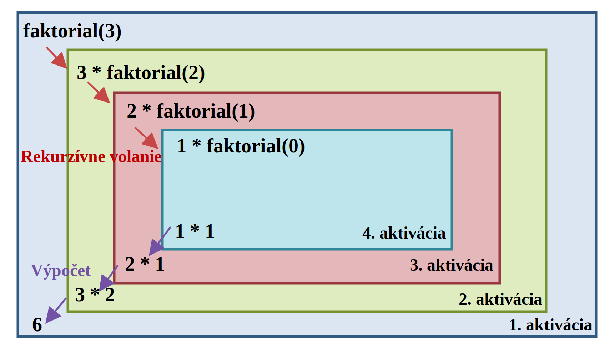
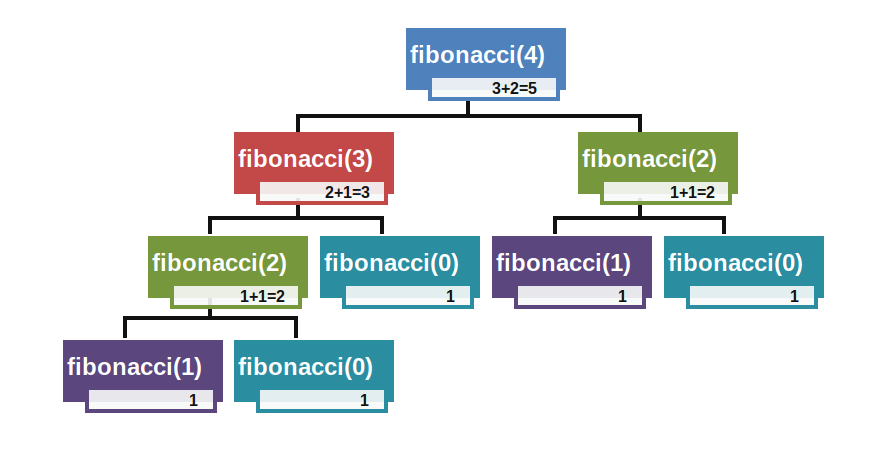
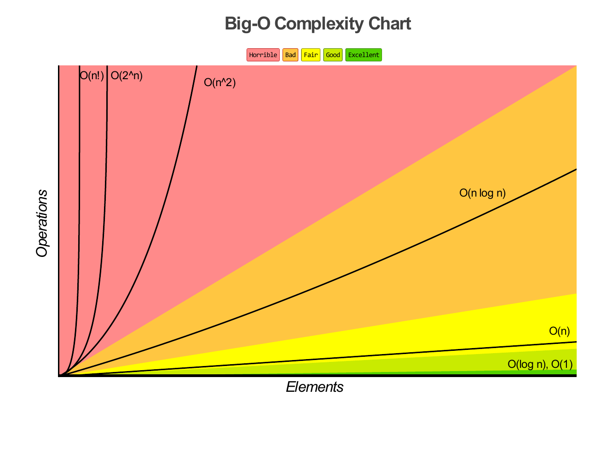
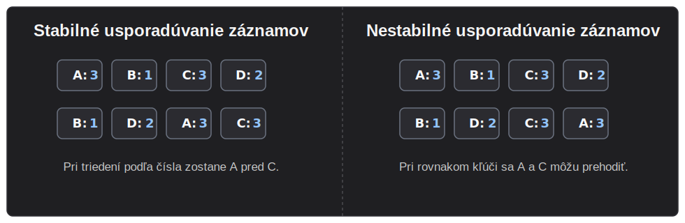

## Algoritmy, dátové štruktúry, programovanie

### 22. Algoritmus a jeho vlastnosti, spôsoby zápisu algoritmu, základné programovacie paradigmy, procedurálne a objektovo orientované programovanie. Základné algoritmické konštrukcie: sekvencia, vetvenie, cyklus. Pojmy príkaz, výraz, premenná. Základné a zložené údajové typy. Rekurzia.

#### Algoritmus a jeho vlastnosti

[[verified: Algoritmom nazývame všeobecné pravidlá, ktoré definujú postupnú transformáciu vstupných údajov na výstupné pri splnení vstupných a výstupných podmienok.]]

**[[verified: Nutné vlastnosti algoritmu:]]**

- [[verified: **Determinovanosť** – každý krok algoritmu musí byť jednoznačne a presne definovaný. V každej situácii musí byť úplne zrejmé, čo a ako sa má vykonať – ako postupuje tok riadenia algoritmu a ako má vykonávanie algoritmu pokračovať.]]
- [[verified: **Konečnosť** – algoritmus musí skončiť po vykonaní konečného počtu krokov. Tento počet krokov môže byť ľubovoľne veľký, ale pre každý jednotlivý vstup musí byť konečný v čase a v priestore.]]
- [[verified: **Rezultatívnosť** – ak algoritmus dáva po konečnom počte krokov správny výsledok, ktorý je pre rovnaké vstupné údaje vždy rovnaký, hovoríme, že algoritmus je rezultatívny.]]

#### Spôsoby zápisu algoritmu

- [[verified: **Slovný zápis** – v prirodzenom jazyku.]]
- [[verified: **Grafický zápis** – s využitím vývojových diagramov, štruktúrogramov, teda Nassiho-Schneidermanových diagramov, obrázkového návodu a pod.]]

- [[verified: **Zápis pomocou rozhodovacích tabuliek**.]]

**Rozhodovacia tabuľka ilustrujúca udelenie/neudelenie zápočtu**

|  | Zápočet | 1. | 2. | 3. | 4. | 5. | 6. | 7. | 8. |
|---|---|---|---|---|---|---|---|---|---|
| P1 | Účasť | A | A | A | A | N | N | N | N |
| P2 | 1. zadanie | A | A | N | N | A | A | N | N |
| P3 | 2. zadanie | A | N | A | N | A | N | A | N |
| A1 | Udeľ zápočet | X |  |  |  |  |  |  |  |
| A2 | Daj nový termín |  | X | X |  |  |  |  |  |
| A3 | Neudeľ zápočet |  |  |  | X | X | X | X | X |

- [[verified: **Matematický zápis** – algoritmus je vyjadrený popisom vzťahov medzi veličinami, sústavami rovníc, maticami a pod.]]
- [[verified: **Využitie pseudojazyka**.]]
- [[verified: **Zápis priamo v programovacom jazyku**.]]

#### Základné programovacie paradigmy

1. [[verified: **Procedurálne programovanie** – je základnou metódou imperatívneho programovania. Program je založený na premenných, postupnosti príkazov a funkciách, ktoré reprezentujú čiastkové algoritmy. Typický jazyk je C.]]
2. [[verified: **Objektovo orientované programovanie** – program je kolekciou objektov. Objekt zapúzdruje dáta, teda svoj stav, a metódy, ktoré predstavujú jeho správanie. Typický jazyk je C++ alebo C#.]]
3. [[verified: **Funkcionálne programovanie** – je deklaratívny prístup, v ktorom je program chápaný ako kolekcia funkcií. Priebeh výpočtu je založený na postupnom aplikovaní funkcií a dôležité miesto tu má rekurzia.]]
4. [[verified: **Logické (relačné) programovanie** – je deklaratívny prístup založený na predikátovej logike. Programátor opisuje, čo sa má riešiť, definuje fakty a relácie a systém hľadá riešenie napríklad pomocou backtrackingu.]]

#### Procedurálne a objektovo orientované programovanie

**Procedurálne programovanie** organizuje kód okolo funkcií (procedúr), ktoré postupne menia dáta – program je v podstate postupnosť volaní funkcií nad spoločnými údajmi. Typický jazyk: C.

**Objektovo orientované programovanie** organizuje kód okolo **objektov**, ktoré spájajú dáta (atribúty) a správanie (metódy) do jedného celku. Stavia na štyroch princípoch:

- **Zapúzdrenie** – dáta sú ukryté za rozhraním.
- **Dedičnosť** – trieda môže rozširovať inú triedu.
- **Polymorfizmus** – rovnaké rozhranie môže mať rôzne implementácie.
- **Abstrakcia** – viditeľná je len podstata, detaily sú skryté.

Typické jazyky: C#, C++.

#### Základné algoritmické konštrukcie: sekvencia, vetvenie, cyklus

- [[verified: **Sekvencia** – predstavuje postupnosť akcií, ktoré sa vykonajú v poradí, v akom sú zapísané, ak explicitne nie je stanovené iné poradie.]]
- [[verified: **Vetvenie** – umožňuje riadiť spracovanie programu na základe vyhodnotenia podmienky alebo hodnoty premennej.]]
- [[verified: **Cyklus** – slúži na opakovanie určitého príkazu alebo skupiny príkazov na základe podmienky, čiže pozostáva z podmienky cyklu a postupnosti príkazov nazývanými telom cyklu.]]

#### Pojmy príkaz, výraz, premenná

- [[verified: **Príkaz** – konkrétna operácia alebo akcia zapísaná v príslušnom programovacom jazyku, ktorá prikazuje procesoru vykonať presne stanovenú činnosť. Základným príkladom je príkaz priradenia.]]
- [[verified: **Výraz** – predpis obsahujúci konštanty, premenné, literály a spôsob ich spracovania pomocou operátorov a funkcií. Výsledkom výrazu je hodnota príslušného typu, napr. `i + 10` alebo `f > 11.4`.]]
- [[verified: **Premenná** – objekt, teda miesto v pamäti počítača, ktorý obsahuje určitú hodnotu presne stanoveného typu. Každá premenná je označená identifikátorom, teda menom.]]

```c
vysledok = x + 3;
```

Celý riadok je **príkaz priradenia**, `x + 3` je **výraz** a `vysledok` je **premenná**.

#### Základné a zložené údajové typy

**Základné (primitívne) typy**

[[verified: Všetky premenné sú vždy určitého typu. To znamená, že je pre ne definovaná prípustná množina hodnôt a podľa ich typu s nimi môžeme pracovať.]]

- [[verified: **Celočíselný typ** – predstavuje čísla definované na množine Z.]]
- [[verified: **Reálny typ** – predstavuje číslo s desatinnou časťou.]]
- [[verified: **Znakový typ** – slúži na uloženie znaku.]]
- [[verified: **Typ textového reťazca** – slúži na uloženie slov, teda viac ako jedného znaku.]]
- [[verified: **Logický typ** – hodnota vyjadruje stav platí alebo neplatí, áno – nie, true – false, 1 – 0.]]

**Zložené (štruktúrované) typy**

[[verified: Pre štruktúrované údajové typy je typické, že sú zložené zo základných dátových typov alebo ich kombinácií. Môžu byť homogénne, teda všetky prvky sú rovnakého typu, alebo heterogénne, teda reprezentujú objekt zložený z dátových objektov rôzneho dátového typu.]]

- [[verified: **Pole** – homogénny štruktúrovaný údajový typ; prvky poľa sú rovnakého typu a k jednotlivým prvkom sa pristupuje pomocou indexu.]]
- [[verified: **Štruktúra** – heterogénny štruktúrovaný údajový typ, ktorý reprezentuje objekt zložený z dátových objektov rôzneho dátového typu.]]
- [[verified: **Union** – heterogénny štruktúrovaný údajový typ podobný štruktúre, používaný hlavne v jazyku C.]]

#### Rekurzia

[[verified: Rekurzia je technika, pri ktorej sa tá istá programová konštrukcia opakovane používa pri riešení tej istej úlohy a jej použitie je zahrnuté vo vnútri samotnej konštrukcie. Používa sa vtedy, keď je vhodné pôvodnú úlohu rozdeliť na menšie podúlohy rovnakého typu.]]

[[verified: V programe sa rekurzia reprezentuje funkciou, ktorá vo vnútri tela obsahuje volanie tej istej funkcie, teda funkcia volá samu seba. Dôležité je správne ošetriť ukončovaciu podmienku, inak môže dôjsť k nekonečnej rekurzii a pretečeniu zásobníka.]]

Aby rekurzia fungovala správne, musí obsahovať:

- **Ukončovaciu podmienku** – prípad, pri ktorom sa funkcia ďalej nevolá.
- **Rekurzívne volanie** – volanie tej istej funkcie s jednoduchším vstupom.

Klasické príklady:

- **Faktoriál** – problém sa zmenšuje tak, že `n!` počítame cez menší faktoriál `(n - 1)!`.



- **Fibonacciho postupnosť** – hodnota závisí od dvoch menších hodnôt tej istej postupnosti.



- prechod **stromových štruktúr** – strom sa prirodzene delí na menšie podstromy, na ktoré použijeme rovnaký postup.

### 23. Abstraktné údajové typy, zásobník, front, zreťazený zoznam. Implementácia a použitie abstraktných údajových typov.

#### Abstraktné údajové typy

**Abstraktný údajový typ (ADT)** opisuje rozhranie dátovej štruktúry: množinu operácií, ktoré ponúka, a ich správanie, bez určenia konkrétnej implementácie.

Pri ADT nás zaujíma najmä:

- **množina hodnôt**, ktoré môže obsahovať,
- **operácie**, ktoré sa nad nimi dajú vykonať (vrátane ich vstupov a výstupov),
- **pravidlá správania** – čo jednotlivé operácie robia a za akých podmienok sa používajú.

Rovnaký ADT sa dá implementovať rôzne. Napríklad zásobník môže byť realizovaný poľom alebo zreťazeným zoznamom, ale navonok sa stále používa cez operácie ako `push`, `pop` a `peek`.

Výhody tejto abstrakcie:

- **Zameniteľnosť implementácie** bez zmeny spôsobu používania (napr. polná implementácia → zreťazený zoznam, keď pribudne veľa prvkov).
- **Skrytie zložitosti** – používateľ nemusí poznať detaily správy pamäte.
- **Testovateľnosť** – rozhranie sa dá otestovať izolovane.

#### Zásobník

Zásobník, teda **stack**, je ADT s princípom **LIFO** (Last In, First Out) – posledný pridaný prvok vychádza von ako prvý.

Hlavné operácie:

- **push(x)** – pridá `x` na vrch.
- **pop()** – odoberie a vráti vrchný prvok.
- **peek() / top()** – vráti vrchný prvok bez odobratia.
- **isEmpty()**, **size()** – stav zásobníka.

Všetky operácie sú typicky v **`O(1)`**.

<div class="adt-visualizer" data-type="stack"></div>

Použitie:

- **Volanie funkcií** – každé volanie pridá na **volací zásobník** (call stack) rámec s lokálnymi premennými – pri návrate sa odoberie. Odtiaľ pojem *stack overflow*.
- **Vyhodnotenie výrazov** – konverzia infix na postfix (Shunting-yard algoritmus) a vyhodnotenie postfix výrazov.
- **Undo/Redo** v aplikáciách.
- **Backtracking** – DFS (depth-first search), riešenie bludísk.
- **Parsovanie** – zásobníkové automaty.

#### Front

Front, teda **queue**, je ADT s princípom **FIFO** (First In, First Out) – prvý pridaný prvok vychádza ako prvý.

Hlavné operácie:

- **enqueue(x)** – pridá `x` na koniec.
- **dequeue()** – odoberie a vráti prvý prvok.
- **front() / peek()** – vráti prvý prvok bez odobratia.
- **isEmpty()**, **size()**.

Pri dobrej implementácii sú všetky operácie v **`O(1)`**.

<div class="adt-visualizer" data-type="queue"></div>

Varianty:

- **Bežný front** – FIFO.
- **Cyklický front (circular queue)** – pevná kapacita, indexy sa „otáčajú“ cez modulo. Efektívne pre pevne veľké buffery.
- **Obojstranný front (deque, double-ended queue)** – pridávať aj odoberať z oboch koncov.
- **Prioritný front (priority queue)** – každý prvok má prioritu – odoberá sa ten s najvyššou. Typicky sa implementuje **haldou (heap)**.

Použitie:

- **Plánovač procesov** v OS – procesy čakajú vo fronte na CPU.
- **Sieťové buffery** – pakety sa spracúvajú v poradí príchodu.
- **BFS (breadth-first search)** – prehľadávanie grafu vrstvu po vrstve.
- **Tlačové a úlohové fronty**.
- **Producent-konzument** pattern pri konkurentnom programovaní.

#### Zreťazený zoznam

Zreťazený zoznam, teda **linked list**, je ADT, v ktorom každý prvok (**uzol, node**) obsahuje **dáta** a **referenciu na nasledujúci uzol** (prípadne aj predchádzajúci). Na rozdiel od poľa **nie sú uzly uložené súvisle v pamäti** – sú navzájom prepojené pointermi a môžu byť roztrúsené po heape.

Hlavné operácie:

- **vloženie prvku** – na začiatok, koniec alebo za známy uzol.
- **odstránenie prvku** – zmenou prepojenia medzi uzlami.
- **prechod zoznamom** – postupné navštevovanie uzlov od začiatku.
- **vyhľadanie prvku** – sekvenčné hľadanie podľa hodnoty alebo pozície.

<div class="adt-visualizer" data-type="linked-list"></div>

Varianty:

- **Jednosmerný (singly linked)** – uzol má referenciu len dopredu. Prechod je možný len jedným smerom.
- **Obojsmerný (doubly linked)** – uzol má referenciu dopredu aj dozadu. Prechod v oboch smeroch, ale stojí viac pamäte.
- **Cyklický** – posledný uzol odkazuje späť na prvý.

Výkonové charakteristiky:

- **Vloženie / odstránenie na začiatok** – `O(1)`.
- **Vloženie / odstránenie na koniec** – `O(1)` ak máme pointer na tail, inak `O(n)`.
- **Vloženie / odstránenie na známej pozícii** – `O(1)` (len prepojíme pointery).
- **Vyhľadanie prvku podľa hodnoty alebo indexu** – `O(n)` (musíme prechádzať sekvenčne).

Porovnanie s poľom:

| Operácia               | Pole (array) | Zreťazený zoznam |
| ---------------------- | ------------ | ---------------- |
| Prístup podľa indexu   | `O(1)`       | `O(n)`           |
| Vloženie na začiatok   | `O(n)`       | `O(1)`           |
| Vloženie na koniec     | `O(1)`*      | `O(1)` / `O(n)`  |
| Pamäť navyše           | žiadna       | pointery v uzloch |

`*` amortizovaná pri dynamických poliach (ArrayList / `std::vector`).

#### Implementácia a použitie abstraktných údajových typov

Ten istý ADT sa dá implementovať rôzne, s odlišnými výkonovými kompromismi:

- **Polová implementácia** – zásobník ako pole + index `top` – front ako cyklické pole. Výborná lokalita dát (cache-friendly), `O(1)` operácie, ale pevná alebo „zdvojnásobovaná“ kapacita.
- **Implementácia pomocou zreťazeného zoznamu** – zásobník a front ako zreťazený zoznam. Dynamická veľkosť bez realokácií, ale réžia na alokáciu každého uzla a horšia lokalita dát.

V reálnych jazykoch sú tieto ADT bežne v štandardnej knižnici:

- **C++:** `std::stack`, `std::queue`, `std::deque`, `std::list`, `std::priority_queue`.
- **C#:** `Stack<T>`, `Queue<T>`, `LinkedList<T>`, `List<T>`, `PriorityQueue<TElement, TPriority>`.

Hlavná pointa ADT: **oddeliť rozhranie od implementácie**. Používateľ pracuje len s operáciami daného typu, kým samotná implementácia sa môže meniť podľa potreby.

### 24. Objektovo orientované programovanie. Trieda a objekt. Zapúzdrenie, abstrakcia, dedičnosť a polymorfizmus. Prístupové práva. [Využívanie konštruktora a metód nadtriedy](#q-24-vyuzivanie-konstruktora-a-metod-nadtriedy), prekrývanie, preťažovanie a prekonávanie. Abstraktné metódy a triedy.

#### Objektovo orientované programovanie

Objektovo orientované programovanie je programovacia paradigma, ktorá organizuje program okolo **tried a objektov**. Objekt spája dáta vo forme **atribútov** a správanie vo forme **metód**.

#### Trieda a objekt

**Trieda (class)** je predpis, podľa ktorého sa vytvárajú objekty. Určuje, aké atribúty a metódy budú mať jej objekty, ale sama ešte nereprezentuje konkrétny objekt s konkrétnymi hodnotami.

**Objekt (object, inštancia)** je konkrétny exemplár triedy vytvorený v pamäti. Má vlastné hodnoty atribútov a môže vykonávať metódy definované v triede.

```java
class Auto {
    String značka;
    int rokVýroby;

    void naštartuj() { /* ... */ }
}

Auto moje = new Auto();   // objekt (inštancia)
moje.značka = "Škoda";
moje.rokVýroby = 2020;
```

#### Zapúzdrenie

**Zapúzdrenie** znamená, že dáta a metódy, ktoré s nimi pracujú, sú spojené v jednej triede a vnútorný stav objektu je chránený pred priamym prístupom zvonka. Atribúty sú preto typicky `private` a vonkajší kód k nim pristupuje cez definované metódy, napríklad gettery a settery.

Výhoda je, že trieda si vie kontrolovať vlastný stav. Zvonku sa tak nedajú priamo nastaviť neplatné hodnoty a vnútorná implementácia sa môže meniť bez toho, aby sa musel meniť kód, ktorý triedu používa.

#### Abstrakcia

**Abstrakcia** znamená, že pri modeli alebo triede vyberáme len tie vlastnosti a operácie, ktoré sú pre daný problém podstatné, a ostatné detaily nechávame bokom. Používateľ triedy pracuje hlavne s tým, **čo** objekt vie robiť, nie s tým, **ako** je to vnútorne implementované.

Napríklad pri volaní `list.add(x)` nás zaujíma, že prvok sa pridá do zoznamu. Nemusíme riešiť, či je zoznam interne uložený ako pole alebo ako zreťazený zoznam.

#### Dedičnosť

**Dedičnosť** umožňuje vytvoriť novú triedu na základe existujúcej triedy. Podtrieda dedí atribúty a metódy nadtriedy a môže ich ďalej rozšíriť alebo upraviť. Používa sa vtedy, keď medzi triedami existuje vzťah **„je typom“** (*is-a*), napríklad `Futbalista` je typ `Osoby`.

Výhoda dedičnosti je znovupoužitie spoločného kódu a možnosť vytvárať hierarchiu tried. Netreba však dediť len kvôli úspore kódu – dedičnosť má dávať významovo zmysel.

Niektoré jazyky podporujú aj **viacnásobnú dedičnosť**, teda dedenie z viacerých tried naraz. Prináša však riziko nejasností, napríklad diamantový problém, preto ju viaceré jazyky obmedzujú alebo nahrádzajú rozhraniami.

#### Polymorfizmus

**Polymorfizmus** znamená, že s objektmi rôznych tried môžeme pracovať cez rovnaké rozhranie, ale konkrétne správanie sa vykoná podľa skutočného typu objektu. Typicky máme premennú alebo kolekciu všeobecnejšieho typu, napríklad `Osoba`, ale v nej môžu byť objekty konkrétnych podtried, napríklad `Futbalista`.

Najtypickejší je **dynamický polymorfizmus**, ktorý vzniká pri dedičnosti a prekonávaní metód. Ak trieda `Osoba` definuje metódu `vypis()` a trieda `Futbalista` ju upraví, volanie `vypis()` môže spustiť inú implementáciu podľa toho, aký objekt sa v premennej reálne nachádza.

Okrem toho existuje aj **statický polymorfizmus**, napríklad preťažovanie metód s rovnakým názvom a rôznymi parametrami, a **parametrický polymorfizmus**, napríklad generiká alebo šablóny.

#### Prístupové práva

**Prístupové práva** určujú, ktoré časti triedy sú viditeľné zvonka a ktoré ostávajú vnútorným detailom triedy. Sú dôležité najmä pri zapúzdrení, lebo pomáhajú oddeliť verejné rozhranie triedy od jej implementácie.

Najčastejšie základné modifikátory sú:

- **public** – prístupné odkiaľkoľvek, teda aj mimo triedy.
- **private** – prístupné len v rámci danej triedy.
- **protected** – prístupné v danej triede a v jej odvodených triedach.

V C# existujú aj ďalšie modifikátory, napríklad **internal** pre prístup v rámci tej istej skompilovanej zostavy (*assembly*) a **protected internal**, ktoré kombinuje prístup cez rovnakú zostavu alebo odvodenú triedu.

#### Využívanie konštruktora a metód nadtriedy

**Konštruktor** je špeciálna metóda, ktorá sa **automaticky zavolá pri vytvorení objektu**, napríklad cez `new`. Jeho úlohou je **inicializovať atribúty**, aby bol objekt hneď po vytvorení v platnom stave. Konštruktor má zvyčajne rovnaký názov ako trieda a **nevracia hodnotu**.

Trieda môže mať **viac konštruktorov s rôznymi parametrami**, aby sa objekt dal vytvoriť rôznymi spôsobmi. Tomu sa hovorí **preťažovanie konštruktorov**. Často existuje aj **bezparametrový konštruktor**, prípadne sa vytvorí automaticky, ak ho sami nedefinujeme.

Pri **dedičnosti** má podtrieda vlastný konštruktor, ale najprv sa musí inicializovať časť objektu zdedená z nadtriedy. Preto konštruktor podtriedy volá **konštruktor nadtriedy**. V C# sa to zapisuje cez `base(...)`, v C++ cez inicializačný zoznam.

Podobne môže podtrieda zavolať aj **metódu nadtriedy**, keď nechce pôvodné správanie úplne nahradiť, ale iba ho rozšíriť.

#### Prekrývanie, preťažovanie a prekonávanie

Tieto pojmy sa týkajú situácií, keď majú metódy rovnaký názov, ale líši sa, **kde sú definované**, **aké majú parametre** a **kedy sa rozhoduje, ktorá verzia sa zavolá**.

##### Preťažovanie

**Preťažovanie** znamená, že v tej istej triede existuje viac metód s rovnakým názvom, ale s rôznymi parametrami. Líšiť sa môžu počtom, typom alebo poradím parametrov. O tom, ktorá verzia metódy sa zavolá, sa rozhoduje už pri kompilácii.

```csharp
Vypis();
Vypis("Adam");
Vypis("Adam", 25);
```

##### Prekonávanie

**Prekonávanie** znamená, že podtrieda poskytne vlastnú implementáciu metódy, ktorú zdedila z nadtriedy. Metóda má rovnakú signatúru, ale správanie sa zmení podľa skutočného typu objektu. Toto je základ dynamického polymorfizmu.

##### Prekrývanie

**Prekrývanie** znamená, že člen v podtriede má rovnaký názov ako člen v nadtriede, ale nejde o skutočné polymorfné prekonanie. Typicky sa to týka statických metód alebo atribútov. Rozhodovanie potom závisí skôr od typu premennej než od skutočného typu objektu.

Stručne: **preťažovanie** = rovnaký názov, iné parametre; **prekonávanie** = podtrieda mení zdedenú metódu; **prekrývanie** = podtrieda zakryje člen nadtriedy rovnakým názvom.

#### Abstraktné metódy a triedy

**Abstraktná metóda** má len **deklaráciu (hlavičku), ale nie implementáciu (telo)**. Značí sa kľúčovým slovom `abstract`:

```csharp
public abstract void Zvuk();
```

**Abstraktná trieda** je trieda, ktorá obsahuje aspoň jednu abstraktnú metódu (alebo je takto explicitne označená). Má dve vlastnosti:

- **Nedá sa priamo inštanciovať** – `new AbstraktnaTrieda()` je chyba.
- **Slúži ako základ pre podtriedy**, ktoré musia všetky zdedené abstraktné metódy **implementovať** (alebo samy zostať abstraktnými).

Použitie: keď chceme definovať **spoločnú kostru** pre skupinu tried, ale niektoré detaily chceme nechať na podtriedy. Napríklad `abstract class Zviera` môže mať konkrétne metódy ako `NajedzSa()`, ale `Zvuk()` je abstraktná, lebo každé zviera vydáva iný zvuk.

**Rozhranie (interface)** je forma abstrakcie, ktorá definuje **čo má trieda vedieť robiť**, nie ako to robí. Trieda môže **dediť z jednej triedy, ale implementovať viac rozhraní**.

Kedy čo použiť:

- **Abstraktná trieda** – keď máme spoločný kód **aj stav** (atribúty), ktoré chceme zdieľať medzi potomkami.
- **Rozhranie** – keď chceme iba definovať **kontrakt** (sadu operácií), ktorý musí trieda splniť, bez zdieľania implementácie.

### 25. Usporadúvanie. Usporadúvanie prebublávaním, usporadúvanie priamym vkladaním, usporadúvanie výberom, Rýchle usporadúvanie (quick-sort). Časová a priestorová zložitosť algoritmov usporadúvania, stabilita algoritmov usporadúvania.

#### Usporadúvanie

Usporadúvanie je základná algoritmická úloha, pri ktorej chceme zoradiť prvky podľa zvoleného kritéria, napr. podľa veľkosti alebo abecedy.

Jednotlivé triediace algoritmy sa líšia najmä:

- **rýchlosťou** – koľko porovnaní a presunov robia,
- **pamäťovou náročnosťou** – či triedia priamo v poli, alebo potrebujú pomocnú pamäť,
- **stabilitou** – či zachovajú poradie rovnakých prvkov,
- **správaním pri rôznych vstupoch** – napr. je rozdiel, či je pole náhodné alebo takmer usporiadané.

#### Usporadúvanie prebublávaním

Najjednoduchší algoritmus. Opakovane prechádza polom a **porovnáva susedné dvojice prvkov** – ak sú v zlom poradí, vymení ich. Najväčšie prvky postupne „prebublávajú“ na koniec poľa.

Po každom prechode je najväčší prvok z aktuálnej nezotriedenej časti na správnom mieste, takže ďalší prechod už nemusí kontrolovať koniec poľa.

V praxi sa prakticky nepoužíva – slúži hlavne na učenie princípu triedenia, lebo robí veľa susedných výmen a pri väčších vstupoch je pomalý.

<div class="sort-visualizer" data-algorithm="bubble"></div>

#### Usporadúvanie priamym vkladaním

Insertion sort triedi podobne, ako keď si zoraďujeme karty v ruke. Naľavo si drží už zoradenú časť poľa a vždy vezme ďalší prvok z nezoradenej časti. Tento prvok posúva doľava dovtedy, kým nenájde miesto, kam patrí.

V praxi sa insertion sort hodí najmä na **malé alebo takmer usporiadané polia**, kde má malú réžiu a vie byť veľmi rýchly.

<div class="sort-visualizer" data-algorithm="insertion"></div>

#### Usporadúvanie výberom

Pri každom prechode nezoradenou časťou poľa **nájde najmenší prvok** a vymení ho s prvkom na aktuálnej pozícii.

Hlavnou nevýhodou selection sortu je, že jeho zložitosť je vždy **kvadratická**, bez ohľadu na vstup.

Má síce **lineárny počet výmen**, ale stále robí veľa porovnaní, preto sa pri väčších vstupoch nehodí.

<div class="sort-visualizer" data-algorithm="selection"></div>

#### Rýchle usporadúvanie (quick-sort)

**Quick-sort** je algoritmus typu **rozdeľuj a panuj** (*divide-and-conquer*).

Princíp:

1. Vyberie **pivot**.
2. **Rozdelí pole**: preusporiada ho tak, aby vľavo od pivota boli menšie prvky a vpravo väčšie.
3. **Rekurzívne** usporiada ľavú a pravú časť.

V praxi je quick-sort dôležitý preto, že pri rozumnej voľbe pivota dáva dobrý kompromis medzi rýchlosťou a pamäťovou náročnosťou.

<div class="sort-visualizer" data-algorithm="quick"></div>

#### Časová a priestorová zložitosť algoritmov usporadúvania

Časová a priestorová zložitosť algoritmov usporadúvania závisí od toho, **koľko porovnaní a presunov prvkov** algoritmus robí a či potrebuje ďalšiu pamäť mimo pôvodného poľa. Zapisujeme ju pomocou **O-notácie**, ktorá opisuje, ako rýchlo rastie počet operácií alebo spotreba pamäte so zväčšujúcim sa vstupom.



<div class="sort-cheatsheet">
  <table class="sort-cheatsheet-table">
    <thead>
      <tr>
        <th rowspan="2">Algoritmus</th>
        <th colspan="3">Časová zložitosť</th>
        <th>Priestor</th>
        <th rowspan="2">Stabilný?</th>
      </tr>
      <tr>
        <th>najlepšia</th>
        <th>priemerná</th>
        <th>najhoršia</th>
        <th>najhoršia</th>
      </tr>
    </thead>
    <tbody>
      <tr>
        <th>Bubble sort</th>
        <td class="sort-c-good">O(n)</td>
        <td class="sort-c-bad">O(n²)</td>
        <td class="sort-c-bad">O(n²)</td>
        <td class="sort-c-good">O(1)</td>
        <td class="sort-c-yes">áno</td>
      </tr>
      <tr>
        <th>Insertion sort</th>
        <td class="sort-c-good">O(n)</td>
        <td class="sort-c-bad">O(n²)</td>
        <td class="sort-c-bad">O(n²)</td>
        <td class="sort-c-good">O(1)</td>
        <td class="sort-c-yes">áno</td>
      </tr>
      <tr>
        <th>Selection sort</th>
        <td class="sort-c-bad">O(n²)</td>
        <td class="sort-c-bad">O(n²)</td>
        <td class="sort-c-bad">O(n²)</td>
        <td class="sort-c-good">O(1)</td>
        <td class="sort-c-no">nie</td>
      </tr>
      <tr>
        <th>Quick-sort</th>
        <td class="sort-c-mid">O(n log n)</td>
        <td class="sort-c-mid">O(n log n)</td>
        <td class="sort-c-bad">O(n²)</td>
        <td class="sort-c-mid">O(n)</td>
        <td class="sort-c-no">nie</td>
      </tr>
    </tbody>
  </table>
</div>

Pri týchto štyroch algoritmoch usporadúvania sa stretneme s nasledujúcimi zložitosťami:

- `O(1)` – **konštantná**: nezávisí od počtu prvkov, napr. pár pomocných premenných,
- `O(log n)` – **logaritmická**: rastie veľmi pomaly, pri quick-sorte typicky rekurzívny zásobník pri vyváženom delení,
- `O(n)` – **lineárna**: počet operácií rastie priamo úmerne počtu prvkov,
- `O(n log n)` – **lineárno-logaritmická**: typická dobrá hodnota pri efektívnych porovnávacích triedeniach,
- `O(n²)` – **kvadratická**: pri dvojnásobnom počte prvkov môže byť práce približne štyrikrát viac, typické pre jednoduché triedenia s vnoreným prechádzaním poľa.

**Bubble sort** a **insertion sort** vedia byť v najlepšom prípade lineárne, teda `O(n)`, ak je pole už usporiadané. Bubble sort to dosiahne len v implementácii, ktorá si pamätá, že počas prechodu nenastala žiadna výmena. Insertion sort je na taký vstup prirodzene dobrý, lebo každý ďalší prvok už len skontroluje a nechá na mieste. V priemernom a najhoršom prípade však oba robia veľa lokálnych posunov alebo výmen, preto majú `O(n²)`.

**Selection sort** má kvadratickú časovú zložitosť, teda `O(n²)` vždy. Aj keď je pole už usporiadané, v každom kroku musí prehľadať zvyšok poľa, aby našiel minimum. Jeho výhoda nie je v rýchlosti, ale v tom, že robí málo výmen: najviac približne `n` výmen. To môže byť užitočné, ak je samotná výmena drahá.

**Quick-sort** je pri dobrej voľbe pivota výrazne rýchlejší: priemerný prípad je `O(n log n)`, lebo pole sa opakovane delí na menšie časti. Najhorší prípad je `O(n²)`, ak pivot delí pole veľmi nevyvážene, napríklad stále na prázdnu časť a zvyšok poľa. Preto sa v praxi používa náhodný pivot alebo median-of-three.

Z pohľadu pamäte sú **bubble sort, insertion sort a selection sort** algoritmy **in-place**, teda potrebujú iba konštantnú pomocnú pamäť `O(1)`. **Quick-sort** tiež triedi priamo v poli, ale kvôli rekurzii potrebuje zásobník volaní – pri vyváženom delení je to typicky `O(log n)`, v zlom prípade až `O(n)`.

Dôležitý rozdiel je v tom, že jednoduché triedenia prechádzajú pole opakovane a robia veľa lokálnych porovnaní alebo výmen. Preto pri väčšom počte prvkov rýchlo narážajú na kvadratickú časovú zložitosť, teda `O(n²)`. Quick-sort je efektívnejší preto, že pole rozdelí podľa pivota na menšie časti a potom rieši každú časť samostatne.

#### Stabilita algoritmov usporadúvania

**Stabilný algoritmus** zachová **pôvodné relatívne poradie rovnakých prvkov**. Ako **nestabilný algoritmus** označujeme taký, ktorý môže toto poradie zmeniť.

Stabilita je dôležitá najmä pri **viacúrovňovom triedení**. Ak najprv zoradíme zamestnancov podľa priezviska a potom podľa oddelenia, stabilný algoritmus zachová v rámci každého oddelenia abecedné poradie podľa priezviska.

Z algoritmov v tejto otázke sú **stabilné** bubble sort a insertion sort. **Nestabilné** sú selection sort a quick-sort.

Nestabilný algoritmus sa dá stabilizovať tak, že ku každému prvku pridáme jeho pôvodné poradie ako pomocný údaj – pri rovnosti kľúčov sa potom porovná aj tento údaj. Prakticky sa to môže uložiť napríklad do pomocného poľa pôvodných indexov, ale podstatné je, že pôvodné poradie slúži ako druhé kritérium porovnania.

<div class="sort-stability-compare">
  <div class="sort-stability-card">
    <h5>Stabilné usporadúvanie</h5>
    <div class="sort-stability-row">
      <span class="sort-ball sort-ball-gray">5</span>
      <span class="sort-ball sort-ball-blue">8</span>
      <span class="sort-ball sort-ball-green">9</span>
      <span class="sort-ball sort-ball-amber">8</span>
      <span class="sort-ball sort-ball-purple">3</span>
    </div>
    <div class="sort-stability-row">
      <span class="sort-ball sort-ball-purple">3</span>
      <span class="sort-ball sort-ball-gray">5</span>
      <span class="sort-ball sort-ball-blue">8</span>
      <span class="sort-ball sort-ball-amber">8</span>
      <span class="sort-ball sort-ball-green">9</span>
    </div>
    <p>Rovnaké hodnoty zostanú v pôvodnom relatívnom poradí.</p>
  </div>
  <div class="sort-stability-card">
    <h5>Nestabilné usporadúvanie</h5>
    <div class="sort-stability-row">
      <span class="sort-ball sort-ball-gray">5</span>
      <span class="sort-ball sort-ball-blue">8</span>
      <span class="sort-ball sort-ball-green">9</span>
      <span class="sort-ball sort-ball-amber">8</span>
      <span class="sort-ball sort-ball-purple">3</span>
    </div>
    <div class="sort-stability-row">
      <span class="sort-ball sort-ball-purple">3</span>
      <span class="sort-ball sort-ball-gray">5</span>
      <span class="sort-ball sort-ball-amber">8</span>
      <span class="sort-ball sort-ball-blue">8</span>
      <span class="sort-ball sort-ball-green">9</span>
    </div>
    <p>Rovnaké hodnoty sa môžu navzájom prehodiť.</p>
  </div>
</div>

Pri záznamoch je stabilita ešte viditeľnejšia: ak triedime podľa čísla, prvky s rovnakým číslom si pri stabilnom algoritme zachovajú pôvodné poradie.



---
