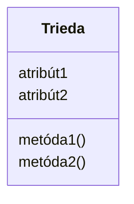

## Softvérové inžinierstvo

### 26. Charakteristiky informačných systémov (Základná terminológia – pojmy informačný systém, metóda, metodika, nástroj. Základné komponenty IS, architektúry IS, životný cyklus vývoja IS, klasické a agilné metodiky vývoja IS. Úloha a rozdelenie CASE.)

#### Základná terminológia

##### Informačný systém

Organizovaný celok ľudí, procesov, hardvéru, softvéru a dát, ktorý zbiera, spracúva, uchováva a distribuuje informácie tak, aby podporoval fungovanie organizácie a rozhodovanie.

##### Metóda

Ide o teoretický postup, teda konkrétne [[verified: množiny pravidiel, ktoré navigujú softvérového inžiniera na báze modelových predstáv]]. V praxi nám metóda jednoducho hovorí, aké je presné [[verified: postupovanie pri riešení konkrétnej úlohy]] a ako má vyzerať [[verified: dokumentovanie výsledkov]]. Dôležitou podmienkou je, že tieto [[verified: pravidlá by mali byť nezávislé od programovacích jazykov a prostredia]] – čiže dobrá metóda funguje bez ohľadu na to, či programujeme v Jave alebo v Pythone.

##### Metodika

*Usporiadaný súbor* metód, techník, pravidiel a odporúčaní pokrývajúci celý proces vývoja IS. Odpovedá na otázku **„čo robiť, v akom poradí a kto“**. Príklady: RUP, SCRUM, XP.

##### Nástroj

Je to už konkrétny softvér alebo prostriedok, s ktorým reálne pracujeme. Nástroje slúžia ako [[verified: podporné prostriedky metód a techník]] (napríklad IDE, Git alebo JIRA) a odpovedajú na jednoduchú otázku: **„čím to urobím?“**.

#### Základné komponenty IS

IS sa typicky skladá z piatich vzájomne prepojených komponentov. Dá sa to chápať ako prechod od technickej vrstvy k ľudskému faktoru:

1. **Hardvér** – fyzické zariadenia: servery, pracovné stanice, sieťové prvky, úložiská.
2. **Softvér** – operačný systém, aplikačný softvér, databázový server, middleware.
3. **Dáta** – uložené v databáze – najcennejšia časť IS, lebo hardvér aj softvér sa dajú vymeniť, dáta nie.
4. **Procedúry** – pravidlá, pracovné postupy a informačné toky, podľa ktorých systém funguje a používatelia ho obsluhujú.
5. **Ľudia** – koncoví používatelia, správcovia, analytici, vývojári – bez nich systém nemá zmysel ani reálne použitie.

#### Architektúry IS

Architektúra opisuje, ako sú komponenty IS rozmiestnené, kde sa vykonáva spracovanie a ako medzi sebou komunikujú. Dobre sa učí ako vývoj od jedného centrálneho počítača k viacvrstvovým a sieťovým systémom:

##### 1. Centralizovaná architektúra / host-terminál

Všetko beží na jednom centrálnom počítači alebo serveri, používateľské stanice slúžia len ako terminály. Výhodou je jednoduchšia centrálna správa, nevýhodou závislosť od jedného miesta a slabšia flexibilita.

##### 2. File-server architektúra

Dáta alebo súbory sú uložené na serveri, ale veľká časť spracovania prebieha na klientskom počítači. Pri väčšom počte používateľov to zaťažuje sieť, lebo sa často prenášajú celé súbory alebo veľké objemy dát.

##### 3. Klient/server

Systém je rozdelený medzi klienta a server. Klient typicky zabezpečuje používateľské rozhranie a server poskytuje dáta, služby alebo časť aplikačnej logiky. V dvojvrstvovej architektúre klient komunikuje priamo s databázovým serverom.

##### 4. Trojvrstvová / viacvrstvová architektúra

Systém sa rozdelí na samostatné vrstvy: prezentačnú vrstvu, aplikačnú vrstvu a dátovú vrstvu. Používateľ komunikuje s prezentačnou vrstvou, biznis logika beží na aplikačnom serveri a dáta spravuje databázový server. Toto je typické pre moderné podnikové a webové systémy.

##### 5. Internetová / distribuovaná architektúra

Komponenty systému môžu bežať na viacerých uzloch a komunikovať cez sieť alebo internet. Sem patria webové aplikácie, intranetové riešenia, distribuované služby a v modernej praxi aj servisne orientovaná architektúra (SOA) alebo mikroslužby.

#### Životný cyklus vývoja IS

Životný cyklus vývoja IS určuje, v akom poradí sa systém analyzuje, navrhuje, implementuje, testuje a udržiava. Model životného cyklu teda [[verified: stanovuje postupnosť]] práce a [[verified: definuje jednotlivé činnosti]].

V praxi to znamená vytvoriť presnú [[verified: časovú postupnosť krokov]], pri ktorej platia dve pravidlá:
1. [[verified: Každá fáza má hmatateľné výsledky]] – teda nekončíme len pocitom, že je to hotové, ale konkrétnym výstupom (napr. analytickým dokumentom alebo kódom).
2. [[verified: Správnosť každej etapy je možné overiť]] – aby sme si boli istí, že do ďalšej fázy neťaháme staré chyby.

##### Fázy životného cyklu softvéru

1. **[[verified: Plánovanie]]** – [[verified: Určiť rozsah projektu, jeho ciele a zdroje.]]
2. **[[verified: Analýza]]** – [[verified: Zber, analýza a dokumentovanie požiadaviek od klientov alebo používateľov.]]
3. **[[verified: Návrh]]** – [[verified: Návrh architektúry softvéru a technických riešení.]]
4. **[[verified: Implementácia]]** – [[verified: Vývoj softvéru podľa navrhnutého dizajnu.]]
5. **[[verified: Testovanie]]** – [[verified: Overiť, že softvér spĺňa špecifikované požiadavky a je bez chýb.]]
6. **[[verified: Údržba]]** – [[verified: Zabezpečiť, aby softvér fungoval efektívne aj po nasadení.]]

Nasadenie sa často nevníma ako samostatná fáza základného vývojového cyklu – skôr sa chápe ako výsledok testovania ([[verified: softvér pripravený na nasadenie]]) alebo je pokryté v špecifických metodikách, ako napríklad v RUP: [[verified: Transition (Prechod): Nasadenie produktu do produkčného prostredia.]]

#### Klasické a agilné metodiky vývoja IS

**Klasické (tradičné) metodiky** idú fázami sekvenčne a kladú dôraz na detailný plán a dokumentáciu vopred:

##### Vodopádový životný cyklus

Vo vodopádovom modeli ďalšia fáza začína až po ukončení predchádzajúcej, preto sú zmeny požiadaviek v neskorších fázach drahé.

##### V-model

Vodopád, kde každá návrhová fáza má zrkadlovú testovaciu fázu (analýza ↔ akceptačné testy, návrh ↔ integračné testy).

**Agilné metodiky** reagujú na to, že požiadavky sa počas vývoja menia. Dodávajú **často a po malých častiach**, spolupracujú so zákazníkom a minimalizujú dokumentáciu v prospech fungujúceho softvéru:

##### Scrum

Celý vývoj je rozdelený na fixné časové úseky, takzvané [[verified: Sprinty: Krátke iterácie (2-4 týždne).]] Na to, aby tento proces fungoval, má tím jasne rozdelené roly: víziu a priority projektu určuje [[verified: Product Owner]], na hladký proces a odstraňovanie prekážok dohliada [[verified: Scrum Master]] a samotnú prácu odvádza [[verified: Development Team]].

##### Kanban

Na rozdiel od Scrumu tu nie sú fixné šprinty, ale plynulý tok úloh. Práca sa riadi vizuálne cez [[verified: Kanban board: Vizualizácia práce s kolónkami]], pričom kľúčové je nasadiť [[verified: WIP limity: Obmedzenie množstva úloh vo vývoji]], aby sme sa nezahltili a nútili sa rozrobené veci reálne dokončovať.

##### Extreme Programming (XP)

XP kladie [[verified: dôraz na vysokú kvalitu kódu, časté dodávky a intenzívnu spoluprácu s klientom]]. Používa praktiky ako [[verified: párové programovanie]], [[verified: test-driven development (TDD)]], [[verified: časté vydávanie (continuous integration)]], [[verified: jednoduchý dizajn]] a [[verified: zbieranie spätnej väzby od zákazníka]].

#### Úloha a rozdelenie CASE

##### **[[verified: CASE (Computer Aided Software Engineering)]]**

CASE nástroje môžu fungovať ako [[verified: Nástroj priameho vývoja – podpora kreslenia diagramov]] a aj ako [[verified: Nástroj spätného vývoja – načítavanie kódu a generovanie diagramov]].

- [[verified: automatizácia dokumentov]]
- [[verified: generovanie kódu]]
- [[verified: podpora návrhu softvéru]]
- [[verified: správa verzií]]

Podľa fázy životného cyklu, ktorú pokrývajú:

##### [[verified: Upper CASE (UML)]]

Podporujú skoré fázy (analýza, návrh): ER diagramy, UML modelovanie, DFD (Enterprise Architect, Lucidchart, draw.io).

##### [[verified: Lower CASE]]

Podporujú neskoré fázy (implementácia, testovanie, údržba): generátory kódu, IDE, debuggere, testovacie frameworky.

##### [[verified: Integrated CASE]]

Pokrývajú celý životný cyklus, prepájajú upper a lower nástroje do jednej platformy.

### 27. Princípy softvérového inžinierstva. Základné pojmy softvérového inžinierstva, softvérová kríza, tvorba softvéru a problémy pri tvorbe, charakteristika kvality, atribúty kvality.

#### Princípy softvérového inžinierstva

Softvérové inžinierstvo je inžinierska disciplína, ktorá aplikuje systematické, disciplinované a kvantifikovateľné postupy na tvorbu, prevádzku a údržbu softvéru. Vzniklo ako reakcia na **softvérovú krízu** v 60. rokoch, keď projekty začali pravidelne zlyhávať na rozpočte, termínoch a kvalite, a jeho cieľom je dodať softvér s definovanou kvalitou a predvídateľnými parametrami.

#### Základné pojmy softvérového inžinierstva

**Softvérové inžinierstvo (SWE)** sa zaoberá systematickým prístupom k **celému životnému cyklu softvéru** – od analýzy požiadaviek cez návrh, implementáciu, testovanie až po nasadenie a údržbu. Nie je to len „programovanie“ – programovanie je len jedna z aktivít. SWE zahŕňa aj riadenie projektov, manažment požiadaviek, odhadovanie úsilia, riadenie rizík, kontrolu kvality a komunikáciu so stakeholdermi.

##### Softvér

Softvér = [[verified: programy]] + [[verified: dokumentácia]] + [[verified: údaje pre správnu funkciu systému]] + [[verified: scenáre použitia]] + [[verified: testovacie scenáre]].

##### Softvérový proces

Štruktúrovaný postup činností (analýza, návrh, implementácia, testovanie…), ktoré vedú k výsledku.

##### Model procesu

Šablóna konkrétneho procesu (vodopád, Scrum, RUP).

##### Metóda

Ide o teoretický postup, teda konkrétne [[verified: množiny pravidiel, ktoré navigujú softvérového inžiniera na báze modelových predstáv]]. V praxi nám metóda jednoducho hovorí, aké je presné [[verified: postupovanie pri riešení konkrétnej úlohy]] a ako má vyzerať [[verified: dokumentovanie výsledkov]]. Dôležitou podmienkou je, že tieto [[verified: pravidlá by mali byť nezávislé od programovacích jazykov a prostredia]] – čiže dobrá metóda funguje bez ohľadu na to, či programujeme v Jave alebo v Pythone.

##### Nástroj

Je to už konkrétny softvér alebo prostriedok, s ktorým reálne pracujeme. Nástroje slúžia ako [[verified: podporné prostriedky metód a techník]] (napríklad IDE, Git alebo JIRA) a odpovedajú na jednoduchú otázku: **„čím to urobím?“**.

#### Softvérová kríza

**Softvérová kríza** označuje stav, keď [[verified: úspešnosť softvérových projektov je nízka]]. Projekty často zlyhávajú v čase, rozpočte, kvalite alebo vo výslednej funkcionalite.

- [[verified: nízka produktivita a kvalita]]
- [[verified: veľké projekty vyvíjané s väčšími nákladmi ako boli odhadované a/alebo časom dlhším ako bol vyhradený]]
- [[verified: vyvíjaný softvér nemá požadovanú funkčnosť]]

##### [[verified: Dôvody neúspechu]]

- [[verified: Zlé plánovanie a absencia príslušného projektového riadenia]]
- [[verified: Časté zmeny požiadaviek a špecifikácií]]
- [[verified: Nejasné a neúplné formulovanie požiadaviek]]
- [[verified: Nedostatočné zapojenie užívateľov do procesu práce na projekte]]
- [[verified: Nedostatok ľudských zdrojov]]
- [[verified: Nepostačujúca kvalifikácia vývojárov, chýbajúce potrebné skúsenosti]]
- [[verified: Nedostatočná podpora zo strany vrcholového vedenia]]
- [[verified: Nové technológie a nedostatočné využitie používanej technológie]]

Zásadný dôvod bývajú [[verified: zlé požiadavky]]. Ak sú požiadavky nejasné, neúplné, protirečivé alebo sa stále menia, tím nevie presne, čo má vytvoriť.

Východiskom je **softvérové inžinierstvo**: [[verified: zisťovať požiadavky vedome, systematicky, formálne...]], používať [[verified: súhrn inžinierskych metód a nástrojov pre vytváranie softvéru]] a uplatňovať [[verified: prísny a systematický prístup k vývoju, prevádzke a údržbe softvéru]].

#### Tvorba softvéru a problémy pri tvorbe

**[[verified: Tvorba SW]]**

- **[[verified: Manažment]]** – [[verified: Riadi a zabezpečuje naplnenie požiadaviek, ktoré definuje vývojový tým na základe požiadaviek zákazníka. Má menej vedomostí o počítačovej technike – ciele môžu byť v rozpore s cieľmi používateľa]]
- **[[verified: Analytik]]** – [[verified: spracovanie informácií; získanie požiadaviek; riešenie rôznych pohľadov používateľov; riešenie technicky realizovateľných/nerealizovateľných požiadaviek; komunikácia so zákazníkmi]]
- **[[verified: Návrhár]]** – [[verified: Práca v etape architektonického návrhu a podrobného návrhu. Vyberá možné riešenie z ponúkaných alternatív. Návrh štruktúry a špecifikácií softvéru; musí mať skúsenosti s programovaním]]
- **[[verified: Programátor]]** – [[verified: Implementácia navrhnutého riešenia; musí mať vedomosti v oblasti programovacích jazykov, podporných prostriedkov a operačných systémov]]
- **[[verified: Tester]]** – [[verified: systematické vykonávanie testovania]]
- **[[verified: Audit]]** (kontrola kvality) – [[verified: Často sa do tejto skupiny radia aj odborníci na testovanie. Sledovanie a zabezpečenie akosti vytváraného systému, ale aj procesu]]

##### [[verified: Problémy s tvorbou SW]]

- **[[verified: Nestálosť]]** – softvér sa mení kvôli zmene okolia, technológií, hardvéru alebo potrieb používateľov.
- **[[verified: Prispôsobivosť]]** – softvér sa často musí dodatočne upravovať pri zmene podmienok.
- **[[verified: Neviditeľnosť]]** – [[verified: neexistuje akceptovateľný spôsob reprezentácie softvéru]], z ktorého by bolo jednoducho jasné, čo chýba alebo kde je problém.
- **[[verified: Zložitosť]]** – [[verified: žiadne časti nie sú rovnaké]], pribúda komunikácia v tímoch a závislosti medzi časťami systému.
- Softvér sa [[verified: nedá produkovať masovo ako „na bežiacom páse“]].
- Náklady na softvér sa správajú inak než pri hardvéri: významnú časť tvorí vývoj a údržba.

##### [[verified: Problémy s tvorbou SW - druhoradé]]

- **[[verified: Špecifikácia požiadaviek]]** – [[verified: komunikačné problémy s používateľmi]], [[verified: nejasné a neúplné požiadavky]], [[verified: nestálosť požiadaviek]], [[verified: protirečivosť požiadaviek]], [[verified: nepresnosť pri špecifikácii]].
- **[[verified: Práca v tíme]]** – problémy s organizáciou práce a komunikáciou.
- **[[verified: Tvorba dokumentácie]]** – veľké množstvo dokumentácie, problémy s udržiavaním, ucelenosťou a úplnosťou.
- **[[verified: Slabá opakovateľnosť]]** – nevyužitie štandardizovaných prvkov.
- **[[verified: Spôsob „starnutia“ softvéru]]** – [[verified: Spoľahlivosť systému môže klesať kvôli častým opravám systému, príp. pridávaniu ďalších funkcií]].
- **[[verified: Náchylnosť na chyby]]**
- **[[verified: Programátorská produktivita]]**

##### [[verified: Dôsledky]]

- [[verified: nárast nákladov na vývoj a údržbu softvéru]]
- [[verified: dodáva sa neskoro]]
- [[verified: nespoľahlivý]]
- [[verified: nespĺňa požiadavky]]

#### Charakteristika kvality

**Kvalita softvéru** je miera, do akej produkt spĺňa stanovené požiadavky a očakávania používateľov. V softvéri sa kvalita meria ťažko – nie je to jedna hodnota, ale **viacrozmerná charakteristika** opísaná atribútmi (viď nižšie).

Pri kvalite softvéru sledujeme jednak vlastnosti hotového systému, jednak kvalitu vývojového procesu a nakoniec aj to, či výsledok zodpovedá očakávaniam používateľa.

Kvalita sa priebežne **zabezpečuje** cez Quality Assurance, teda preventívne aktivity ako code review a testy. Pred vydaním sa **kontroluje** cez Quality Control, kde sa overuje, či hotový produkt spĺňa požiadavky.

#### Atribúty kvality

**Atribút kvality** je [[verified: typ nefunkčnej požiadavky, ktorý popisuje charakteristiku služby alebo výkonu systému]]. Nehovorí teda primárne, **čo** má systém robiť, ale **ako dobre** to má robiť. Typické atribúty kvality sú:

- **Funkčnosť** – softvér robí to, čo má robiť.
- **[[verified: Spoľahlivosť]]** – funguje správne a stabilne aj pri dlhšom používaní.
- **[[verified: Výkonnosť]]** – reaguje dostatočne rýchlo a primerane využíva zdroje.
- **[[verified: Škálovateľnosť]]** – zvláda rast počtu používateľov, dát a záťaže bez zásadnej degradácie.
- **[[verified: Použiteľnosť]]** – dá sa ľahko ovládať a používať.
- **[[verified: Bezpečnosť]]** – chráni dáta a prístupy.
- **Udržiavateľnosť** – dá sa jednoducho meniť, opravovať a rozširovať.

Tieto atribúty sa často dostávajú do konfliktu, preto sa pri návrhu systému hľadá primeraný kompromis podľa priorít projektu.

### 28. Procesy vývoja systému. Životný cyklus a modely procesu vývoja, fázy životného cyklu, princípy a metódy pri tvorbe softvéru, špecifikácia požiadaviek, štruktúrovaný prístup k modelovaniu, validácia a verifikácia, testovanie.

#### Procesy vývoja systému

Proces vývoja softvéru určuje, ako sa má softvér vytvárať:

- [[verified: stanovuje postupnosť]]
- [[verified: definuje jednotlivé činnosti]]
- má podobu [[verified: časová postupnosť krokov]]
- [[verified: každá fáza má hmatateľné výsledky]]
- [[verified: správnosť každej etapy je možné overiť]]

#### Životný cyklus a modely procesu vývoja

Životný cyklus hovorí, cez aké fázy produkt prechádza. Model procesu vývoja určuje, ako sa tieto fázy organizujú. Najznámejšie modely, ktorými sa dá vývoj riadiť, sú:

##### [[verified: Vodopádový model]]

Je to klasický [[verified: tokovo-orientovaný prístup]], pri ktorom vývoj tečie zhora nadol. Základným pravidlom je, že [[verified: prechod je závislý na úplnom a úspešnom spracovaní predchádzajúcej fázy]]. Pretože [[verified: na konci každej fázy je vytvorený ČIASTKOVÝ PRODUKT]] (zvyčajne dokument), hodí sa pre [[verified: projekt s jasne definovanými požiadavkami]], pre [[verified: stabilné prostredie]] a [[verified: projekty s vysokou formálnosťou]]. Najväčším kameňom úrazu je [[verified: malá flexibilita vo vývoji produktu]] a fakt, že [[verified: testovanie je až na konci životného cyklu]], takže na chyby sa príde neskoro.

##### [[verified: V model]]

Ide o prísnejšiu [[verified: variácia kaskádového modelu]] (vodopádu). Má tvar písmena V: na ľavej strane klesajú fázy vývoja, na pravej stúpajú fázy testovania, pričom [[verified: horizontálne čiary ukazujú ako výsledky jednotlivých fáz vplývajú na fázy testovania]] (návrh architektúry sa priamo viaže na integračné testy). Používa sa pre [[verified: kritické systémy]] so [[verified: stabilné požiadavky]], kde sa [[verified: vyžaduje dôsledné testovanie]].

##### [[verified: Inkrementálny model]]

Na začiatku sa síce [[verified: definujú sa všetky požiadavky]], ale systém sa [[verified: vytvára sa a odovzdáva sa po častiach]] (inkrementoch). Tento prístup umožňuje [[verified: postupné pridávanie a zlepšovanie softvérového produktu]]. Výhodou je, že [[verified: proces je dobre viditeľný]] pre zákazníka, no zlyháva, ak je na začiatku [[verified: neúplná špecifikácia požiadaviek]].

##### [[verified: Evolučný model]]

Používa sa vtedy, [[verified: pokiaľ nevieme vyjadriť špecifikácie (existuje len náčrt)]]. Produkt vzniká v postupných verziách, ktoré sa za behu spresňujú. To síce [[verified: znižuje riziko pre nové aplikácie, pretože fázy špecifikácie a implementácie sú v súlade]], ale daňou za to je, že celkový [[verified: proces nie je viditeľný]] pre manažment a [[verified: systémy sú často slabo štruktúrované]], keďže sa neustále prepisujú.

##### [[verified: Prototypovanie]]

Hodí sa, keď [[verified: používateľ „nevie“ čo chce]], alebo keď [[verified: je stanovená funkcionalita, ale nie je jasné ako má produkt vyzerať]]. V praxi ide o [[verified: vývojový postup návrhu softvéru – experimentovanie na zjednodušenej verzii softvérového produktu]]. Jeho najväčšou silou je [[verified: vytvorenie v krátkom časovom úseku]] a [[verified: zodpovedanie určitých otázok]] okolo UI/UX. Obrovským rizikom je však [[verified: absencia vhodnej analytickej dokumentácie]] a fakt, že zákazník získa [[verified: ilúzia rýchleho dokončenia celého systému]], hoci prototyp nemá žiadne reálne pozadie.

Pri voľbe metodiky platia tieto všeobecné odporúčania:

- [[verified: Stabilné požiadavky: Vodopád, SSADM, V-Model.]]
- [[verified: Dynamické požiadavky: Agile, UP/RUP, XP.]]
- [[verified: Kritické systémy: V-Model, UP/RUP, Prince2.]]
- [[verified: Rýchle dodanie: RAD, Agile.]]
- [[verified: Veľké a komplexné projekty: UP/RUP, Prince2, SSADM.]]

#### Fázy životného cyklu

1. **[[verified: Plánovanie]]** – [[verified: určiť rozsah projektu, jeho ciele a zdroje.]] Výstupom je [[verified: projektový plán, identifikácia rizík, strategický plán.]]
2. **[[verified: Analýza]]** – [[verified: zber, analýza a dokumentovanie požiadaviek od klientov alebo používateľov.]] Výstupom je [[verified: dokumentácia požiadaviek (SRS – Software Requirements Specification), prípady použitia (use cases), diagramy procesov.]]
3. **[[verified: Návrh]]** – [[verified: návrh architektúry softvéru a technických riešení.]] Výstupom je [[verified: high-level design (HLD), low-level design (LLD), špecifikácie komponentov.]]
4. **[[verified: Implementácia]]** – [[verified: vývoj softvéru podľa navrhnutého dizajnu.]] Výstupom je [[verified: funkčný kód, zdrojové súbory, integrovaný systém.]]
5. **[[verified: Testovanie]]** – [[verified: overiť, že softvér spĺňa špecifikované požiadavky a je bez chýb.]] Výstupom sú [[verified: testovacie správy, opravené chyby, softvér pripravený na nasadenie.]]
6. **[[verified: Údržba]]** – [[verified: zabezpečiť, aby softvér fungoval efektívne aj po nasadení.]] Výstupom je [[verified: stabilný a aktuálny systém, dlhodobá podpora softvéru.]]

Nasadenie a vyradenie sa často nevyčleňujú ako samostatné fázy základného životného cyklu softvéru – nasadenie sa objavuje skôr ako výstup testovania alebo ako fáza konkrétnej metodiky (napr. RUP).

#### Princípy a metódy pri tvorbe softvéru

Vývoj softvéru sa nezaobíde bez definovaných pravidiel. **Metódy** sú teoretické [[verified: množiny pravidiel, ktoré navigujú softvérového inžiniera na báze modelových predstáv]]. Určujú presné [[verified: postupovanie pri riešení konkrétnej úlohy]] a [[verified: dokumentovanie výsledkov]] bez ohľadu na to, aký programovací jazyk tím používa ([[verified: pravidlá by mali byť nezávislé od programovacích jazykov a prostredia]]). Na ich uplatnenie v praxi sa používajú **nástroje** – softvérové [[verified: podporné prostriedky metód a techník]].

Z pohľadu celkového prístupu k vývoju rozoznávame tri hlavné smery:

##### Klasické (sekvenčné) metodiky, napr. SSADM

Vyžadujú prísne [[verified: sekvenčné kroky - jednotlivé fázy sa vykonávajú lineárne, pričom výstup jednej fázy slúži ako vstup pre nasledujúcu.]]. Kladú obrovský [[verified: dôraz na dokumentáciu: Každá fáza je presne zdokumentovaná, čo minimalizuje riziká.]] Práca má výhradne [[verified: písomná forma]], je tu silná [[verified: snaha o minimalizáciu zmien]] a [[verified: po prvotnej špecifikácii požiadaviek, zákazník už nezasahuje do projektu]]. Je to [[verified: presne a podrobne definovaný proces]].

##### UP / RUP

Toto je už moderný [[verified: iteratívno-incrementálny prístup]]. Projekt je rozdelený na cykly, [[verified: pričom každá iterácia pridáva hodnotu k produktu]] a pri každej z nich sa opakujú [[verified: aktivity analýzy, návrhu, vývoja a testovania]]. Mimoriadne dôležitá je [[verified: identifikácia rizík]] a samotný životný cyklus má štyri fázy: [[verified: Inception (Začiatok)]], [[verified: Elaboration (Rozpracovanie)]], [[verified: Construction (Konštrukcia)]] a [[verified: Transition (Prechod)]]. Vývoj [[verified: zahŕňa kontinuálnu spätnú väzbu a možnosť prispôsobenia počas vývoja]].

##### Agilné metódy

Predstavujú [[verified: iteratívny a inkrementálny vývoj s krátkymi iteráciami]]. Na rozdiel od klasických metodík presadzujú otvorenú [[verified: akceptácia zmien]], neustále [[verified: prehodnocovanie požiadaviek]] a dôležitá je živá [[verified: komunikácia medzi zákazníkom a vývojovým tímom]] (najmä [[verified: dôraz na osobné stretnutia]]). Zákazník sa tu [[verified: aktívne zapája do celého projektu]]. Agilný prístup tvrdí, že [[verified: podstatná nie je dokumentácia ale pochopenie]] a cieľom je [[verified: eliminácia nepotrebných činností]] – programujú sa [[verified: iba požadované funkcie]].

Medzi najznámejšie agilné metódy patria:
- **Scrum** – [[verified: založený na iteratívnom prístupe]], vývoj prebieha v cykloch zvaných [[verified: sprinty: krátke iterácie (2-4 týždne)]]. Základné roly sú [[verified: Scrum Master]], [[verified: Product Owner]] a [[verified: Development Team]].
- **Kanban** – [[verified: riadenie workflowu zameraný na minimalizáciu nedokončenej práce (WIP)]]. Úlohy sa riadia cez [[verified: Kanban board: vizualizácia práce s kolónkami]], pričom kľúčové sú [[verified: WIP limity: obmedzenie množstva úloh vo vývoji]].
- **XP (Extreme Programming)** – kladie [[verified: dôraz na vysokú kvalitu kódu, časté dodávky a intenzívnu spoluprácu s klientom]]. Tím povinne využíva techniky ako [[verified: párové programovanie]], [[verified: test-driven development (TDD)]] a [[verified: časté vydávanie (continuous integration)]].

#### Špecifikácia požiadaviek

Pri požiadavkách je dôležité vždy rozlišovať dve základné úrovne: biznisovú a softvérovú.

[[verified: Biznis požiadavka popisuje vysokú úroveň cieľov, potrieb alebo zámerov organizácie.]] Jednoducho povedané, [[verified: tieto požiadavky odrážajú, čo chce organizácia dosiahnuť alebo vyriešiť pomocou softvéru alebo iného systému.]] Následne platí, že táto [[verified: biznis požiadavka je vstupom do procesu analýzy, ktorá sa následne prekladá do detailnejších technických požiadaviek]].

Samotná práca s požiadavkami má tri logické kroky:
1. **[[verified: Analýza požiadaviek – skúma sa súčasný stav, existujúci systém. Získavanie požiadaviek pozorovaním, diskusiou, prototypovanie]]**
2. **[[verified: Špecifikácie požiadaviek – sústreďuje sa na softvér, nie na proces jeho tvorby]]**
3. **[[verified: Definovanie požiadaviek – transformácie z analýzy do dokumentu]]**

Výsledné požiadavky na systém sa klasicky delia na funkčné (čiže konkrétna [[verified: Funkcia, ktorú softvér ponúka]], jej [[verified: Vstupy, výstupy, správanie sa]]) a nefunkčné. Nefunkčné môžeme ďalej podrobnejšie členiť na [[verified: Atribúty kvality]], [[verified: Externé požiadavky]], [[verified: Požiadavky na výsledok]], [[verified: Požiadavky na prevádzku systému]], [[verified: Požiadavky na rozhranie]] a [[verified: Požiadavky na proces]].

Aká by však mala byť **kvalitná požiadavka**? Základ je, aby bola [[verified: Správna]], [[verified: Jednoznačná]], [[verified: Konzistentná]], [[verified: Úplná]], [[verified: Verifikovateľná]] (čiže sa dá otestovať), [[verified: Sledovateľná]] a [[verified: Modifikovateľná]]. Znamená to, že [[verified: požiadavka nie je v rozpore s inými požiadavkami]] a je úplne [[verified: bez vnútorných rozporov]]. Zároveň musí byť [[verified: v súlade s cieľmi, požiadavkami, technickými a funkčnými obmedzeniami]] a musí byť realistická – čiže platí, že [[verified: požiadavka môže byť realizovaná v rámci stanovených hraníc projektu]].

Pri písaní požiadaviek do dokumentácie preto platí zopár zlatých pravidiel: nikdy by sme nemali [[verified: Nekombinovať požiadavky]] do jednej (každá musí byť samostatná a [[verified: Každá požiadavka by mala byť kompletná a presná]]), mali by sme jasne ukázať [[verified: Mapovanie požiadaviek na ciele]] a zabezpečiť [[verified: Zdokumentovanie „kritických“ stavov]]. Predovšetkým však dbáme na to, že [[verified: Požiadavky by mali byť popísané čo najpodrobnejšie]] – dokument musí obsahovať [[verified: Dokument by mal obsahovať všetky technické požiadavky]] a rovnako by v ňom mali byť [[verified: Možné obmedzenia alebo predpoklady by mali byt zdokumentované]].

#### Štruktúrovaný prístup k modelovaniu

Pri modelovaní platí pravidlo, že [[verified: žiadne vyjadrenie požiadaviek v jedinej forme nedáva úplný obraz]]. Preto [[verified: celková predstava je kombináciou textových a vizuálnych spôsobov prezentovania požiadaviek na rôznych úrovniach abstrakcie]].

Význam vizuálneho modelovania je v tom, že:

- [[verified: Niektoré typy informácií zobrazené pomocou grafov môžu byť prenášané oveľa efektívnejšie ako text]]
- [[verified: Obrázky pomáhajú prekonávať jazykové bariéry a terminologické rozdiely medzi členmi tímu]]

Ako užitočné nástroje a postupy modelovania sa často využívajú:

- [[verified: Use-case diagram]]
- [[verified: Dátový model systému – entitno-relačný diagram ERD]]
- [[verified: Funkčný model - diagram dátových tokov DFD – podrobný slovný popis funkcií]]
- [[verified: História života entity – životný cyklus entít ELH]]
- [[verified: Model prechodu stavov – diagram stavov a prechodov STD]]

#### Validácia a verifikácia

##### Verifikácia

Odpovedá na otázku: *„[[verified: verifikácia: vytvárame produkt správne?]]“*

Zaujíma nás tu rýdza [[verified: technická správnosť a súlad so špecifikáciami.]]. Ide o [[verified: overenie či softvér je správne implementovaný podľa špecifikácií a technických požiadaviek.]] Verifikácia sa pozerá na systém vyslovene [[verified: z pohľadu vývojára alebo inžiniera]], prebieha priebežne ako [[verified: kontroly počas všetkých fáz vývoja.]] a využívajú sa na ňu techniky ako [[verified: code reviews, jednotkové testy, statická analýza, kontrola dokumentácie.]].

##### Validácia

Odpovedá na otázku: *„[[verified: validácia: vytvárame správny produkt?]]“*

Na rozdiel od verifikácie nás tu zaujíma pohľad zvonka – čiže pohľad [[verified: z pohľadu zákazníka alebo koncového používateľa]]. Cieľom je zistiť, či to, čo sme naprogramovali, naozaj [[verified: spĺňa softvér požiadavky používateľa a jeho očakávania.]] a aká je reálna [[verified: funkčnosť a užitočnosť pre koncového používateľa.]]. Na to nám už nestačí len čítať kód, preto validácia typicky využíva reálne [[verified: testovanie akceptácie, simulácie reálnych scenárov, prototypovanie.]].

#### Testovanie

Testovanie sa dá členiť viacerými spôsobmi: podľa úrovne, podľa prístupu ku kódu, podľa cieľa a podľa toho, kedy a kde sa vykonáva.

##### Úrovne testovania

1. **[[verified: Jednotkové testovanie / Unit Testing]]** – testujeme najmenšie možné časti kódu, napríklad funkcie. Dôležitá je [[verified: izolovanosť]], [[verified: automatizácia]], [[verified: rýchlosť]] a dostatočné [[verified: pokrytie]] kódu. Unit testy pomáhajú s [[verified: detekcia chýb v počiatočných fázach vývoja]], so [[verified: zabezpečenie kvality kódu]], s [[verified: dokumentácia správania kódu]] a s [[verified: podpora refaktoringu]].
2. **[[verified: Integračné testovanie / Integration Testing]]** – overuje [[verified: správnu integráciu medzi rôznymi modulmi alebo subsystémami]], [[verified: komunikáciu a výmenu údajov medzi komponentmi]] a to, či [[verified: rozhrania medzi modulmi fungujú správne]]. Cieľom je [[verified: identifikovanie problémov v interakcii, ktoré sa neprejavili počas jednotkového testovania]].
3. **[[verified: Systémové testovanie / System Testing]]** – testuje systém ako celok. Ide o [[verified: testovanie správania z pohľadu používateľa a z technického hľadiska]], zahŕňa [[verified: funkčné testovanie]] aj [[verified: nefunkčné testovanie]] a overuje, či systém [[verified: spĺňa požiadavky]].
4. **[[verified: Akceptačné testovanie / Acceptance Testing]]** – záverečné overenie z pohľadu zákazníka alebo používateľa, či je riešenie pripravené na reálne použitie.

##### Prístup ku kódu

- **[[verified: Čierna skrinka (Black-box testing)]]** – [[verified: testovanie bez znalosti vnútorných implementácií]]. Tester nevidí kód, zadáva vstupy a sleduje výstupy.
- **[[verified: Biela skrinka (White-box testing)]]** – [[verified: testovanie so znalosťou vnútornej štruktúry a implementácie]]. Tester vidí kód a zameriava sa na [[verified: testovanie logiky, vetvení a toku dát]].
- **[[verified: Šedá skrinka (Gray-box testing)]]** – [[verified: kombinácia čiernej a bielej skrinky]], kde [[verified: tester má čiastočnú znalosť systému]].

##### Cieľ testovania

- **Funkčné testovanie** – [[verified: cieľom je overiť, či systém vykonáva všetky funkcie definované v špecifikácii]]. Sleduje sa [[verified: správnosť, úplnosť a súlad funkcií s požiadavkami]].
- **Nefunkčné testovanie** – nerieši primárne *čo* systém robí, ale *ako dobre* to robí. [[verified: Cieľom je overiť ako systém vykonáva svoje funkcie, t. j. kvalitatívne vlastnosti softvéru]]. Patrí sem napríklad [[verified: výkonnostné testovanie (Performance Testing)]], [[verified: záťažové testovanie (Load Testing)]], [[verified: stresové testovanie (Stress Testing)]], [[verified: testovanie použiteľnosti (Usability Testing)]], [[verified: testovanie bezpečnosti (Security Testing)]] a [[verified: testovanie škálovateľnosti (Scalability Testing)]].

##### Statické a dynamické testovanie

**Statické testovanie** [[verified: zameriava sa na analýzu a kontrolu kódu, dokumentácie alebo iných artefaktov]] a [[verified: nevyžaduje spustenie aplikácie]]. **Dynamické testovanie** naopak [[verified: vyžaduje spustenie aplikácie alebo jej častí]] a sleduje, [[verified: ako systém reaguje na rôzne vstupy a scenáre]].

##### Alpha a beta testovanie

**Alpha testovanie** je [[verified: prvá fáza testovania vykonávaná v kontrolovanom prostredí]] a robia ho [[verified: interní testeri]]. **Beta testovanie** robia [[verified: externí používatelia]], pretože [[verified: testovanie sa vykonáva v reálnom prostredí a na zariadeniach používateľov]].

##### Best practices

V praxi sa zdôrazňuje [[verified: Testovanie na začiatku vývoja (Shift Left)]], [[verified: Jasne definované testovacie požiadavky]], [[verified: Dobre navrhnuté testovacie prípady]], [[verified: Automatizácia testovania]], [[verified: Regresné testovanie]], [[verified: Testovanie z hľadiska používateľa (User-Centric Testing)]], [[verified: Testovanie na viacerých prostrediach a platformách]], [[verified: Testovanie na rôznych úrovniach]] a [[verified: Dokumentácia testovania]].

### 29. UML, diagram tried, diagram prípadov použitia a slovný scenár, sekvenčný diagram, stavový diagram, diagram aktivít.

#### UML (Unified Modeling Language)

**UML** je modelovacia notácia, ktorá slúži na opis systému z viacerých pohľadov. Je to [[verified: otvorený štandard]] určený na [[verified: vizuálne modelovanie, projektovanie a dokumentovanie komponentov softvéru, biznis procesov a iných systémov]].

UML primárne využíva [[verified: objektovo-orientovaný prístup]]. Diagramy sa členia na [[verified: štruktúrne]] a [[verified: správanie]]: štruktúrne diagramy opisujú statickú stavbu systému, diagramy správania opisujú jeho dynamiku.

#### Diagram tried (class diagram)

Diagram tried opisuje [[verified: statická štruktúra systému]]. Trieda je [[verified: základný stavebný blok diagramu tried]] a [[verified: je reprezentovaná obdĺžnikom]].

Každá trieda má tri časti:

1. **[[verified: Meno triedy]]**
2. **[[verified: Atribúty (vlastnosti alebo údaje triedy)]]**
3. **[[verified: Metódy (operácie)]]**

Vzťahy medzi triedami:

Pred atribútmi a metódami sa používajú modifikátory prístupu:

- `+` [[verified: public (verejný) – dostupný všade.]]
- `-` [[verified: private (súkromný) – dostupný len v rámci triedy.]]
- `#` [[verified: protected (chránený) – dostupný v rámci triedy a jej podtried.]]
- `~` [[verified: package (balíkový atribút) - nie je dostupný alebo viditeľný pre všetky triedy mimo balíka, v ktorom je určený majiteľ triedy daného atribútu]]

#### Diagram prípadov použitia a slovný scenár

Diagram prípadov použitia sa [[verified: zameriava na funkcie a interakcie medzi používateľmi a systémom na vysokej úrovni]]. [[verified: funkčné požiadavky vyjadrujeme pomocou scenárov]] a ich správnosť [[verified: vieme overiť pomocou akceptačných testov]].

##### Aktér (Actor)

- [[verified: vonkajšia entita vo vzťahu k modelovanému systému]]
- [[verified: spolupracuje so systémom a používa jeho funkčné možnosti pre dosiahnutie cieľov]]
- [[verified: nachádza sa mimo systému – vnútorná štruktúra sa nestanovuje]]
- má [[verified: pridelenú ROLU]]
- [[verified: posiela alebo dostáva SPRÁVY]]

##### Prípad použitia (Use Case)

- [[verified: postupnosť činnosti, ktoré systém alebo entita môžu vykonávať]]
- [[verified: stanovenie funkčných požiadaviek pre systém]]
- [[verified: opis služieb, ktoré systém poskytuje aktérovi]]
- [[verified: konečný súbor činnosti, ktoré vykonáva systém pri dialógu s aktérom]]
- [[verified: realizácia sa nestanovuje]]
- [[verified: špecifikácia činnosti sa nachádza vo vnútri prípadov použitia]]

##### Hranica systému

- use case-y patria do bloku [[verified: softvér]]
- aktéri sú vo [[verified: vonkajšom prostredí]]

Postup pri vytváraní diagramov:

- [[verified: Identifikovať skupiny aktérov]]
- [[verified: Identifikovať čo najviac prípadov použitia]]
- [[verified: Doplniť slovným opisom – scenáre]]
- [[verified: Pre každý scenár vytvoriť hlavné a alternatívne toky]]
- [[verified: Pýtať sa zákazníka!]]

Use case má byť [[verified: zmysluplný]], má reprezentovať **biznis cieľ** a jeho pomenovanie má mať [[verified: SLOVESNÝ TVAR]]. Nemá to byť len technický krok typu „zadaj PIN“ alebo názov entity typu „účet“.

##### Vzťahy závislosti

- **`include`** – [[verified: zdieľanie spoločnej funkcionality medzi viacerými use cases]]. Vníma sa ako [[verified: povinné]] rozšírenie (na rozdiel od extend).
- **`extend`** – [[verified: voliteľné alebo podmienené správanie, ktoré rozširuje pôvodný Use Case.]] Toto správanie je [[verified: voliteľné podľa nastavenia]].

Aktéri sa ďalej delia na:

- **[[verified: Primárny aktér]]** – [[verified: iniciuje interakciu so systémom a používa systém na splnenie svojich potrieb]]
- **[[verified: Sekundárny aktér]]** – [[verified: poskytuje podporu alebo pomocné služby primárnemu aktérovi, ale sám od systému nečaká naplnenie svojich cieľov]]

Ku každému use case-u sa píše **slovný scenár** – textový popis interakcie medzi aktérom a systémom krok po kroku:

- Slovný scenár je očíslovaný postup krokov medzi aktérom a systémom.
- **[[verified: Hlavný scenár]]** opisuje štandardný úspešný priebeh.
- **[[verified: Alternatívny scenár]]** opisuje odbočku, výnimku alebo podmienené správanie pri konkrétnom kroku hlavného scenára.
- Na konci alternatívneho scenára sa uvedie, či sa pokračuje konkrétnym krokom hlavného scenára alebo sa prípad použitia ukončí.

##### [[verified: Najčastejšie chyby pri vytváraní diagramov prípadov použitia]]

- [[verified: vývoj diagramu z pohľadu programátora a nie používateľa]]
- [[verified: nesprávne používanie väzieb include a extend]]
- [[verified: nedostatočné prepracovanie scenárov]]
- [[verified: chýbajúce alternatívne toky alebo ich nedostatočný počet]]
- [[verified: opis činnosti používateľa bez uvedenia konkrétnych prvkov rozhrania systému]]
- [[verified: nedostatok opisu reakcie systému v scenároch]]

#### Sekvenčný diagram (sequence diagram)

Sekvenčný diagram opisuje [[verified: Interakcie medzi objektmi v určitom časovom poradí]], teda [[verified: Kto s kým komunikuje a v akom poradí sa správy alebo volania odosielajú]]. Zároveň [[verified: Modeluje tok správ medzi objektmi alebo komponentmi a zobrazí presný časový sled udalostí.]]

Prvky:

- **[[verified: Línia života (lifeline)]]** – [[verified: existovanie objektu v čase]]
- **[[verified: Aktivita objektu]]** – [[verified: časový úsek, počas ktorého objekt vykonáva nejakú činnosť]]
- **[[verified: Správa]]** – [[verified: komunikácia medzi objektmi]]

##### [[verified: Typy činnosti]]

- [[verified: call – volá operáciu, ktorá sa aplikuje na objekt]]
- [[verified: return – vracia hodnotu volajúcemu objektu]]
- [[verified: send – posiela objektu signál]]
- [[verified: create – vytvára nový objekt]]
- [[verified: destroy – ničí objekt]]

##### [[verified: Typy správ]]

- [[verified: Synchrónne]]
- [[verified: Asynchrónne]]
- [[verified: Odpoveď na správu]]

[[verified: Na sekvenčnom diagrame všetky správy sú v časovom poradí svojho vzniku v modelovanom systéme]] a [[verified: Správy sa zobrazujú v tvare horizontálnej šípky s menom správy alebo bez neho a vytvárajú určitý poriadok v závislosti od času svojej inicializácie]].

Sekvenčný diagram sa dá dobre ilustrovať na scenári **výberu z bankomatu**: zvislé čiary ukazujú existenciu aktérov a objektov v čase, vodorovné šípky predstavujú správy medzi nimi a bloky `alt` zachytávajú alternatívne priebehy, napríklad neúspešné overenie karty alebo nedostatočný zostatok.

#### Stavový diagram (state diagram)

Stavový diagram sa používa vtedy, keď sledujeme **životný cyklus jedného objektu** a zmeny jeho stavu.

- [[verified: používajú sa pre opis správania zložitých systémov]]
- zobrazujú [[verified: všetky možné stavy, v ktorých sa môže nachádzať objekt]]
- zobrazujú [[verified: proces zmeny stavu objektu ako výsledok nejakých udalosti]]

Prvky:

- **[[verified: Stav]]** – [[verified: podmienka alebo situácia počas životného cyklu objektu]], ktorá [[verified: zodpovedá logickému stavu]], [[verified: vykonáva určitú činnosť]] alebo [[verified: očakáva udalosti.]]
- **[[verified: Udalosť]]** – [[verified: podstatné javy v správaní systémov, ktoré sa nachádzajú v čase a priestore.]]
- **Prechod** – šípka medzi stavmi – v diagrame ukazuje, ktorá udalosť alebo podmienka presunie objekt do nového stavu.
- **Počiatočný a koncový stav** – štandardné uzly začiatku a konca životného cyklu objektu.

Typickým použitím je modelovanie objektov, ktoré majú jasne oddelené stavy, napr. bankomatová karta, objednávka, používateľský účet alebo tiket. V ukážke na scenári výberu z bankomatu zaoblené obdĺžniky predstavujú stavy, šípky prechody medzi nimi a čierne kruhy počiatočný alebo koncový stav.

#### Diagram aktivít (activity diagram)

Diagram aktivít sa používa na opis workflow a detailného priebehu procesu. Na rozdiel od use case diagramu sa [[verified: zameriava na detaily toku procesu alebo pracovného postupu v rámci konkrétneho prípadu použitia alebo procesu]]. Jeho jadrom je [[verified: Postupnosť prechodu z jednej aktivity na ďalšiu]].

Pri diagramoch aktivít sa odlišujú dva blízke pojmy:

- **[[verified: Aktivita]]** – [[verified: Mení stav alebo vracia hodnotu]]
- **[[verified: Činnosť]]** – [[verified: Volanie inej operácie, vysielania signálu, výpočet..]]

Základné prvky diagramu aktivít:

Špeciálnym prvkom sú **[[verified: Plavecké dráhy (swimlanes)]]**, ktoré predstavujú [[verified: Rozdelenie procesu do viacerých častí podľa toho, kto alebo čo vykonáva jednotlivé aktivity]]. Ich prínosom je [[verified: Oddelenie zodpovedností]], [[verified: Lepšia vizualizácia]] a používajú sa ako [[verified: Horizontálne alebo vertikálne línie]]. V ukážke diagramu aktivít začiatočný uzol spúšťa tok činností, zaoblené obdĺžniky predstavujú aktivity, kosoštvorce rozhodovania a šípky tok riadenia medzi krokmi.

Pri objektoch v diagrame aktivít platí, že **[[verified: Objekt]]** [[verified: inicializuje vykonanie určitej aktivity alebo stanovuje výsledok aktivít]]. Podľa toho, či vie riadiť iné objekty, môže byť:

- **[[verified: Pasívny]]** – [[verified: nemôže iniciovať aktivitu na riadenia iných objektov]]
- **[[verified: Aktívny]]** – [[verified: môže iniciovať aktivitu na riadenia iných objektov]]
