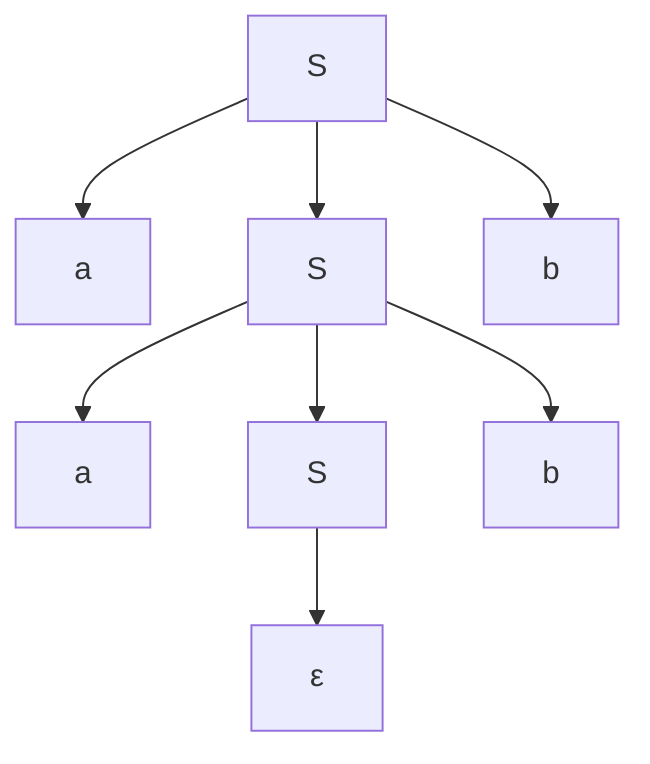

## Matematické a teoretické základy informatiky

### 30. Výroková a predikátová logika. Výrok, pravdivostná hodnota a logické spojky. Rozdiel medzi výrokovou a predikátovou logikou.

#### Výroková logika

Logika v informatike dáva presný spôsob, ako pracovať s pravdivosťou tvrdení a s odvodzovaním záverov. Výroková logika pracuje s celými výrokmi a spája ich pomocou **logických spojok**. Formálne sú jej **atómami celé výroky**. Neanalyzuje vnútornú štruktúru výroku – napr. tvrdenie „Jakub je študent“ je pre ňu len jedno písmeno `P` – neobsahuje žiaden záznam o tom, kto je Jakub ani čo znamená byť študentom.

Výroková logika je **rozhodnuteľná** – pre každú formulu sa dá algoritmicky zistiť, či je **tautológiou** (vždy pravdivá), **kontradikciou** (vždy nepravdivá), alebo **kontingenciou** (pravdivá len pri niektorých ohodnoteniach). Stačí skonštruovať **pravdivostnú tabuľku**, aj keď pre `n` premenných má `2ⁿ` riadkov. Samostatne sa často rieši problém **SAT**: či je formula **splniteľná**, teda či existuje aspoň jedno ohodnotenie, pri ktorom je pravdivá.

V informatike má výroková logika praktické využitie všade tam, kde systém rozhoduje medzi pravdou a nepravdou: v digitálnych obvodoch, v podmienkach programov, pri filtrovaní dát a vo vyhľadávacích dotazoch.

#### Predikátová logika

Predikátová logika ide hlbšie: rozkladá tvrdenia na **objekty**, **vlastnosti** a **vzťahy** medzi nimi. Formálne rozkladá výrok na **predikát a argumenty**. Namiesto atómu `P` má napr. `Študent(Jano)` – **predikát** `Študent` (vlastnosť) aplikovaný na **objekt** `Jano`. Predikáty môžu byť aj o viacerých objektoch naraz: `JeStarší(Jano, Peter)`, `Medzi(a, b, c)`.

Kľúčovým rozšírením sú **kvantifikátory**, ktoré umožňujú hovoriť o skupinách objektov:

- **Univerzálny kvantifikátor ∀** – „pre všetky x platí...“. Príklad: `∀x: Človek(x) → Smrteľný(x)` – „každý človek je smrteľný“.
- **Existenčný kvantifikátor ∃** – „existuje aspoň jedno x, pre ktoré platí...“. Príklad: `∃x: Prvočíslo(x) ∧ Párne(x)` – „existuje párne prvočíslo“ (je to 2).

Kvantifikátory sa dajú kombinovať a vnárať, pričom **poradie má zásadný význam**: `∀x ∃y: Miluje(x, y)` znamená „každý niekoho miluje“, zatiaľ čo `∃y ∀x: Miluje(x, y)` znamená „existuje niekto, koho milujú všetci“ – sú to dve úplne iné tvrdenia.

Predikátová logika (1. rádu) je **nerozhodnuteľná vo všeobecnosti** – neexistuje algoritmus, ktorý by pre ľubovoľnú formulu vedel rozhodnúť, či je tautológia. Napriek tomu tvorí základ **formálnej matematiky**, **logického programovania** (Prolog), **databáz** (relačná algebra a relačný kalkul) aj **automatického dokazovania**.

#### Výrok

**Výrok (propozícia)** je oznamovacia veta, o ktorej má zmysel povedať, či je **pravdivá** alebo **nepravdivá** – nikdy oboje súčasne.

Čo je výrok:

- „Bratislava je hlavné mesto Slovenska.“ → `1`
- „2 + 3 = 5.“ → `1`
- „6 je prvočíslo.“ → `0`

Čo výrokom **nie je**:

- otázka („Koľko je hodín?“), rozkaz („Zavri dvere!“), prianie alebo zvolanie,
- veta s nejasnou pravdivosťou („Matematika je krásna.“) – subjektívny názor,
- paradox („Tento výrok je nepravdivý.“) – nedá sa priradiť konzistentná hodnota.

Výroky sa označujú veľkými písmenami `A, B, P, Q`.

#### Pravdivostná hodnota a logické spojky

Pravdivostná hodnota výroku je jedna z dvoch: `1` (pravda) alebo `0` (nepravda). V klasickej logike pracujeme s **dvojhodnotovou logikou**.

Zložený výrok vznikne spojením jednoduchých cez **logické spojky**.

Spojky berú jeden alebo viac výrokov a tvoria z nich nový výrok. Určujú teda, ako sa z pravdivostných hodnôt jednoduchých výrokov vypočíta pravdivostná hodnota zloženého výroku.

Najčastejšie používané spojky:

| Spojka           | Zápis           | Význam                  | Pravdivá, keď                        |
| ---------------- | --------------- | ----------------------- | ------------------------------------ |
| **Negácia**      | ¬A, `NOT`       | „nie je pravda, že A“   | A je nepravdivý                      |
| **Konjunkcia**   | A ∧ B, `AND`    | „A a zároveň B“         | oba sú pravdivé                      |
| **Disjunkcia**   | A ∨ B, `OR`     | „A alebo B“             | aspoň jeden je pravdivý              |
| **Implikácia**   | A → B           | „ak A, tak B“           | A je nepravdivý alebo B je pravdivý |
| **Ekvivalencia** | A ↔ B           | „A práve vtedy, keď B“  | oba majú rovnakú hodnotu             |

Okrem nich sa používajú aj ďalšie užitočné spojky, napr. **XOR**, **NAND** a **NOR**.

Význam logických spojok sa formálne vyjadruje **pravdivostnou tabuľkou**.

Napríklad pre implikáciu `A → B`:

| A | B | A → B |
| - | - | ----- |
| 1 | 1 | 1     |
| 1 | 0 | 0     |
| 0 | 1 | 1     |
| 0 | 0 | 1     |

Pozor na implikáciu – je pravdivá aj vtedy, keď je **predpoklad nepravdivý**, bez ohľadu na záver. To je klasický zdroj omylov („z nepravdy vyplýva čokoľvek“).

**Tautológia** je formula, ktorá je pravdivá pre ľubovoľné dosadenie (napr. `A ∨ ¬A`). **Kontradikcia** je naopak vždy nepravdivá (napr. `A ∧ ¬A`).

#### Rozdiel medzi výrokovou a predikátovou logikou

Najväčší rozdiel medzi výrokovou a predikátovou logikou je v tom, že výroková logika pracuje s **celými výrokmi** ako s **nedeliteľnými celkami**, zatiaľ čo predikátová logika ich vie rozložiť na **objekty**, **vlastnosti** a **vzťahy** medzi nimi. Teda zatiaľ čo výroková logika vie vyjadriť len to, že niečo platí alebo neplatí, predikátová logika vie vyjadriť aj pre čo konkrétne to platí.

| Aspekt                  | Výroková logika                          | Predikátová logika                                 |
| ----------------------- | ---------------------------------------- | -------------------------------------------------- |
| **Atóm**                | celý výrok (`P`, `Q`, `R`)               | predikát nad objektmi (`Študent(x)`, `Väčší(a,b)`) |
| **Vnútorná štruktúra**  | neanalyzuje                              | rozkladá výrok na predikát + argumenty             |
| **Premenné a objekty**  | nemá                                     | premenné (`x`, `y`), konštanty (`Jano`), funkcie   |
| **Kvantifikátory**      | nemá                                     | `∀` (pre všetky), `∃` (existuje)                   |
| **Vyjadrovacia sila**   | slabšia – len kombinácie celých výrokov  | silnejšia – zachytí aj vzťahy medzi objektmi       |
| **Rozhodnuteľnosť**     | **rozhodnuteľná** (pravdivostné tabuľky) | **nerozhodnuteľná** vo všeobecnom prípade          |
| **Typické použitie**    | digitálna logika, booleovské výrazy, SAT | matematika, databázové dotazy, formálne overovanie |

### 31. Regulárne jazyky. Regulárne gramatiky. Konečné automaty – deterministické a nedeterministické. Uzavretosť jazykov.

#### Regulárne jazyky

Regulárne jazyky sú najjednoduchšia trieda v **Chomského hierarchii** (typ 3). Ten istý regulárny jazyk vieme opísať regulárnym výrazom, vygenerovať regulárnou gramatikou alebo rozpoznať konečným automatom.

**Jazyk** je množina reťazcov nad nejakou abecedou **Σ**, teda sigma (napr. `{a, b}`). **Regulárny jazyk** je taký, ktorý sa dá opísať **regulárnym výrazom** alebo ekvivalentne rozpoznať **konečným automatom**. Základné operácie regulárnych výrazov:

- **Zjednotenie:** `a | b` – buď `a`, alebo `b`.
- **Zreťazenie:** `ab` – najprv `a`, potom `b`.
- **Iterácia:** `a*` – nula alebo viac výskytov `a`.

Príklad: `(0|1)*` = všetky binárne reťazce aj prázdny – `a(a|b)*b` = reťazec, ktorý začína `a`, končí `b` a v strede má ľubovoľnú kombináciu znakov `a` / `b`.

Regulárne jazyky však majú zásadné obmedzenie: **nevedia počítať**. Nedokážu vyjadriť jazyk typu „rovnaký počet `a` ako `b`“ alebo „správne uzátvorkované výrazy“ – na to už treba bezkontextové jazyky. Formálne sa to dokazuje **pumping lemmou**, ktorá hovorí, že každý dostatočne dlhý reťazec regulárneho jazyka obsahuje časť, ktorá sa dá ľubovoľne-krát zopakovať a reťazec zostane v jazyku.

#### Regulárne gramatiky

Gramatika je štvorica `G = (N, Σ, P, S)`, kde `N` je množina **neterminálov**, `Σ` množina **terminálov**, `P` **prepisovacie pravidlá** a `S` **štartovací neterminál**. V **regulárnej gramatike** (typ 3) sú pravidlá obmedzené tak, že neterminál na pravej strane môže byť maximálne jeden a vždy na rovnakom konci:

- **Pravolineárna:** `A → aB` alebo `A → a` (neterminál vždy vpravo).
- **Ľavolineárna:** `A → Ba` alebo `A → a` (neterminál vždy vľavo).

Obe varianty generujú presne tú istú triedu jazykov. Príklad pravolineárnej gramatiky pre jazyk `a*b` (ľubovoľne veľa `a` a na konci jedno `b`):

```
S → aS | b
```

Každá regulárna gramatika sa dá algoritmicky previesť na konečný automat a naopak – sú to len dve formy zápisu tej istej veci.

#### Konečné automaty

Konečný automat (finite automaton) je najjednoduchší model výpočtu – má **konečný počet stavov**, vstup číta zľava doprava po jednom znaku a podľa aktuálneho stavu a prečítaného znaku prechádza do nasledujúceho stavu. Ak po spracovaní celého vstupu skončí v niektorom **koncovom (akceptujúcom) stave**, reťazec je v jazyku – inak nie.

Formálne: `M = (Q, Σ, δ, q₀, F)`, kde `Q` sú stavy, `Σ` vstupná abeceda, `δ` prechodová funkcia, `q₀` počiatočný stav a `F ⊆ Q` množina koncových stavov.

#### Deterministické konečné automaty

Deterministický konečný automat (DFA) je taký automat, v ktorom pre každý pár `(stav, znak)` existuje **presne jeden** nasledujúci stav. Prechodová funkcia má tvar `δ: Q × Σ → Q`. Výpočet je preto jednoznačný, bez akýchkoľvek volieb.

Dobrý príklad DFA je automat, ktorý číta binárne číslo a rozhoduje, či je jeho hodnota deliteľná tromi. Nemusí si pamätať celé číslo – stačí mu aktuálny **zvyšok po delení 3**. Preto má tri stavy: zvyšok `0`, `1` a `2`. Pri každom ďalšom bite sa nový zvyšok vypočíta ako `(2 × starý_zvyšok + bit) mod 3`.

<div class="dfa-deterministic-visualizer"></div>

#### Nedeterministické konečné automaty

Nedeterministický konečný automat (NFA) sa líši od deterministického tým, že z jedného stavu nemusí byť pre daný znak určený iba jeden nasledujúci stav. Môže existovať **viac možných prechodov**, prípadne žiadny. Navyše môže obsahovať aj **ε-prechody**, teda prechody bez čítania vstupného znaku. Reťazec je akceptovaný, ak **aspoň jedna** z možných ciest výpočtu skončí v koncovom stave.

Formálne sa to zapisuje napríklad ako `δ: Q × (Σ ∪ {ε}) → P(Q)`, teda prechodová funkcia z aktuálneho stavu a znaku nevracia jeden stav, ale **množinu možných stavov**.

Dôležité je, že DFA a NFA majú **rovnakú rozpoznávaciu silu** – rozpoznávajú tú istú triedu jazykov. Nedeterminizmus teda nepridáva novú silu, iba často umožní zapísať automat jednoduchšie. Každý NFA sa dá previesť na ekvivalentný DFA pomocou **podmnožinovej konštrukcie**. Nevýhoda je, že pri tomto prevode môže počet stavov narásť až exponenciálne, z `n` stavov NFA teoreticky až na `2ⁿ` stavov DFA.

Prakticky sa dá povedať, že NFA je často pohodlnejší pri návrhu, lebo vie prirodzene vyjadriť viac možných ciest. DFA je zase jednoduchší na vykonávanie, pretože pri každom znaku má presne určený jeden ďalší stav.

Ukážkový DFA akceptuje binárne reťazce **končiace na `1`**. V stave `q0` pri čítaní `0` zostáva, pri `1` prechádza do `q1`. Stav `q1` je akceptujúci – pri `1` v ňom zostáva, pri `0` sa vracia do `q0`.

Druhý režim ukazuje DFA pre reťazce s **párnym počtom jednotiek**. Automat má dva stavy: `párny` a `nepárny`. Pri znaku `0` sa stav nemení, pri znaku `1` sa prepína medzi párnym a nepárnym počtom jednotiek.

<div class="dfa-visualizer"></div>

*Tento automat je pekným príkladom toho, čo v praxi znamená obmedzená pamäť. Pri čítaní vstupu si nepotrebuje pamätať celú históriu prečítaných znakov. Všetko podstatné, čo pre jeho rozhodnutie potrebuje vedieť – či bol posledný znak 1, alebo nie – je plne zakódované v tom, v ktorom z dvoch stavov sa práve nachádza.*

#### Uzavretosť jazykov

Trieda jazykov je **uzavretá voči operácii**, ak výsledok tejto operácie nad jazykmi triedy zase patrí do rovnakej triedy. Regulárne jazyky sú uzavreté voči:

- **Zjednoteniu (∪)** – `L₁ ∪ L₂` je regulárny, ak sú `L₁` aj `L₂` regulárne.
- **Prieniku (∩)** – `L₁ ∩ L₂` (konštrukcia cez súčinový automat).
- **Doplnku (L̄)** – všetky reťazce, ktoré nie sú v `L` – v DFA stačí prehodiť akceptujúce a neakceptujúce stavy.
- **Zreťazeniu (L₁ · L₂)** – všetky reťazce tvaru `xy`, kde `x ∈ L₁` a `y ∈ L₂`.
- **Kleeneho iterácii (L*)** – nula alebo viac zreťazení reťazcov z `L`.
- **Rozdielu (L₁ \ L₂)** – ekvivalentne `L₁ ∩ L̄₂`.
- **Obraz a inverzný obraz homomorfizmu** (formálne dôležité, v praxi menej).

Uzavretosť je dôležitá preto, lebo umožňuje komponovať riešenia: ak vieme rozpoznať dva jednoduché jazyky, vieme zo skladania automatov dostať aj ich zjednotenie, prienik či doplnok bez toho, aby sme museli navrhovať nový automat od nuly.

### 32. Bezkontextové jazyky. Bezkontextové gramatiky. Zásobníkové automaty.

#### Bezkontextové jazyky

Bezkontextové jazyky sú trieda formálnych jazykov typu 2 v Chomského hierarchii. Generujú ich bezkontextové gramatiky a ekvivalentne ich rozpoznávajú zásobníkové automaty. V hierarchii ležia nad regulárnymi (každý regulárny jazyk je zároveň bezkontextový) a pod kontextovými (typ 1).

Typické príklady, ktoré nie sú regulárne, ale sú bezkontextové:

- `{ aⁿbⁿ | n ≥ 0 }` – rovnaký počet `a` a `b` v tvare `aaa...bbb`. Regulárny automat si nevie zapamätať, koľko `a` videl – PDA si ich počet uloží na zásobník a páruje s `b`.
- **Správne uzátvorkované výrazy** (`()`, `(())`, `(()())`) – klasická Dyckova štruktúra, základ syntaxe jazykov s vnorenými blokmi.
- **Vnorené konštrukcie** v programovacích jazykoch, XML alebo JSON.
- **Palindromy** nad pevnou abecedou.

Dôležité obmedzenie: bezkontextové jazyky **nevedia vyjadriť** napr. jazyk `{ aⁿbⁿcⁿ | n ≥ 0 }` (tri symboly v rovnakom počte) ani to, že deklarovaná premenná musí byť použitá so zhodným typom. Tieto javy sú už **kontextové** a v praxi sa riešia mimo syntaxe, v sémantickej analýze kompilátora.

Uzavretosť: bezkontextové jazyky sú uzavreté voči **zjednoteniu, zreťazeniu, Kleeneho iterácii** a **obrátke**, ale **nie sú uzavreté voči prieniku ani doplnku** – to je podstatný rozdiel oproti regulárnym jazykom.

#### Bezkontextové gramatiky

Rovnaká štvorica `G = (N, Σ, P, S)` ako pri regulárnych, ale pravidlá v `P` majú tvar:

```
A → α
```

kde `A` je **jeden neterminál** a `α` je ľubovoľná postupnosť terminálov a neterminálov (môže byť aj prázdna ε). Na rozdiel od regulárnej gramatiky nie je obmedzené, kde v pravej strane neterminály ležia – preto sa volá **bezkontextová**: prepis `A` nezávisí od okolia, v akom sa `A` v reťazci nachádza.

Príklad gramatiky pre `{ aⁿbⁿ }`:

```
S → aSb | ε
```

Rozvojom zo `S` postupne vzniknú `ε`, `ab`, `aabb`, `aaabbb` – vždy rovnaký počet `a` a `b`.



Derivačný strom (parse tree) reťazca `aabb` podľa gramatiky `S → aSb | ε`.

**Odvodenie (derivation)** je postupnosť aplikácií pravidiel, ktorá zo `S` postupne vyprodukuje reťazec terminálov. Jednému reťazcu môže zodpovedať viac odvodení, ktoré sa grafickej reprezentujú ako **derivačný strom**.

**Ambiguita (viacznačnosť):** gramatika je **nejednoznačná**, ak pre niektorý reťazec existujú dva rôzne derivačné stromy. Klasický príklad je výraz `a + b * c`, ktorý sa bez priority operátorov dá rozparsovať ako `(a + b) * c` aj ako `a + (b * c)`. V programovacích jazykoch sa ambiguita rieši buď **prioritnými pravidlami** (krátky zápis), alebo **prepisom gramatiky** do jednoznačného tvaru (štandardné riešenie v kompilátoroch).

Podtriedy bezkontextových gramatík používané v praxi pri parsovaní:

- **LL(k)** – vstup číta zľava doprava, odvodenie vyvoláva zľava, pozerá sa vopred na `k` znakov. Používa sa v rekurzívne-zostupných parseroch.
- **LR(k)** – zľava doprava, odvodenie sprava, lookahead `k`. Silnejšia než LL – používa sa v generátoroch parserov (Yacc, Bison).

#### Zásobníkové automaty (PDA)

Zásobníkový automat (pushdown automaton) je konečný automat rozšírený o **nekonečný zásobník** (LIFO pamäť). Pri každom prechode sa berie do úvahy nielen stav a vstupný znak, ale aj **symbol na vrchole zásobníka**, a akcia môže tento symbol vybrať, nahradiť alebo pridať ďalšie symboly nad neho.

Formálne: `M = (Q, Σ, Γ, δ, q₀, Z₀, F)`, kde oproti konečnému automatu pribúdajú:

- `Γ` – zásobníková abeceda (symboly, ktoré môžu byť na zásobníku),
- `Z₀ ∈ Γ` – počiatočný symbol zásobníka,
- prechodová funkcia `δ: Q × (Σ ∪ {ε}) × Γ → P(Q × Γ*)` – berie stav, voliteľne znak zo vstupu a symbol z vrchu zásobníka, vracia nový stav a postupnosť zásobníkových symbolov, ktorá nahrádza ten vrchol.

**Dva ekvivalentné spôsoby akceptácie** reťazca:

- **koncovým stavom** – vstup je akceptovaný, ak po jeho prečítaní automat skončí v niektorom stave z `F`,
- **prázdnym zásobníkom** – vstup je akceptovaný, ak je po jeho prečítaní zásobník prázdny.

<div class="pda-visualizer"></div>

*Tento príklad ukazuje rozdiel oproti konečnému automatu. DFA si nevie zapamätať ľubovoľne veľký počet `a`, ale PDA na to použije zásobník. Pri každom `a` niečo uloží, pri každom `b` to odoberie. Slovo prijme iba vtedy, ak sa počty vyrovnajú a vstup má správny tvar.*

Determinizmus: na rozdiel od konečných automatov platí, že **DPDA (deterministický PDA) je striktne slabší ako NPDA** (nedeterministický). DPDA rozpoznávajú iba **deterministické bezkontextové jazyky** – vlastnú podmnožinu všetkých BKJ. Napríklad palindromy nad `{a, b}` vyžadujú nedeterminizmus, pretože automat si musí „uhádnuť“ stred reťazca, aby vedel, kedy prestať ukladať a začať porovnávať.

Prakticky: **NPDA ≡ bezkontextové gramatiky** z hľadiska rozpoznávacej sily, takže ide o presný automatový náprotivok bezkontextových gramatík. Reálne parsery programovacích jazykov pracujú s deterministickou podmnožinou (LL, LR gramatiky), lebo tie sa dajú implementovať **efektívne a bez backtrackingu**.

### 33. Frázové jazyky. Turingov stroj. Univerzálny TS.

#### Frázové jazyky

Frázové jazyky (typ 0 v Chomského hierarchii) sú najvšeobecnejšou triedou formálnych jazykov v tejto hierarchii. Zodpovedajú jazykom, ktoré vie rozpoznať nejaký Turingov stroj. Generujú ich **frázové gramatiky**, v ktorých pravidlá majú tvar:

```
α → β
```

kde `α` a `β` sú ľubovoľné reťazce terminálov a neterminálov, pričom `α` musí obsahovať aspoň jeden neterminál. Oproti bezkontextovým gramatikám tu už **nie je obmedzenie, aby bola ľavá strana jediný neterminál** – do prepisu môže vstupovať okolitý kontext, preto aj pomenovanie „frázová“: neprepisuje sa len jeden neterminál, ale celá fráza.

Kľúčové vlastnosti:

- [[verified: Frázové gramatiky generujú práve tie jazyky, ktoré môžu byť rozpoznané nejakým Turingovým strojom.]]
- Rozpoznať jazyk znamená dať v konečnom čase kladnú odpoveď pre slová, ktoré do jazyka patria. Pre slová mimo jazyka sa TS nemusí zastaviť.
- Ak TS pre každý vstup vždy skončí a odpovie **ÁNO/NIE**, jazyk je **rekurzívny (rozhodnuteľný)**. [[verified: Rozhodnuteľné jazyky tvoria vlastnú podtriedu jazykov prijímaných Turingovými strojmi.]]
- [[verified: Nie ku každému jazyku existuje Turingov stroj, ktorý ho rozpoznáva.]] Typický príklad z prednášok je diagonálne skonštruovaný jazyk `D`.

**Chomského hierarchia:**

| Typ | Trieda gramatík        | Generované jazyky / rozpoznávanie |
| --- | ---------------------- | --------------------------------- |
| 0   | frázové gramatiky      | generujú frázové jazyky, rozpoznateľné Turingovým strojom |
| 1   | kontextové gramatiky   | generujú kontextové jazyky, rozpoznateľné lineárne ohraničeným TS |
| 2   | bezkontextové gramatiky | generujú bezkontextové jazyky, rozpoznateľné nedeterministickým zásobníkovým automatom |
| 3   | regulárne gramatiky    | generujú regulárne jazyky, rozpoznateľné konečným automatom |

#### Turingov stroj

Turingov stroj je **abstraktný výpočtový model**, ktorý formalizuje pojem algoritmu. Predstavil ho Alan Turing v roku 1936.

V Chomského hierarchii zodpovedá frázovým jazykom: jazyk je frázový práve vtedy, keď ho vie rozpoznať nejaký Turingov stroj. TS sa považuje za univerzálny model klasického výpočtu – zachytáva všetko, čo vieme v intuitívnom zmysle algoritmicky vypočítať.

Model si môžeme predstaviť ako tri časti:

- **pásku** rozdelenú na bunky, do ktorých sa zapisujú symboly; na začiatku je na nej vstup uložený v súvislom bloku a ostatné bunky obsahujú špeciálny prázdny symbol, tzv. **blank** `⊔`,
- **hlavu**, ktorá číta aktuálnu bunku, môže ju prepísať a posúva sa najviac o jedno políčko doľava alebo doprava,
- **riadiacu jednotku**, ktorá má konečný počet stavov a podľa prechodovej funkcie určuje ďalší krok stroja.

Formálne sa TS často zapisuje ako šestica `T = (Σ, Γ, K, q₀, δ, F)`, kde:

- `Σ` – vstupná abeceda; neobsahuje blank,

- `Γ` – pracovná abeceda pásky; obsahuje vstupnú abecedu aj blank,

- `K` – konečná množina stavov,

- `q₀` – počiatočný stav,

- `δ` – prechodová funkcia; z aktuálneho stavu a symbolu pod hlavou určí nový stav, symbol na zápis a posun hlavy,

- `F` – množina akceptujúcich stavov.

TS pracuje krok po kroku. Na začiatku má na páske zapísaný vstup a hlava je nastavená na prvý symbol. V každom kroku sa stroj pozrie na aktuálny symbol, podľa prechodovej funkcie ho môže prepísať, posunie hlavu doľava alebo doprava a prejde do nového stavu. Slovo akceptuje vtedy, keď sa výpočet dostane do niektorého akceptujúceho stavu z `F`. Ak sa tam nedostane, môže sa zastaviť bez akceptovania alebo bežať donekonečna.

Turingov stroj vie realizovať každý výpočet, ktorý vieme prirodzene chápať ako algoritmus. Rozšírenia ako **viac pások**, **nedeterminizmus** alebo **2D páska** nezväčšujú triedu jazykov, ktoré vie TS rozpoznávať – štandardný TS ich vie simulovať. Môžu však výpočet zrýchliť alebo zjednodušiť konštrukciu. Zároveň existujú problémy, ktoré TS nevie rozhodnúť – klasika je **problém zastavenia (halting problem)**: neexistuje TS, ktorý by pre ľubovoľný Turingov stroj a vstup rozhodol, či sa daný stroj na tomto vstupe zastaví.

<div class="turing-visualizer"></div>

*Tento vizualizér má dva režimy. **Invertor bitov** ukazuje úplne základnú mechaniku: čítanie, zápis, zmenu stavu a pohyb hlavy vždy len doprava. **Inkrementácia (+1)** ukazuje jednoduchý algoritmický výpočet. Stroj najprv prejde na koniec slova a potom plynule postupuje sprava doľava, pričom mení koncové jednotky na nuly (šíri prenos), až kým nenájde nulu, ktorú zmení na jednotku. Práve vďaka voľnému pohybu obojsmerne po páske môže TS simulovať plnohodnotné algoritmy.*

#### Univerzálny Turingov stroj (UTS)

**Univerzálny Turingov stroj** vie simulovať ľubovoľný iný Turingov stroj.

Na vstupe dostane:

1. **kód simulovaného TS** `T` – teda zakódovaný popis jeho stavov, abecedy a prechodovej funkcie,
2. **vstupné slovo** `w`, na ktorom sa má tento stroj spustiť.

UTS potom simuluje výpočet stroja `T` na slove `w`. Ak by `T` slovo akceptoval, akceptuje ho aj UTS; ak by sa `T` nezastavil, nezastaví sa ani simulácia.

Dôležitá myšlienka je, že Turingove stroje sa dajú **zakódovať ako reťazce**. Kód stroja sa tak môže stať vstupom pre iný stroj – podobne ako program v reálnom počítači.

**Prečo je UTS dôležitý:**

UTS je formálny predchodca dnešného počítača s **uloženým programom** (*stored-program computer*). Program aj dáta sú reprezentované ako vstupné reťazce a ten istý stroj ich vie postupne interpretovať.

Ukazuje, že **jeden univerzálny stroj dokáže vykonať ľubovoľný algoritmus** – netreba pre každú úlohu meniť samotný stroj, stačí zmeniť „program“ na vstupe.

Je to aj **dôkazový nástroj** v teórii vypočítateľnosti. Keďže Turingove stroje vieme kódovať ako reťazce, môžeme sa pýtať otázky o samotných programoch, napríklad pri dôkaze nerozhodnuteľnosti **problému zastavenia**.

UTS tak tvorí dobrý most medzi **abstraktnou teóriou výpočtu** a praktickou predstavou počítača, ktorý dostane program aj dáta a krok po kroku ich spracuje.

### 34. Rozdelenie problémov do tried zložitosti. Triedy zložitosti P vs. NP, NP-úplnosť. Algoritmicky neriešiteľné problémy.

#### Rozdelenie problémov do tried zložitosti

Zložitosť algoritmu nám hovorí, koľko času (operácií) alebo pamäte budeme potrebovať pre vstup veľkosti `n`. Zapisuje sa známou **O-notáciou** (napr. `O(n)`, `O(n log n)`, `O(n²)`). 

V teoretickej informatike sa ale na túto zložitosť pozeráme s obrovským nadhľadom. [[verified: Z teoretického hľadiska zanedbáme rozdiely medzi rôznymi stupňami polynomiálnej zložitosti a uvažujeme iba dve triedy problémov - polynomiálnu a exponenciálnu.]] Neriešime teda, či má niečo zložitosť `O(n)` alebo `O(n³)` – obe považujeme za prakticky zvládnuteľné. Zato exponenciálna zložitosť (napr. `O(2ⁿ)`) už znamená, že problém sa dá zväčša riešiť len **hrubou silou** (brute-force skúšaním všetkých možností) a pre väčšie vstupy je v praxi neriešiteľný.

Na základe tohto prístupu delíme problémy do dvoch hlavných tried:

**Trieda P (Polynomial)**
Ide o problémy, ktoré dokáže normálny **deterministický Turingov stroj** vyriešiť v polynomiálnom čase. 
[[verified: Trieda P v podstate zodpovedá triede úloh, ktoré sú realisticky riešiteľné na počítači.]] Sú to tie "dobré", efektívne zvládnuteľné problémy.

Patria sem klasické veci:
- Triedenie prvkov v poli (QuickSort, MergeSort).
- Hľadanie najkratšej cesty v grafe (Dijkstra) alebo minimálnej kostry.
- Bežné matematické operácie ako násobenie matíc.

**Trieda NP (Nondeterministic Polynomial)**
Toto sú problémy, pri ktorých nepoznáme rýchly algoritmus na nájdenie riešenia (hľadanie počtu možností rastie exponenciálne). Ak nám ale niekto vnukne správne riešenie, vieme ho **rýchlo skontrolovať**.
[[verified: Trieda NP je trieda jazykov, pre ktoré existuje verifikačný algoritmus pracujúci v polynomiálne obmedzenom čase.]]

Písmeno "N" v názve NP znamená "nedeterministický" – na hypotetickom nedeterministickom Turingovom stroji by sme tento problém vedeli vyriešiť rýchlo (stroj by riešenie uhádol a potom ho polynomiálne overil).

Patria sem známe optimalizačné hádanky:
- **Rozmiestnenie N-dám na šachovnici** tak, aby sa neohrozovali (overiť predložené rozloženie je pre počítač triviálne, no prepočítať všetky možnosti trvá dlho).
- **Problém súčtu podmnožiny** (ako rozdeliť čísla na dve kôpky s rovnakým súčtom).
- **Hľadanie Hamiltonovej cesty** (cesta cez všetky vrcholy grafu práve raz).

*(Prirodzene platí, že `P ⊆ NP` – pretože ak vieme riešenie v polynomiálnom čase priamo nájsť, tak ho vieme v polynomiálnom čase zaručene aj overiť. Všetky problémy z P sú teda automaticky aj v NP.)*

#### Triedy zložitosti P vs. NP

[[verified: Zatiaľ čo problémy z triedy P sú „rýchlo“ rozhodnuteľné, problémy z NP sú iba „rýchlo“ verifikovateľné.]]

Otázka `P = NP?` pátra po jadre veci: *Dá sa každý problém, ktorého riešenie vieme rýchlo skontrolovať, aj rovnako rýchlo vyriešiť?* 

Väčšina odborníkov verí, že `P ≠ NP` (teda že hľadanie riešenia je fundamentálne ťažšie ako jeho overovanie). Ak by totiž platilo, že `P = NP`, znamenalo by to napríklad koniec modernej kryptografie – nájdenie privátneho kľúča (čo je extrémne ťažké hľadanie) by bolo algoritmicky podobne náročné ako overenie, či kľúč pasuje (čo je veľmi ľahká verifikácia). 

Ide o jeden z najväčších nevyriešených problémov teoretickej informatiky (tzv. miléniový problém s odmenou 1 milión dolárov).

#### NP-úplnosť

Aby sme vedeli problémy porovnávať, používame mechanizmus **polynomiálnej redukcie** (prevodu). Funguje to ako algoritmické prekladanie: ak máme ťažký problém a vieme ho v polynomiálnom čase (teda „rýchlo“) preložiť na iný problém, vyriešenie toho druhého nám automaticky vyrieši aj ten prvý.

**NP-úplné problémy** (NP-complete) sú pomyselným „klubom najťažších problémov“ v triede NP. Problém patrí do tohto elitného klubu, ak spĺňa dve vlastnosti:

1. **Patrí do NP** – jeho riešenie sa dá rýchlo overiť.
2. **Každý iný problém z NP sa naň dá polynomiálne redukovať** – to znamená, že všetky NP problémy vieme „rýchlo“ preložiť do tohto jedného problému.

Z tohto vyplýva brutálny dôsledok: [[verified: Riešenie ktoréhokoľvek problému z triedy NP-úplných problémov v polynomiálne obmedzenom čase, by znamenalo nájdenie rýchleho algoritmu pre riešenie všetkých.]] Ak by sa to podarilo, automaticky by platilo `P = NP`.

Historicky prvý dokázaný NP-úplný problém bol **SAT** (splniteľnosť booleovských formúl), čo dokazuje tzv. **Cookova veta**. Akonáhle bol tento prvý pilier dokázaný, dal sa použiť ako odrazový mostík – postupným reťazením polynomiálnych redukcií sa dokázala NP-úplnosť stoviek ďalších problémov z praxe:

- **Problém obchodného cestujúceho** (najkratšia trasa prechádzajúca cez všetky mestá),
- **Problém batohu** (výber predmetov pre maximalizáciu hodnoty pri limitovanej nosnosti),
- **k-zafarbiteľnosť grafu** (ako vyfarbiť vrcholy tak, aby susediace nemali rovnakú farbu),
- **Hľadanie kliky v grafe** (úplný podgraf).

*(Na okraj existujú aj tzv. **NP-ťažké problémy**. Sú aspoň tak ťažké ako NP-úplné problémy, dajú sa na ne polynomiálne redukovať iné problémy z NP, ale ony samotné už **nemusia ležať ani len v NP** – to znamená, že ich riešenie nevieme v polynomiálnom čase ani len overiť. Príkladom je Problém zastavenia z predchádzajúcej podotázky.)*

#### Algoritmicky neriešiteľné problémy

Okrem riešiteľných problémov existujú aj také, ktoré **nie sú riešiteľné žiadnym algoritmom** – ani keby sme mali k dispozícii neobmedzený čas a pamäť. Voláme ich **nerozhodnuteľné (undecidable)** problémy. To znamená, že neexistuje algoritmus (Turingov stroj), ktorý by na každý možný vstup zaručene zastal a povedal odpoveď ÁNO/NIE.

Najznámejším zástupcom je **problém zastavenia (halting problem)**. Zjednodušene sa pýta: *Vieme napísať program, ktorý dostane zdrojový kód iného programu a rozhodne, či sa ten druhý program niekedy zastaví, alebo či padne do nekonečného cyklu?* Turing dokázal, že takýto program napísať **nemožno**.

Dôkaz sa vedie paradoxom (sporom). Predstavme si, že taký program existuje (nazvime ho analyzátor). Čo ak by sme mu predhodili zákerný program, ktorý sa zachová presne opačne, ako mu analyzátor predpovie? Ak mu analyzátor povie „zastavíš sa“, zákerný program skočí do nekonečného cyklu. Ak mu povie „zacyklíš sa“, zákerný program sa okamžite zastaví. Analyzátor sa v takomto prípade vždy zmýli.

Výbornou metaforou z prednášok je **Paradox holiča**: *„Holič holí práve všetkých mužov v meste, ktorí sa neholia sami. Holí holič sám seba?“* – Ak sa holí, porušuje pravidlo. Ak sa neholí, mal by sa podľa pravidla oholiť. Rovnaký logický spor platí pri programe z predchádzajúceho odseku.

**Čiastočná rozhodnuteľnosť**
Je dôležité dodať, že [[verified: Problém zastavenia Turingovho stroja je čiastočne rozhodnuteľný.]] To znamená:
- Ak analyzovaný program naozaj skončí, náš algoritmus to skôr či neskôr zistí (program dobehne).
- Ak sa ale analyzovaný program zacyklí, náš algoritmus ho bude simulovať donekonečna. My tak nikdy s istotou nebudeme vedieť rozlíšiť, či program iba veľmi dlho niečo počíta, alebo či sa už naozaj zacyklil.

**Praktický dôsledok**
Toto nie je len abstraktná matematika. Znamená to definovanie absolútnych limitov softvéru. Práve preto nikdy nevznikne perfektný kompilátor, ktorý by nás s istotou upozornil na všetky nekonečné cykly, ani absolútne stopercentný antivírus, ktorý by vedel bez spustenia rozanalyzovať ľubovoľný kód. Všeobecný analyzátor je jednoducho **matematicky nemožný**.

---
