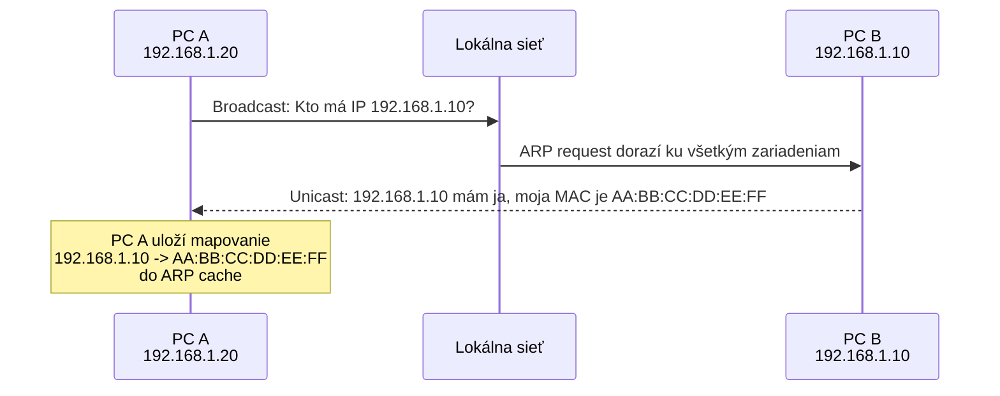
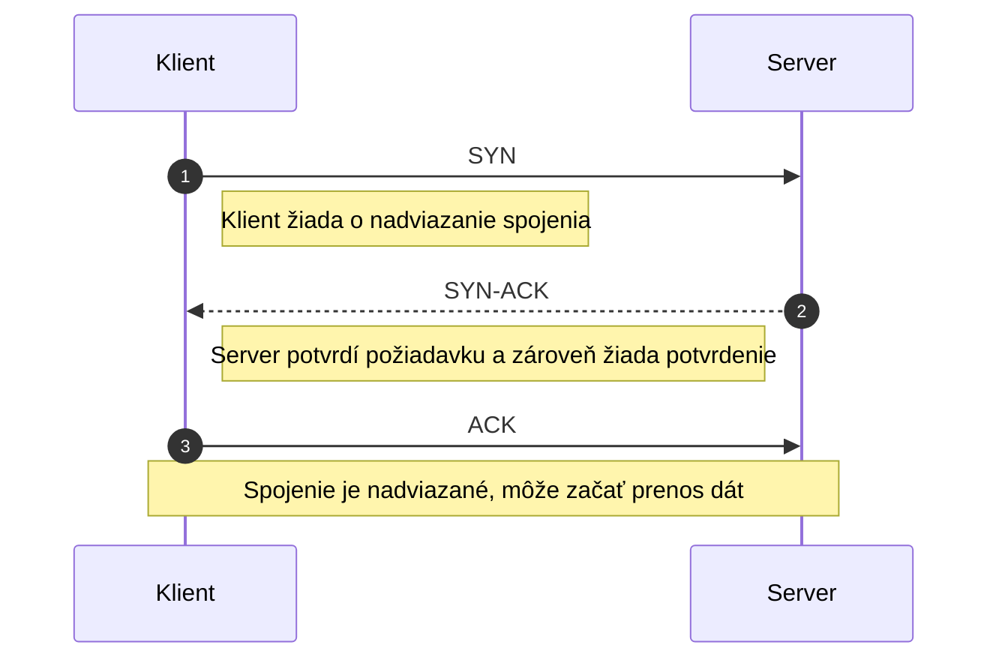
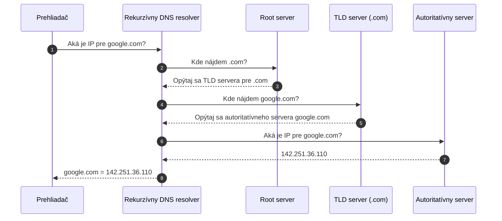
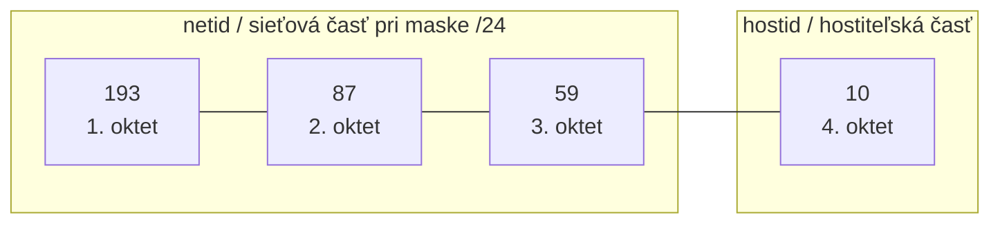
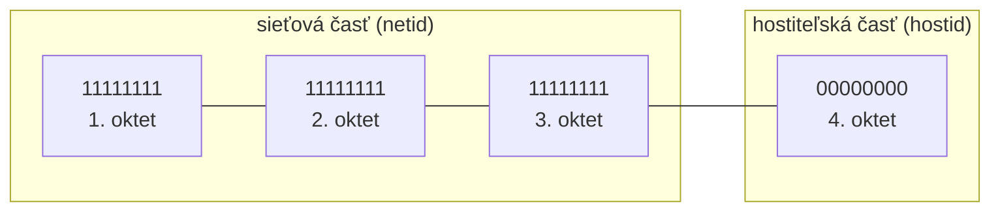
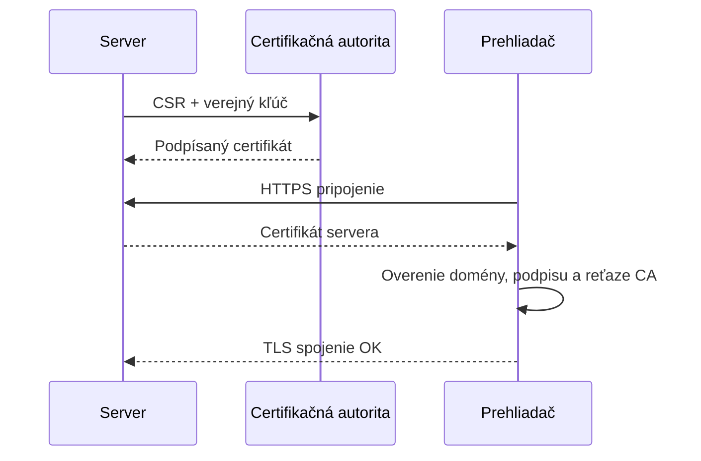

## Počítačové siete a informačná bezpečnosť

### 35. Vrstvový model architektúry počítačových sietí (ISO OSI a TCP/IP, vrstvy a ich služby, porovnanie modelov). Základné protokoly modelu TCP/IP (ARP, IP, ICMP, TCP, UDP, DNS).

#### Vrstvový model architektúry počítačových sietí

Vrstvový model rozdeľuje sieťovú komunikáciu na nezávislé abstraktné vrstvy, aby zmena v jednej časti neovplyvnila ostatné – a dva najznámejšie modely tohto prístupu sú **ISO/OSI** a **TCP/IP**. Každá vrstva rieši iba svoju časť problému (adresovanie, smerovanie, spoľahlivosť, interpretácia dát) a so susednou vrstvou komunikuje cez pevne definované rozhranie. Pri odoslaní sa dáta postupne **zapúzdrujú** – každá vrstva pridá svoju hlavičku – pri prijatí sa **rozbaľujú** v opačnom poradí.

#### ISO/OSI model

Referenčný model definovaný organizáciou ISO v roku 1984. Má **7 vrstiev**. Dá sa zapamätať ako **3 časti orientované na aplikácie**, **1 transportná časť, ktorá ich prepája**, a **3 časti orientované na prenos dát**.

OSI je v praxi skôr **referenčný a učebný** – s reálnym softvérom sa priamo v ňom nekomunikuje, ale používa sa pri výklade a diagnostike („chyba je na vrstve 2").

<table class="osi-stack">
  <tbody>
    <tr class="osi-app">
      <th><strong>Aplikačná</strong></th>
      <td>priame rozhranie pre používateľské aplikácie</td>
      <td>HTTP, FTP, SMTP, DNS</td>
    </tr>
    <tr class="osi-app">
      <th><strong>Prezentačná</strong></th>
      <td>formát dát, kódovanie, šifrovanie, kompresia</td>
      <td>ASCII, UTF-8, TLS</td>
    </tr>
    <tr class="osi-app">
      <th><strong>Relačná</strong></th>
      <td>zakladanie, udržiavanie a ukončovanie relácií</td>
      <td>session, dialóg</td>
    </tr>
    <tr class="osi-bridge">
      <th><strong>Transportná</strong></th>
      <td>end-to-end prenos medzi procesmi, spoľahlivosť, riadenie toku, porty</td>
      <td>TCP, UDP</td>
    </tr>
    <tr class="osi-transfer">
      <th><strong>Sieťová</strong></th>
      <td>smerovanie paketov medzi sieťami, IP adresovanie</td>
      <td>IP, ICMP</td>
    </tr>
    <tr class="osi-transfer">
      <th><strong>Linková / dátová spojová</strong></th>
      <td>rámce medzi priamo spojenými uzlami, MAC adresovanie, detekcia chýb</td>
      <td>Ethernet, Wi-Fi, PPP</td>
    </tr>
    <tr class="osi-transfer">
      <th><strong>Fyzická</strong></th>
      <td>prenos bitov po fyzickom médiu, signály, kódovanie, konektory</td>
      <td>metalika, optika, rádio</td>
    </tr>
  </tbody>
</table>

#### TCP/IP model

Praktický model vyvinutý pre ARPANET a neskôr internet. Má **4 vrstvy**.

TCP/IP je **dominantný** model dnešného internetu – od prehliadania webu cez e-mail po videohovory všetko beží na jeho protokoloch.

<table class="osi-stack">
  <tbody>
    <tr class="tcpip-app">
      <th><strong>Aplikačná</strong></th>
      <td>pokrýva relačnú, prezentačnú aj aplikačnú vrstvu z OSI</td>
      <td>HTTP, FTP, SMTP, DNS, SSH</td>
    </tr>
    <tr class="tcpip-transport">
      <th><strong>Transportná</strong></th>
      <td>end-to-end prenos medzi procesmi, TCP (spoľahlivý), UDP (rýchly)</td>
      <td>TCP, UDP</td>
    </tr>
    <tr class="tcpip-internet">
      <th><strong>Internetová</strong></th>
      <td>smerovanie medzi sieťami, IP adresovanie</td>
      <td>IP, ICMP</td>
    </tr>
    <tr class="tcpip-link">
      <th><strong>Linková</strong></th>
      <td>fyzická a linková vrstva OSI v jednej – prenos cez konkrétne médium</td>
      <td>Ethernet, Wi-Fi, ARP</td>
    </tr>
  </tbody>
</table>

#### Porovnanie modelov

Hlavné rozdiely:

- **Počet vrstiev** – OSI má 7, TCP/IP 4 – TCP/IP zlučuje vyššie vrstvy do jednej aplikačnej a nižšie vrstvy do jednej linkovej.
- **Pôvod** – OSI vznikol ako referenčný model štandardizovaný organizáciou ISO, zatiaľ čo TCP/IP sa vyvinul z praktických potrieb siete ARPANET a internetu.
- **Použitie dnes** – TCP/IP je základom dnešnej internetovej komunikácie, kým OSI sa používa najmä ako referenčný model pri výučbe a pri popise sieťových problémov.

| TCP/IP vrstva   | Zodpovedá OSI vrstvám                    | Príklady protokolov |
| --------------- | ---------------------------------------- | ------------------- |
| **Aplikačná**   | 5 (Relačná), 6 (Prezentačná), 7 (Aplikačná) | HTTP, FTP, SMTP, DNS, SSH |
| **Transportná** | 4 (Transportná)                          | TCP, UDP |
| **Internetová** | 3 (Sieťová)                              | IP, ICMP |
| **Linková**     | 1 (Fyzická), 2 (Linková)                 | Ethernet, Wi-Fi, ARP |

#### Základné protokoly modelu TCP/IP

K modelu TCP/IP patria protokoly rôznych vrstiev. Na internetovej vrstve sú to najmä `IP` a `ICMP`, na transportnej vrstve `TCP` a `UDP`, a na aplikačnej vrstve napríklad `DNS`. `ARP` stojí na rozhraní linkovej a internetovej vrstvy a slúži na preklad IP adries na MAC adresy v lokálnej sieti.

#### ARP (Address Resolution Protocol)

Protokol, ktorý prekladá **IP adresy na MAC adresy** v rámci lokálnej siete. Keď chce zariadenie poslať paket inému v rovnakej sieti, pozná jeho IP, ale pre linkovú vrstvu potrebuje MAC adresu – pošle broadcast dotaz „kto má IP 192.168.1.10?“ a zariadenie s tou IP odpovie svojou MAC adresou. Odpovede sa cachujú v **ARP tabuľke**, aby sa dotaz nemusel opakovať pri každom pakete. ARP pracuje medzi linkovou a sieťovou vrstvou.

Vizualizácia ARP dotazu v lokálnej sieti:

#### IP (Internet Protocol)

Hlavný protokol sieťovej vrstvy – adresuje zariadenia v sieti (IPv4: 32-bitová adresa, napr. `192.168.1.1`, IPv6: 128-bit) a **smeruje pakety** medzi rôznymi sieťami. Je **nespojovo orientovaný (connectionless)** a **nespoľahlivý** – negarantuje doručenie, poradie ani detekciu duplicít – tieto záruky poskytuje až transportná vrstva (TCP). Každý paket obsahuje zdrojovú a cieľovú IP, **TTL (time-to-live)** a označenie protokolu vyššej vrstvy.

#### ICMP (Internet Control Message Protocol)

Protokol na prenos **riadiacich a diagnostických správ** v sieti (cieľ nedostupný, TTL vypršalo, neznámy port). Neprenáša aplikačné dáta, slúži sieti samotnej – väčšinu ICMP správ generujú smerovače, nie aplikácie.

Typické príklady:

- príkaz `ping` (ICMP Echo Request + Echo Reply na overenie dostupnosti)
- `traceroute` (sleduje cestu paketu postupným zvyšovaním TTL a analýzou ICMP chýb „TTL expired“)

*Praktická ukážka `ping -c 4 julis.sk`: vidno ICMP odpovede aj záverečnú štatistiku o strate paketov a odozve.*

#### TCP (Transmission Control Protocol)

**Spojovo orientovaný** a **spoľahlivý** protokol transportnej vrstvy. Pred samotným prenosom naviaže spojenie cez **three-way handshake** (`SYN` → `SYN-ACK` → `ACK`), a následne garantuje **doručenie, správne poradie a bezchybnosť dát** pomocou potvrdení (ACK), retransmisií a kontrolných súčtov. Podporuje aj **riadenie toku** a **kontrolu preťaženia**.

Transportná vrstva zároveň používa **porty**, ktorými rozlišuje konkrétne služby alebo procesy na jednom zariadení. IP adresa určí počítač v sieti, port určí aplikáciu na tomto počítači. Napríklad `localhost:3000` znamená, že prehliadač sa pripája na vlastný počítač na port `3000`, kde beží lokálny vývojový web server.

Vizualizácia nadviazania TCP spojenia:

Použitie: HTTP(S), FTP, SMTP, SSH – všade, kde je spoľahlivosť dôležitejšia ako rýchlosť.

#### UDP (User Datagram Protocol)

**Nespojovo orientovaný** a **nespoľahlivý** protokol transportnej vrstvy. Nevytvára spojenie, neposiela potvrdenia, nezaručí doručenie ani poradie – iba pošle datagram a dúfa, že dorazí. Jeho prednosťou je **minimálna réžia a nízka latencia**.

Použitie: DNS, DHCP, streamovanie videa a zvuku, VoIP, online hry – aplikácie, ktorým viac záleží na rýchlosti než na stopercentnej spoľahlivosti.

#### DNS (Domain Name System)

Vďaka DNS si nemusíme pamätať IP adresy, stačia doménové mená.

Distribuovaný hierarchický systém, ktorý prekladá **doménové mená na IP adresy** (napr. `google.com` → `142.251.36.110`). Keď prehliadač zadá doménu, pýta sa rekurzívneho DNS servera – ten môže odpoveď poznať z cache, alebo sa dotazuje hierarchie serverov (koreňový → TLD `.com` → autoritatívny server danej domény). Beží na porte 53, primárne cez UDP (pre rýchlosť), pre veľké odpovede alebo prenos zóny cez TCP.

Známym príkladom verejného DNS resolvera je `8.8.8.8` od Google.

Vizualizácia DNS dotazu, keď odpoveď nie je v cache:

### 36. [Komponenty počítačových sietí](#q-36-komponenty-pocitacovych-sieti) (sieťové topológie, prenosové médiá, prístupové metódy, aktívne sieťové prvky).

#### Komponenty počítačových sietí

Počítačová sieť sa skladá z prenosového média, čo je prostredie, v ktorom sa šíri signál, z aktívnych sieťových prvkov (napr. router), ktoré prevádzku riadia, a je zapojená podľa určitej topológie. Ak viac zariadení zdieľa jedno médium, dohodnú sa cez prístupovú metódu, kto v ktorom okamihu vysiela.

#### Sieťové topológie

Topológia je **popis spôsobu pripojenia počítačov do siete**. Rozlišujeme dve roviny:

- **Fyzická topológia** opisuje štruktúru sieťového hardvéru – skutočné rozloženie káblov a zariadení. Má vplyv na rýchlosť, rozšíriteľnosť, rekonfigurovateľnosť a spoľahlivosť siete.
- **Logická topológia** opisuje schému, ktorú sieťový operačný systém používa na riadenie toku informácií medzi uzlami – teda ako v sieti reálne prúdia dáta, bez ohľadu na fyzické zapojenie. Základné logické topológie sú lineárna a kruhová.

Základné fyzické topológie:

**Zbernicová**

Všetky zariadenia sú pripojené na jeden spoločný kábel. Jednoduchá a lacná, ale pri prerušení kábla spadne celá sieť. Dnes zastaralá.

**Hviezdicová**

Všetky zariadenia sú pripojené k centrálnemu prvku (switch, router). Najrozšírenejšia topológia v LAN sieťach – zlyhanie jedného kábla ovplyvní len jedno zariadenie, centrálny prvok je však *single point of failure*.

**Kruhová**

Zariadenia sú zapojené do uzavretej slučky a dáta obiehajú okolo kruhu. Deterministické správanie, ale prerušenie slučky ovplyvní celú sieť.

**Stromová**

Hierarchické prepojenie viacerých hviezdíc do stromu – typické pre väčšie podnikové siete.

#### Prenosové médiá

Prenosové médium je **prostredie, v ktorom sa šíri signál**.

**Metalické**

Signál sa prenáša ako elektrické napätie.
- **Hrubý koaxiálny kábel (RG8)** – staršia technológia, Ethernet 10base5, dnes zastaralý.
- **Tenký koaxiálny kábel (RG58)** – BNC konektory, Ethernet 10base2, dnes zastaralý.
- **Krútená dvojlinka (UTP / STP)** – dnes najbežnejšia – UTP je netienená, STP tienená, používa konektor RJ45. Bežné kategórie: Cat 5e, Cat 6, Cat 7. Pri bežnom Ethernet použití sa často počíta s maximálnou dĺžkou segmentu okolo 100 m.

**Optické**

Signál sa prenáša svetlom cez sklenené vlákno.
- **Monovidový (single-mode)** – tenké jadro, laserový zdroj, pre veľké vzdialenosti.
- **Multividový (multi-mode)** – hrubšie jadro, pre kratšie vzdialenosti – gradientný alebo skokový index lomu.

**Vzduch**

Signál sa šíri rádiovými vlnami, laserom alebo satelitom. Rozlišujeme **smerové antény** (úzky lúč, väčší dosah) a **všesmerové antény**. Kvalita prenosu závisí od prostredia – sneh, hmla a fyzické prekážky znižujú dosah a spoľahlivosť.

#### Prístupové metódy

Keď viac zariadení zdieľa jedno prenosové médium, potrebujú pravidlá, kto a kedy môže vysielať. Bez nich by sa vysielanie viacerých staníc navzájom rušilo a vznikali by kolízie.

Prístupové metódy sa delia na **deterministické** a **nedeterministické**. Deterministické metódy vedia zaručiť, že stanica sa dostane k vysielaniu v určitom časovom intervale, preto sú predvídateľnejšie, ale zvyčajne pomalšie. Nedeterministické metódy môžu byť rýchlejšie, ale pri zdieľanom médiu pri nich môžu vzniknúť kolízie.

**Deterministické:**

- **Token passing** – po sieti koluje **token**, teda špeciálny rámec oprávňujúci vysielať. Vysielať môže iba stanica, ktorá token práve vlastní, takže sa predchádza kolíziám.

**Nedeterministické:**

- **Aloha** – stanica vyšle rámec vtedy, keď potrebuje. Ak nastane kolízia, po náhodnom čase vysielanie zopakuje. Je to jednoduchý princíp, ale pri vyššej záťaži vzniká veľa kolízií.
- **CSMA/CD (Carrier Sense Multiple Access / Collision Detection)** – stanica najprv počúva, či je médium voľné. Ak je voľné, začne vysielať; ak zistí kolíziu, prestane a po náhodnom čase to skúsi znova. Typické pre starší zdieľaný Ethernet.
- **CSMA/CA (Collision Avoidance)** – používa sa vo Wi-Fi, kde zariadenie nevie spoľahlivo vysielať a zároveň počúvať médium. Preto sa snaží kolíziám predchádzať: pred vysielaním čaká náhodný čas a podľa potreby môže použiť mechanizmus `RTS/CTS`.

#### Aktívne sieťové prvky

Aktívne sieťové prvky sú zariadenia, ktoré spracúvajú, prepájajú alebo smerujú sieťovú komunikáciu.

**Hub (rozbočovač)**

Viacportový opakovač (repeater) – prijatý signál zosilní a rozošle na **všetky porty**. Pracuje na 1. vrstve – dnes zastaralý, nahradený switchmi.

**Switch (prepínač)**

Inteligentné zariadenie pracujúce na 2. vrstve (linkovej). Buduje **MAC address table** – pre každý port si pamätá MAC adresy zariadení. Na jej základe rámce **forwarduje** (posiela len na cieľový port), alebo **flooduje** (posiela na všetky porty), ak cieľovú MAC ešte nepozná. Podľa správy sa delí na **unmanaged** (plug and play, bez konfigurácie) a **managed** (podporuje VLAN, SNMP/RMON monitorovanie).

**Router (smerovač)**

Základ prepájania sietí, pracuje na 3. vrstve (sieťovej) s IP adresami. Smeruje pakety podľa **smerovacej tabuľky** a **metriky**, ktorá ohodnocuje prenosovú cestu. Podporuje **filtrovanie prevádzky (ACL)**. Smerovacie algoritmy sa delia na **statické** (manuálne zadané cesty) a **dynamické** (napr. algoritmus stavu linky alebo vektora vzdialenosti).

**Bridge (most)**

Pracuje na 2. vrstve – spája dva segmenty siete a filtruje prevádzku podľa MAC adries. Dnes prevažne nahradený funkcionalitou switcha.

**Sieťové brány (network gateways)**

Zariadenia, ktoré spájajú rôzne typy sietí a môžu pracovať na rôznych vrstvách. Patria sem:
- **Firewall** – filtruje prevádzku podľa pravidiel (IP, port, protokol).
- **Aplikačná brána (WAF)** – analyzuje prevádzku na úrovni aplikácie, blokuje škodlivé HTTP požiadavky.
- **SMTP gateway** – vstupná brána pre e-mail, zvyčajne s antivírom a spam filtrom.

**Kombinované sieťové prvky**

Zariadenia, ktoré spájajú funkcie viacerých prvkov do jedného. Príklady: modem-router-switch (napr. Connect Box od UPC), L3 switch (switch so smerovacou schopnosťou), smerovač s integrovaným firewallom.

### 37. [IPv4 adresa](#q-37-ipv4-adresa), [sieťová maska](#q-37-sietova-maska), [CIDR](#q-37-cidr). [Smerovanie](#q-37-smerovanie). [Bezpečnosť v sieťach](#q-37-bezpecnost-v-sietach), [Firewall](#q-37-firewall), [IDS](#q-37-ids).

#### IPv4 adresa

IPv4 je **32-bitová** adresa, ktorá jednoznačne identifikuje zariadenie v IP sieti. Zapisuje sa ako štyri **oktety** (8-bitové skupiny) v desiatkovej sústave. Každá adresa sa skladá zo **sieťovej časti (netid)** a **hostiteľskej časti (hostid)** – ich hranicu určuje sieťová maska. Adresný priestor IPv4 je dnes vyčerpaný, preto sa ako nástupca používa **128-bitový IPv6**.

Triedy IPv4 adries (pôvodné delenie, dnes nahradené CIDR):

| Trieda | Maska | Verejný rozsah | Privátny rozsah |
| --- | --- | --- | --- |
| A | /8 `255.0.0.0` | 1.0.0.0 – 126.0.0.0 | 10.0.0.0/8 |
| B | /16 `255.255.0.0` | 128.0.0.0 – 191.0.0.0 | 172.16.0.0/12 |
| C | /24 `255.255.255.0` | 192.0.0.0 – 223.0.0.0 | 192.168.0.0/16 |
| D | – | 224.0.0.0 – 239.0.0.0 | multicast |
| E | – | 240.0.0.0 – 255.0.0.0 | rezervované |

Adresovanie podľa príjemcu:

- **Unicast** – adresa jedného konkrétneho rozhrania.
- **Broadcast smerovateľný** – doručenie všetkým zariadeniam v danej podsieti, router ho môže preposlať ďalej.
- **Broadcast lokálny** – `255.255.255.255`, nesmerovateľný, doručí sa len zariadeniam v tej istej sieti.
- **Multicast** – doručenie skupine zariadení, v IPv4 trieda D.

#### Sieťová maska

Sieťová maska určuje, kde sa v IPv4 adrese končí **sieťová časť (netid)** a začína **hostiteľská časť (hostid)**. Sieťová časť identifikuje konkrétnu sieť alebo podsieť, hostiteľská časť konkrétne zariadenie v nej. Vďaka maske vie zariadenie rozhodnúť, či cieľová IP adresa patrí do rovnakej lokálnej siete, alebo sa má paket poslať cez smerovač.

Príklad ukazuje adresu `193.87.59.10/24`: maska `/24` znamená, že prvých 24 bitov (8 + 8 + 8, teda prvé tri oktety) patrí sieťovej časti a posledný oktet patrí hostiteľskej časti.

Maska má rovnako ako IPv4 adresa 32 bitov. Napríklad maska `255.255.255.0` sa dá zapísať aj ako `/24`.

Pri maske `/24` je prvých 24 bitov nastavených na `1`, preto patria sieťovej časti; zvyšných 8 bitov je nastavených na `0`, preto patria hostiteľskej časti.

Pomocou masky vieme určiť sieťovú adresu. Robí sa to bitovou operáciou AND medzi IP adresou a maskou. Pri adrese `193.87.59.10/24` je sieťová adresa `193.87.59.0`.

Maska zároveň určuje veľkosť siete, teda koľko adries ostáva pre hostiteľov. Dlhší prefix znamená menšiu sieť, kratší prefix väčšiu sieť. Napríklad `/24` má 8 bitov pre hostiteľskú časť, teda 256 adries, z čoho 254 je bežne použiteľných pre zariadenia.

#### CIDR

CIDR (Classless Inter-Domain Routing) je spôsob zápisu a prideľovania IP adries bez pevného viazania na pôvodné triedy A, B a C. Namiesto toho sa používa prefix, napr. `192.168.1.0/24`, ktorý hovorí, koľko bitov patrí sieťovej časti.

CIDR vznikol preto, že triedne adresovanie bolo neefektívne: trieda C bola pre mnohé organizácie príliš malá, trieda B príliš veľká, rástli smerovacie tabuľky a zároveň ubúdali verejné IPv4 adresy.

Umožňuje:
- **Subnetting** – rozdelenie väčšej siete na menšie podsiete, napr. `/24` na viac podsietí `/26`.
- **Supernetting / sumarizáciu** – spojenie viacerých menších sietí do jedného väčšieho prefixu, aby sa zmenšili smerovacie tabuľky.
- **VLSM (Variable Length Subnet Mask)** – použitie rôzne dlhých masiek podľa veľkosti podsietí, napr. väčšia LAN dostane `/26`, menšia `/28`.

#### Smerovanie

Smerovanie (routing) je proces rozhodovania, **cez ktorý nasledujúci uzol (next hop) má paket putovať**, aby sa dostal do cieľovej siete. Smerovač pracuje s IP adresami a udržiava **smerovaciu tabuľku**.

**Metrika** je ohodnotenie prenosovej cesty – smerovač vyberá cestu s najlepšou metrikou. Môže závisieť od: dĺžky cesty, oneskorenia, šírky pásma, vyťaženia, chybovosti alebo ceny prenosu.

Smerovanie musí spĺňať: **správnosť**, **robustnosť** (flexibilitu pri výpadkoch), **optimálnosť** (nízka réžia) a **rýchlu konvergenciu**.

Smerovacie algoritmy sa delia na **statické** a **dynamické** (základné rozdelenie), ďalej na ploché/hierarchické, s jednou/viacerými cestami, intradoménové/interdoménové, algoritmus stavu linky/vektora vzdialenosti.

**Statické smerovanie** – cesty sa zadávajú manuálne.
- Výhody: žiadne advertisementy, nízke HW nároky, cesta je stála a známa.
- Nevýhody: každá zmena vyžaduje zásah admina, náročné na správu, riziko chýb.
- Vhodné pre: malé siete, smerovanie do koncových sietí, default route.

**Dynamické smerovanie** – smerovače si vymieňajú informácie automaticky.
- Výhody: automatické objavovanie sietí, výpočet najlepšej cesty, menej administratívy.
- Nevýhody: HW réžia, advertisementy zaťažujú sieť.
- Protokoly sa delia na **IGP** (vnútri autonómneho systému – RIP, OSPF) a **EGP** (medzi autonómnymi systémami – BGP).

**RIP (Routing Information Protocol)** – algoritmus vektora vzdialenosti, metrika = počet skokov (max 15), každých 30 s rozposiela celú tabuľku, platnosť záznamu 180 s.
- **RIP1** – len triedy (A/B/C), broadcast, bez autentifikácie.
- **RIP2** – CIDR/VLSM, multicast `224.0.0.9`, autentifikácia heslom.
- Nevýhody: pomalé šírenie zmien, náchylnosť na slučky – vhodné len pre malé siete.

**OSPF (Open Shortest Path First)** – algoritmus stavu linky, metrika = cena spoja nastavená správcom. O zmene informuje okamžite (link state packets na multicast `224.0.0.5`). Podporuje **hierarchické smerovanie cez oblasti (areas)** – vhodné pre veľké siete s možnosťou paralelných ciest.

#### Bezpečnosť v sieťach

Bezpečnosť v sieťach stojí na **CIA triáde** a na praktickom riadení **aktív, hrozieb a incidentov**. Prakticky rieši, ktorá prevádzka je dovolená, čo treba blokovať a čo môže znamenať útok alebo incident.

- **Dôvernosť (Confidentiality)** – ochrana pred neoprávneným prístupom – šifrovanie, autentifikácia, riadenie prístupov.
- **Integrita (Integrity)** – ochrana pred neautorizovanou aj náhodnou zmenou – hash/checksum, digitálny podpis, kontrola zmien, zálohy.
- **Dostupnosť (Availability)** – odolnosť voči DoS/DDoS, výpadkom napájania a haváriám – redundancia, failover, plán obnovy.

**Aktíva (čo chránime):** hardvér, softvér, dáta, personál, dokumentácia, zásoby, pripojenie.
**Hrozby (čo im hrozí):** neoprávnený prístup, prezradenie, strata, modifikácia, odmietnutie služby.

- **Bezpečnostná politika:** pravidlá, zodpovednosti a podpora vedenia.
- **Zvládnutie incidentu:** detekcia -> obnova -> informovanie -> prevencia opakovania.
- **Vrstvená ochrana:** firewall, DMZ, IDS/IPS.
- **Typ útočníka:** externý aj interný.
- **Investícia do obrany:** primerane hodnote aktív.

#### Firewall

Sieťový prvok, ktorý **filtruje prevádzku medzi dvoma segmentmi siete** (typicky medzi LAN a internetom) na základe pravidiel. Pracuje na princípe **default deny** – čo nie je explicitne povolené, je zakázané. Podľa hĺbky analýzy sa delí na:

- **Paketový filter** – pracuje na sieťovej/transportnej vrstve (L3/L4), rozhoduje podľa hlavičky paketu (zdrojová / cieľová IP, port, protokol). Rýchly, ale nevidí kontext spojenia.
- **Stavový firewall** – sleduje stav spojení (napr. TCP handshake) a prepustí len pakety patriace k nadviazaným spojeniam. Dnešný štandard.
- **Aplikačná brána / proxy** – analyzuje obsah na úrovni aplikácie (HTTP, DNS, SMTP) – vie blokovať konkrétne URL, škodlivé payloady alebo nechcené protokoly.

Firewall môže byť **hardvérový** (samostatné zariadenie pred sieťou), **softvérový** (súčasť OS – `iptables` v Linuxe, Windows Defender Firewall) alebo integrovaný priamo v routeri.

#### IDS

IDS (Intrusion Detection System) je systém, ktorý **monitoruje** prevádzku alebo systémové udalosti a **hľadá znaky útoku**. Na rozdiel od firewallu a IPS útoky **neblokuje**, ale hlási varovanie.

Pri **detekcii nesprávneho použitia (misuse detection)** IDS porovnáva prevádzku alebo udalosti so známymi signatúrami útokov.

Pri **anomálnej detekcii** IDS nehľadá konkrétnu známu signatúru, ale odchýlky od bežného správania.

Podľa umiestnenia môže byť IDS **sieťové (NIDS)**, ktoré sleduje sieťovú prevádzku, alebo **hostové (HIDS)**, ktoré sleduje konkrétny počítač/server.

**IPS (Intrusion Prevention System)** je aktívna verzia IDS – po detekcii vie prevádzku aj zablokovať.

### 38. [Základné historické](#q-38-zakladne-historicke-kryptograficke-systemy)/[súčasné kryptografické systémy](#q-38-sucasne-kryptograficke-systemy), symetrické a asymetrické systémy, digitálny podpis.

#### Základné historické kryptografické systémy

Historické šifry sú dnes prekonané, ale dobre ilustrujú základné princípy substitúcie, teda nahradenie znaku iným znakom, a transpozície, teda zmenu poradia znakov:

- **Caesarova šifra** – monoalfabetická substitúcia: každé písmeno sa posunie o pevný počet miest v abecede.

- **Vigenèrova šifra** – polyalfabetická substitúcia s opakujúcim sa kľúčovým slovom, takže rôzne písmená sa môžu posúvať rôzne.
- **Transpozičné šifry** – znaky sa nemenia, iba sa preusporiadajú podľa kľúča.
- **Enigma** – rotorový šifrovací stroj, ktorý kombinoval substitúciu s dynamicky sa meniacim kľúčom.

#### Súčasné kryptografické systémy

Súčasné kryptografické systémy sa opierajú o **tajnosť kľúča** a **výpočtovú náročnosť prelomenia**. Algoritmus môže byť verejne známy, ale bez správneho kľúča má byť prakticky nemožné získať pôvodné dáta.

#### Symetrické systémy

Používa **rovnaký tajný kľúč** na šifrovanie aj dešifrovanie, takže obe strany si ho musia vopred bezpečne vymeniť. Najznámejšie algoritmy:

- **DES (Data Encryption Standard)** – 56-bitový kľúč – dnes prekonaný, dá sa zlomiť brute force útokom.
- **3DES (Triple DES)** – DES aplikovaný trikrát za sebou – prechodné riešenie, postupne sa nahrádza.
- **AES (Advanced Encryption Standard)** – dnešný štandard, kľúč 128 / 192 / 256 bitov. Veľmi rýchly, hardvérovo akcelerovaný (AES-NI) – používa sa všade – Wi-Fi (WPA2/3), TLS, šifrovanie diskov, archívy.

**Výhody:** veľmi rýchle, vhodné pre veľké objemy dát (celé súbory, sieťová prevádzka).
**Nevýhody:** problém **distribúcie kľúča** – ako ho odovzdať druhej strane po nezabezpečenom kanáli? Navyše pri *N* účastníkoch treba `N(N-1)/2` rôznych kľúčov.

#### Asymetrické systémy

Používa **dvojicu kľúčov**: **verejný** (public key – zdieľa sa voľne) a **súkromný** (private key – tajný, nikdy sa neposiela). Čo zašifruje jeden kľúč z dvojice, dá sa dešifrovať len tým druhým. Bezpečnosť stojí na matematicky náročných úlohách (faktorizácia veľkých čísel, diskrétny logaritmus). Najznámejšie algoritmy:

- **RSA** – najrozšírenejší – bezpečnosť stojí na ťažkosti faktorizácie súčinu dvoch veľkých prvočísel. Dnes sa používa s kľúčmi 2048 alebo 4096 bitov.
- **ECC (Elliptic Curve Cryptography)** – novší prístup na báze eliptických kriviek – pri rovnakej bezpečnosti má výrazne kratší kľúč (256-bit ECC ≈ 3072-bit RSA), takže je vhodný aj pre mobilné a IoT zariadenia.
- **Diffie-Hellman** – nie je to priamo šifrovací algoritmus, ale protokol na **bezpečnú výmenu symetrického kľúča** cez nezabezpečený kanál.

**Výhody:** žiadny problém s distribúciou – verejný kľúč sa môže poslať hocikomu aj cez otvorenú sieť.

**Nevýhody:** stokrát až tisíckrát **pomalšie** než symetrické algoritmy.

V praxi sa preto takmer vždy používa **hybridné šifrovanie**: asymetricky sa vymení náhodný *session key*, ktorým sa ďalej komunikuje symetricky. Takto funguje TLS/HTTPS, SSH aj PGP – kombinujú rýchlosť symetriky s bezpečnou distribúciou asymetriky.

#### Digitálny podpis

Digitálny podpis je elektronický ekvivalent vlastnoručného podpisu. Jeho idea je [[verified: založená na asymetrickej kryptografii]]: [[verified: súkromný kľúč na vytvorenie podpisu]] používa autor a [[verified: verejný kľúč na overenie digitálneho podpisu]] používa prijímateľ. Dôležitá pointa je, že [[verified: kto nepozná súkromný kľúč, nemôže vytvoriť podpis]].

Digitálny podpis zabezpečuje:

- **Autentifikáciu tvorcu** – [[verified: je možné overiť pôvodnosť (identitu subjektu, ktorému patrí privátny kľúč, ktorý podpis vytvoril)]].
- **Integritu** – [[verified: možno dokázať, že po podpísaní nedošlo k žiadnej zmene]], teda dokument alebo súbor [[verified: nie je úmyselne či neúmyselne poškodený]].
- **Nepopierateľnosť** – [[verified: autor nemôže tvrdiť, že podpísaný elektronický dokument nevytvoril]].
- Voliteľne môže obsahovať aj **časovú pečiatku**, ktorá [[verified: preukazuje dátum a čas podpísania dokumentu]].

**Ako funguje:**

1. Odosielateľ vypočíta **hash** dokumentu `M` (napr. SHA-256).
2. Hash **zašifruje svojím súkromným kľúčom** – výsledkom je **digitálny podpis**.
3. K dokumentu pripojí podpis a odošle dvojicu `M, podpis`.
4. Prijímateľ **verejným kľúčom odosielateľa dešifruje podpis** a získa pôvodný hash.
5. Sám si z prijatého dokumentu `M` vypočíta hash a porovná ho s hashom získaným z podpisu.
6. **Ak sa hashe zhodujú**, dokument je od uvedeného odosielateľa a po ceste sa nezmenil. Ak sa nezhodujú, zmenil sa dokument, podpis alebo bol použitý nesprávny verejný kľúč.

Digitálny podpis dokument zvyčajne **nešifruje**, ale overuje jeho pôvod a nezmenenosť. Šifrovanie rieši utajenie obsahu, digitálny podpis rieši dôkaz, **kto** dokument podpísal a či sa **nezmenil**.

**DSA / DSS:**

- **DSA (Digital Signature Algorithm)** je algoritmus pre digitálny podpis, ktorý je [[verified: popísaný v Digital Signature Standard (DSS)]].
- Je to [[verified: asymetrický algoritmus]], ale [[verified: umožňuje iba digitálny podpis, nedá sa využiť k šifrovaniu dát]].
- **ECDSA (Elliptic Curve Digital Signature Algorithm)** sa používa v moderných aplikáciách, ktoré [[verified: ponúkajú lepšiu efektivitu a bezpečnosť oproti DSA]].

Pri DSA [[verified: čísla p, q, g označujeme ako parametre DSS a sú verejné]]. [[verified: Čísla x a y sú skutočné kľúče]]: `x` je tajný kľúč a `y` je verejný kľúč. Pre každý podpis sa používa aj 160-bitový parameter `k`, [[verified: ktorý sa generuje pre každý podpis zvlášť]], musí byť [[verified: generovaný náhodne]] a musí zostať [[verified: tajný]].

**PGP / OpenPGP v praxi:**

- **PGP (Pretty Good Privacy)** je program, ktorý [[verified: vytvoril v roku 1991 Phil Zimmerman]] ako [[verified: verejne dostupný nástroj na ochranu súkromnej elektronickej komunikácie]].
- PGP používa [[verified: hybridnú kryptografiu – teda kombináciu asymetrického (verejného kľúča) a symetrického šifrovania (tajného kľúča)]].
- **OpenPGP** je [[verified: otvorený štandard]].

Dôvera vo verejný kľúč odosielateľa sa rieši cez **certifikačnú autoritu** (CA), ktorá jeho verejný kľúč vydá ako digitálny certifikát a svojím podpisom ručí za to, že kľúč naozaj patrí uvedenej entite. Praktické použitie digitálneho podpisu: elektronický občiansky preukaz, bankové a štátne aplikácie, podpisovanie e-mailov (S/MIME, PGP/OpenPGP), podpisovanie kódu a binárok, HTTPS certifikáty.

### 39. Bezpečnostná politika, mechanizmy zaistenia dôvernosti, integrity a dostupnosti aktív počítačových systémov, princíp certifikačnej autority.

#### Bezpečnostná politika

Bezpečnostná politika organizácie je základný dokument, ktorým sa bezpečnostná stratégia organizácie premieta do riadenia informačnej bezpečnosti. Nevysvetľuje detailne technické riešenia, ale určuje rámec: čo organizácia chráni, prečo to chráni, kto za čo zodpovedá a podľa akých pravidiel sa má bezpečnosť riadiť.

[[verified: Bezpečnostná politika vytvára len rámec pre IB v organizácii, ale nezaoberá sa spôsobmi ako dosiahnuť ciele, ktoré stanovila.]] Bezpečnostná dokumentácia sa delí na 3 úrovne:
1. **[[verified: Bezpečnostná politika]]** (1. úroveň): [[verified: dokumentuje, prečo organizácia chráni svoje informácie]]. Jej hlavnou úlohou je [[verified: povedať každému zamestnancovi organizácie, **čo môže, čo nesmie, čo musí a za čo je zodpovedný**]].
2. **[[verified: Štandardy/Vyhlášky]]** (2. úroveň): [[verified: dokumentujú, čo chce organizácia urobiť pre zaistenie a riadenie bezpečnosti svojich informácií]].
3. **[[verified: Postupy/Metodika]]** (3. úroveň): [[verified: presne dokumentujú, ako organizácia dosiahne splnenie požiadaviek predpísaných na vyššej úrovni v štandardoch a politike]].

**Obsah bezpečnostnej politiky** typicky zahŕňa:
- [[verified: Deklarácia vedenia organizácie]] – o význame ochrany aktív a stanovenie cieľov.
- **[[verified: Oblasť použiteľnosti]]** – na koho a na aké systémy sa politika vzťahuje.
- [[verified: Klasifikácia informácie (klasifikačná schéma)]] – napr. verejné, interné, prísne tajné.
- [[verified: Stanovenie zodpovednosti zamestnancov]] – za dodržiavanie pravidiel.
- **Spôsob analýzy rizík** – pravdepodobnosť hrozby × dopad – na jej základe sa určí akceptovateľné riziko.
- **Riešenie incidentov a kontinuita** – kto reaguje, komu sa hlási a ako sa systém zotavuje (Disaster Recovery).

V praxi sa politika opiera o rodinu noriem **ISO/IEC 27000** (ISO 27k) a v EÚ ju dopĺňa smernica **NIS2** (na Slovensku implementovaná do Zákona o kybernetickej bezpečnosti) či **GDPR**.

Samotné bezpečnostné opatrenia potom smerujú najmä k ochrane dôvernosti, integrity a dostupnosti aktív, teda k známemu modelu CIA.

**Rýchly prehľad CIA:**

| Pilier | Čo sa chráni | Typické hrozby | Ochranné opatrenia |
| --- | --- | --- | --- |
| Dôvernosť | Utajenie informácií | Odpočúvanie, únik dát, neoprávnený prístup | Šifrovanie, riadenie prístupových práv |
| Integrita | Nezmenenosť dát | Neautorizovaná zmena, manipulácia údajov | Digitálny podpis, šifrovanie |
| Dostupnosť | Funkčnosť systému | Odoprenie služby (DoS/DDoS), výpadok prúdu, zlyhanie HW | Zálohy, rezervné zdroje napájania (UPS) |

#### Mechanizmy zaistenia dôvernosti

Dôvernosť (Confidentiality) zabezpečuje, že [[verified: k informácii, ktorú údaje obsahujú, nemajú prístup nepovolané osoby]]. Dáta sú prístupné len **oprávneným osobám**. Hlavné mechanizmy:

- **Identifikácia** – [[verified: neoverené prehlásenie (osoby, počítača, programu) o svojej identite]]. V praxi je to napríklad zadanie prihlasovacieho mena (loginu) do systému.
- **Autentifikácia** – [[verified: proces overenia, že prihlásený používateľ je naozaj tým, za koho sa prehlasuje]]. Rozdeľuje sa na 4 kategórie podľa toho, čím sa overujeme:
  - **[[verified: čo poznáme: heslo, šifrovací kľúč, PIN]]**,
  - **[[verified: čo máme: mechanický kľúč, magnetická karta, čipová karta, pas, token, mobil]]**,
  - **[[verified: čím sme: odtlačok prstu, dlane, obraz očného pozadia]]**,
  - **[[verified: čím sa prejavujeme: dynamika podpisu, určitá akcia]]**.
- **Autorizácia a riadenie prístupových práv** – po úspešnej autentifikácii systém na základe politiky [[verified: overí, či má osoba na prístup k údajom či iné aktivity oprávnenie]].
- **Šifrovanie** – [[verified: proces úpravy správy spôsobom zaisťujúcim ukrytie jej obsahu]]. Pomocou šifrovacieho algoritmu a kľúča sa otvorený text transformuje na zašifrovaný text, aby jeho obsah nebol čitateľný neoprávneným osobám.
- **Fyzická ochrana** – zamknuté serverovne, kamerové systémy, fyzický dohľad nad zariadeniami.

#### Mechanizmy zaistenia integrity

Integrita (Integrity) zabezpečuje, že [[verified: dáta nemôžu byť vytvorené, zmenené alebo zmazané neoprávnenou osobou]]. Zároveň to znamená, že [[verified: príjemca správy by mal mať možnosť preveriť, že počas prenosu správy nedošlo k jej modifikácii]] a [[verified: narušiteľ nemá možnosť vydávať falošnú správu za pravú]]. Hlavné mechanizmy:

- **Hashovacie funkcie** – napr. SHA-256 alebo SHA-3 – hash slúži ako „odtlačok“ dát: [[verified: malá zmena vstupných dát indukuje veľkú zmenu hash výstupu]]. Používajú sa pri porovnávaní dát, ukladaní odtlačkov hesiel a ako základ digitálnych podpisov. [[verified: Vstupom hašovacej funkcie je dátový súbor alebo správa premennej dĺžky a výstupom je hašovací kód pevnej a relatívne malej dĺžky]].
  *Praktický príklad: ak porovnám MD5 (alebo SHA-256) hash dvoch súborov a vyjde rovnako, viem rýchlo overiť, že súbory sú zhodné. V bezpečnostnej praxi sa dnes kvôli kolíziám namiesto MD5 odporúča používať práve SHA-256.*
- **MAC (Message Authentication Code)** – kód vytvorený pomocou zdieľaného tajného kľúča. MAC [[verified: deteguje akúkoľvek úmyselnú aj neúmyselnú zmenu v správe, čím zabezpečuje integritu a zároveň autentifikuje pôvodcu správy]] (pretože iba on mohol poznať tajný kľúč). Dnes sa často používa jeho variant **HMAC** (Keyed-Hash MAC).
- **Digitálny podpis** – [[verified: idea digitálneho podpisu je založená na asymetrickej kryptografii]]: verejný kľúč slúži na overenie podpisu, súkromný kľúč na vytvorenie podpisu a kto nepozná súkromný kľúč, nemôže vytvoriť podpis.
- **Audit logy** – [[verified: vytváranie záznamov je neoceniteľný zdroj informácie pri vyšetrovaní pokusov o prienik]]. Pomáhajú spätne zistiť, čo sa stalo, k akým dátam sa útočník dostal, prípadne aké zraniteľnosti boli využité.

#### Mechanizmy zaistenia dostupnosti

Dostupnosť (Availability) zabezpečuje, že [[verified: systém/údaje je pre oprávneného používateľa k dispozícii v prípade, že je vyžiadané jeho použitie v primeranej kvalite]]. Hlavné mechanizmy:

- **Zálohovanie údajov** – pravidelné záložné kópie informácií a systémov umožňujú obnoviť činnosť po výpadku, poškodení alebo strate dát. Zálohy majú byť uložené mimo primárneho systému a chránené podľa citlivosti údajov.
- **Zabezpečenie infraštruktúry** – rezervné zdroje napájania (UPS), záložné kapacity, spoľahlivý hardvér a havarijné plány/plány obnovy činnosti pre kľúčové systémy.
- **Ochrana pred odopretím služby (DoS/DDoS)** – DoS útok sa snaží narušiť normálny chod služby alebo vyčerpať jej zdroje, napríklad zahltením šírky pásma alebo otvorením mnohých relácií. Ochrana zahŕňa filtrovanie prevádzky, firewally, monitoring a škálovanie kapacity.

#### Princíp certifikačnej autority

Certifikačná autorita je dôveryhodná tretia strana, ktorá certifikátom potvrdzuje väzbu medzi identitou subjektu a jeho verejným kľúčom. Vďaka tomu vieme overiť, že verejný kľúč v certifikáte patrí konkrétnej osobe, serveru alebo organizácii.

**Certifikačná autorita** zaručuje jednoznačnosť a [[verified: ručí za vierohodnosť údajov na certifikáte]].

**Certifikát** je [[verified: dokument, ktorým je zaručené, že verejný kľúč patrí príslušnému používateľovi]]. Najpoužívanejší štandardný formát certifikátov je **X.509**. Takýto certifikát typicky obsahuje:
- [[verified: identitu subjektu]],
- [[verified: verejný kľúč subjektu]],
- dobu platnosti (od – do),
- sériové číslo,
- [[verified: identifikáciu vydavateľa certifikátu, t. j. certifikačnej autority]].

To najdôležitejšie je, že certifikát je [[verified: podpísaný pomocou súkromného kľúča CA]]. Ak používateľ dôveruje certifikačnej autorite (má v systéme jej verejný kľúč), môže podpis overiť a byť si istý, že verejný kľúč v certifikáte je pravý a patrí danej identite.

Praktické použitie:
- serverové certifikáty pri HTTPS/TLS,
- osobné certifikáty pri zabezpečení e-mailov cez S/MIME,
- certifikáty pre IPsec alebo podpisovanie softvérových balíkov.

**Ako to funguje v praxi pri HTTPS:**

1. Prevádzkovateľ webu si vygeneruje dvojicu kľúčov a pošle CA **Certificate Signing Request (CSR)** so svojím verejným kľúčom a údajmi o doméne.
2. CA overí, že žiadateľ danú doménu skutočne vlastní (napr. cez DNS záznam alebo súbor umiestnený na serveri).
3. CA podpíše certifikát svojím súkromným kľúčom a pošle ho žiadateľovi.
4. Pri návšteve stránky prehliadač dostane certifikát zo servera a overí jeho podpis **verejným kľúčom CA**, ktorý má predinštalovaný v úložisku dôveryhodných koreňových CA.
5. Ak je podpis platný a doména sedí, prehliadač zobrazí zámok a bezpečne nadviaže TLS spojenie.

**PKI v skratke pri HTTPS:**

